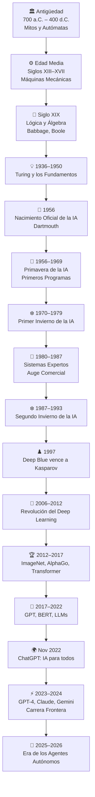
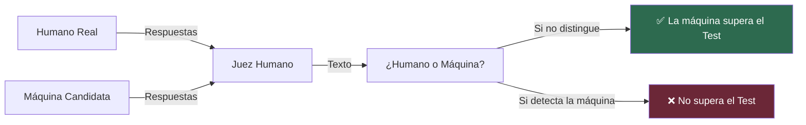
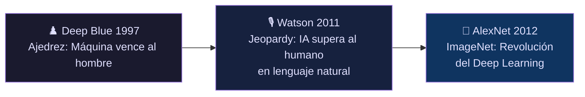
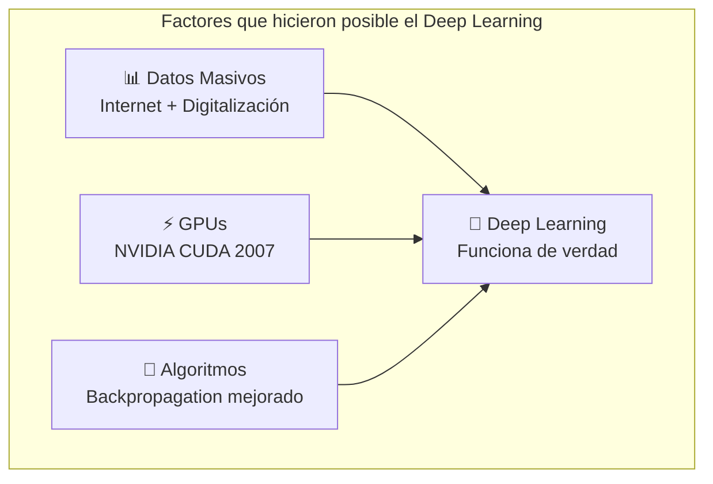
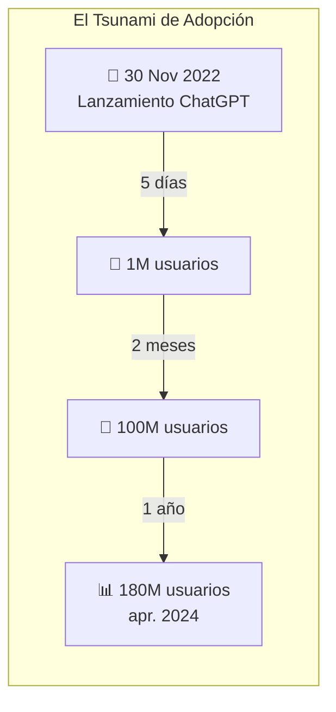
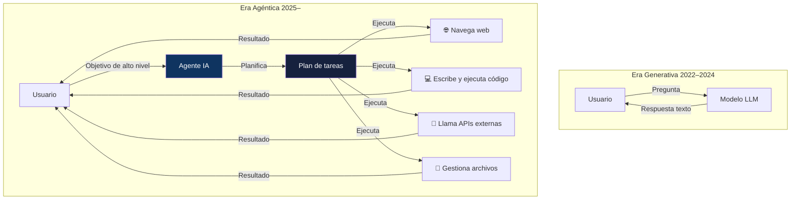
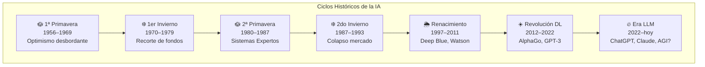

# 🧠 Historia de la Inteligencia Artificial
## Desde los Mitos de la Antigüedad hasta la Era de los Agentes Autónomos

> *"Nuestra capacidad de imaginar inteligencia artificial se remonta a la antigüedad."*
> — **Adrienne Mayor**, investigadora de historia de la ciencia, Universidad de Stanford

---

## 📌 Introducción

La inteligencia artificial no nació en un laboratorio de Silicon Valley ni con el lanzamiento de ChatGPT. Sus raíces son mucho más profundas, entrelazadas con los sueños más ambiciosos del ser humano: la creación de vida artificial, de máquinas que piensen, de seres que obedezcan sin cansarse.

Esta es la historia completa de cómo la humanidad pasó de imaginar gigantes de bronce en mitologías griegas, a construir sistemas que razonan, crean, programan y actúan de forma autónoma. Un recorrido de más de 2.700 años que culmina —por ahora— en el umbral de la era AGI.

---

## 🗺️ Mapa del Recorrido

---

## 🏛️ PARTE I — La Prehistoria del Pensamiento Artificial (700 a.C. – 1900)

### 🔱 Los Autómatas Divinos de Grecia (700 a.C.)

Mucho antes de que existieran los ordenadores, la humanidad ya imaginaba criaturas artificiales dotadas de inteligencia. Los mitos griegos son el primer repositorio de esa obsesión.

**Talos**, mencionado por primera vez por el poeta Hesíodo hacia el año **700 a.C.**, es considerado por historiadores de la ciencia como uno de los primeros conceptos de robot en la historia. Era un gigante de bronce forjado por **Hefesto** —el dios de la herrería y la tecnología— por encargo de Zeus para proteger la isla de Creta. Patrullaba sus costas tres veces al día y destruía a los invasores arrojando rocas. En su interior circulaba *icor*, la sustancia vital de los dioses, desde la cabeza hasta el tobillo: una metáfora extraordinariamente cercana a lo que hoy llamaríamos un sistema de energía o flujo de datos.

> 🔍 **Dato curioso:** En griego, la palabra *"automaton"* tiene la raíz *mat* —compartida con el latín *mens, mentis* (mente)— combinada con *auto* (propio). "Automaton" significa literalmente **"mente propia"**, o algo que tiene voluntad autónoma. — *Gregory Nagy, Harvard University*

Hefesto también creó **criadas de oro** —autómatas con forma femenina que asistían en su taller con "la sabiduría de los dioses"—, y **trípodes automovilizados** que se desplazaban solos al Olimpo. Homero describía estas creaciones en la Ilíada como si fueran tan naturales como cualquier otra herramienta divina.

La investigadora **Adrienne Mayor** (Stanford) documenta en su obra *Gods and Robots: Myths, Machines, and Ancient Dreams of Technology* (Princeton University Press, 2018) cómo estas narrativas evidencian que la fascinación humana por la vida artificial precede en siglos a la tecnología que la haría posible.

**Pandora**, otra creación de Hefesto por encargo de Zeus, también puede interpretarse como un autómata: un ser artificial diseñado con propósito específico —en este caso, como castigo hacia la humanidad— que actúa de forma autónoma con consecuencias imprevistas. Una parábola que, vista desde el siglo XXI, resuena con debates actuales sobre alineación de IA.

#### El aporte de Aristóteles (384–322 a.C.)

El filósofo especuló en su obra *Política* que si los instrumentos pudieran actuar por sí solos, la esclavitud dejaría de ser necesaria. Citó explícitamente los trípodes de Hefesto y el telar que tejiera solo como ejemplos de lo que liberaría a la humanidad. Es quizás la primera reflexión filosófica sobre la **automatización del trabajo**.

---

### ⚙️ Edad Media y Renacimiento: Autómatas Mecánicos (Siglos XIII–XVII)

Con el florecimiento de la mecánica de relojería, la idea del ser artificial dejó de ser solo mítica.

**Al-Jazari** (1136–1206), ingeniero islámico, documentó diseños de autómatas hidráulicos programables en su *Libro del conocimiento de los ingeniosos mecanismos*. Construyó músicos mecánicos que podían reproducir melodías distintas, considerados los primeros autómatas programables de la historia.

**Ramon Llull** (1232–1316) concibió el *Ars Magna*, un sistema de lógica combinatoria con ruedas giratorias que generaba afirmaciones verdaderas a partir de conceptos básicos. Es visto como un predecesor directo de la lógica formal que siglos después alimentaría la computación.

En el **Renacimiento**, **Leonardo da Vinci** diseñó entre 1495 y 1497 un caballero mecánico articulado capaz de mover brazos, mandíbula y cuello. Sus notas muestran un sistema de poleas y cables que lo hacen funcionar, y es considerado el primer robot antropomorfo diseñado con base científica.

**René Descartes** (1596–1650) sentó las bases filosóficas al argumentar en su *Discurso del Método* que el cuerpo humano podría ser entendido como una máquina compleja. Si bien diferenciaba la res cogitans (mente) de la res extensa (materia), abrió la puerta a pensar que la inteligencia podría replicarse mecánicamente.

---

### 📐 Siglo XIX: Las Bases Matemáticas (1820–1900)

Este siglo produjo los fundamentos formales sin los cuales la IA sería imposible.

**Charles Babbage** (1791–1871) diseñó la *Máquina Diferencial* (1822) y la *Máquina Analítica* (1837), concibiendo por primera vez una calculadora mecánica de propósito general con memoria, procesador y capacidad de ser programada con tarjetas perforadas.

**Ada Lovelace** (1815–1852), colaboradora de Babbage, escribió en 1843 lo que se considera el **primer algoritmo de la historia**, destinado a la Máquina Analítica para calcular los números de Bernoulli. Fue también la primera en contemplar que estas máquinas podrían ir más allá del cálculo numérico.

**George Boole** (1815–1864) publicó en 1854 *An Investigation of the Laws of Thought*, estableciendo el **álgebra booleana**: el sistema binario de verdadero/falso sobre el que opera toda la computación moderna.

---

## 💡 PARTE II — Los Fundamentos Científicos (1936–1956)

### 🧮 Alan Turing y la Máquina Universal (1936–1950)

En **1936**, **Alan Turing** publicó su artículo *On Computable Numbers* donde describió una máquina abstracta capaz de simular cualquier proceso computacional. La **Máquina de Turing** no era un dispositivo físico, sino un modelo matemático: el fundamento teórico de toda la computación moderna.

En **1943**, **Warren McCulloch** y **Walter Pitts** publicaron *A Logical Calculus of the Ideas Immanent in Nervous Activity*, demostrando que las neuronas biológicas podían modelarse con circuitos lógicos. Es el **acta de nacimiento de las redes neuronales artificiales**.

En **1950**, Turing publicó en la revista *Mind* su artículo *Computing Machinery and Intelligence*, que abre con la pregunta: **"¿Pueden las máquinas pensar?"** Propone el célebre **Test de Turing** (o "Juego de Imitación"): si un juez humano no puede distinguir, en conversación escrita, entre un humano y una máquina, la máquina debe considerarse inteligente.

En **1951**, Turing también describió el concepto de **aprendizaje automático**, anticipando que sería más eficiente enseñar a una máquina que programarla manualmente para cada tarea.

---

## 🚀 PARTE III — El Nacimiento Oficial: Dartmouth (1956)

### La Conferencia que lo Cambió Todo

El verano de **1956** marcó el nacimiento oficial de la inteligencia artificial como disciplina. **John McCarthy**, matemático del MIT, organizó junto a **Marvin Minsky**, **Claude Shannon** y **Nathaniel Rochester** una conferencia de investigación en el **Dartmouth College** de New Hampshire.

McCarthy acuñó el término **"Inteligencia Artificial"** y la propuesta original de la conferencia afirmaba que "cada aspecto del aprendizaje o cualquier otra característica de la inteligencia puede ser descrita con tal precisión que una máquina pueda ser construida para simularla". Una declaración de intenciones que define el campo hasta hoy.

---

## 🌟 PARTE IV — La Primera Primavera de la IA (1956–1969)

Este período se caracterizó por un optimismo desbordante y avances genuinamente notables:

- **1956:** **Allen Newell y Herbert Simon** presentan el *Logic Theorist*, el primer programa capaz de demostrar teoremas matemáticos. Más tarde crean el *General Problem Solver* (1957), que modelaba la resolución de problemas humanos.
- **1958:** **John McCarthy** desarrolla **LISP**, el lenguaje de programación que dominaría la IA durante décadas.
- **1959:** **Arthur Samuel** (IBM) acuña el término **"Machine Learning"** al desarrollar un programa que aprendía a jugar a las damas mejor que su creador.
- **1964:** **ELIZA** (Joseph Weizenbaum, MIT) se convierte en el primer chatbot capaz de simular conversación, creando la ilusión de comprensión. Muchos usuarios se negaban a creer que hablaban con una máquina.
- **1966:** El proyecto **ALPAC** del gobierno de EE.UU. concluye que la traducción automática era demasiado cara y de baja calidad, cortando financiación a varios proyectos.

La promesa de la IA parecía cumplirse a velocidad vertiginosa. Marvin Minsky declaró en 1967: *"En una generación, el problema de crear inteligencia artificial estará sustancialmente resuelto."* Esta confianza resultaría prematura.

---

## ❄️ PARTE V — El Primer Invierno de la IA (1970–1979)

Los límites del hardware y los algoritmos de la época chocaron con las expectativas.

El informe **Lighthill** (1973), encargado por el gobierno británico, criticó duramente el progreso de la IA: los sistemas sólo funcionaban en dominios extremadamente limitados y no podían escalar a problemas del mundo real. Como consecuencia, el **Science Research Council** del Reino Unido cortó casi toda la financiación en IA.

En EE.UU., la **DARPA** (Agencia de Investigación de Defensa Avanzada) redujo drásticamente fondos tras el fracaso del reconocimiento del habla en condiciones reales.

> 💡 **Lección aprendida:** Las expectativas superaron la realidad. El *problema de la combinatoria explosiva* —el número de posibles estados que un sistema debía evaluar— resultó intratable con el hardware disponible.

---

## 🔬 PARTE VI — Los Sistemas Expertos y el Segundo Auge (1980–1987)

Una nueva aproximación revivió el campo: en lugar de intentar replicar la inteligencia general, ¿por qué no capturar el conocimiento de expertos humanos en dominios específicos?

Los **sistemas expertos** eran programas que codificaban reglas del tipo *SI [condición] → ENTONCES [acción]*, capturando el razonamiento de médicos, ingenieros o abogados.

- **MYCIN** (Stanford, 1972–1980): diagnosticaba infecciones bacterianas con una tasa de precisión superior a la de muchos médicos humanos.
- **XCON** (Digital Equipment Corporation, 1982): configuraba automáticamente sistemas de computadoras VAX con 2.500 reglas, procesando 80.000 pedidos al año y ahorrando **40 millones de dólares anuales** a la empresa.
- Para **1985**, el mercado de sistemas expertos alcanzó los **2.000 millones de dólares**.
- **Japón** lanzó en 1982 el ambicioso *Proyecto de Computadoras de Quinta Generación* con una inversión de 850 millones de dólares para construir máquinas de procesamiento en paralelo orientadas a la IA.

---

## ❄️ PARTE VII — El Segundo Invierno de la IA (1987–1993)

El mercado de hardware especializado colapsó casi de un día para otro. Las workstations de **Sun Microsystems** ofrecían mejor rendimiento a una décima parte del precio de las máquinas LISP especializadas. El mercado de máquinas LISP cayó de **400 millones a 20 millones de dólares en 18 meses**.

El proyecto de Quinta Generación de Japón terminó sin cumplir sus promesas. La DARPA concluyó que los sistemas expertos eran demasiado rígidos para escalar.

> 🧠 **Reflexión:** Los sistemas expertos tenían un problema fundamental —el *knowledge bottleneck*: toda la inteligencia dependía de que un humano la codificara manualmente. No aprendían, no se adaptaban.

---

## ♟️ PARTE VIII — El Regreso Silencioso (1993–2006)

Sin grandes proclamas, la IA comenzó a volver por la puerta trasera.

### Hitos de esta etapa:

| Año | Evento | Significado |
|-----|--------|-------------|
| **1997** | **Deep Blue** (IBM) vence a Garry Kasparov en ajedrez | Primera derrota de un campeón mundial ante una máquina en condiciones de torneo |
| **1998** | **Yann LeCun** publica LeNet-5 | Primera aplicación exitosa de redes neuronales convolucionales para reconocimiento de escritura |
| **2001** | **Robot Kismet** (MIT) | Primer robot con expresión facial emocional |
| **2002** | **Roomba** de iRobot | IA de navegación autónoma llega a los hogares |
| **2004** | **DARPA Grand Challenge** | Primer vehículo autónomo completa un recorrido en desierto (sin conductores) |
| **2005** | **Watson Project** iniciado | IBM comienza el proyecto que derrotaría a campeones de Jeopardy! |

---

## 🧬 PARTE IX — La Revolución del Deep Learning (2006–2017)

### El Gran Renacimiento

**Geoffrey Hinton** —junto a sus estudiantes— publicó en **2006** técnicas para entrenar redes neuronales profundas (*deep belief networks*), resolviendo el problema del *vanishing gradient* que había paralizado el campo durante décadas. Las ideas de las redes profundas existían desde los 80, pero necesitaban dos ingredientes que ahora estaban disponibles: **datos masivos** (internet) y **cómputo barato** (GPUs).

**Hito clave — ImageNet 2012:** El equipo de **AlexNet** (Hinton, Krizhevsky, Sutskever) redujo el tasa de error en clasificación de imágenes del 26% al **15,3%**. La siguiente mejor arquitectura daba 26%. El campo entero pivotó en un año.

### Cronología del Deep Learning:

- **2007:** NVIDIA lanza CUDA, permitiendo usar GPUs para cómputo científico general.
- **2012:** AlexNet gana ImageNet con un margen histórico.
- **2014:** **Generative Adversarial Networks (GANs)** — Ian Goodfellow, mientras esperaba el metro, imagina la arquitectura que revolucionaría la generación de imágenes.
- **2015:** **AlphaGo** (DeepMind) derrota a Fan Hui, el campeón europeo de Go. El Go tenía más posiciones que átomos en el universo observable —se creía inabordable para las máquinas por décadas.
- **2016:** **AlphaGo** vence al número uno mundial, **Lee Sedol**, 4-1. Sedol se retiró años después, citando la imposibilidad de competir con la IA.
- **2017:** El paper **"Attention Is All You Need"** (Vaswani et al., Google Brain) introduce la **arquitectura Transformer**, el componente que sustenta todos los grandes modelos de lenguaje actuales: GPT, Claude, Gemini, Llama.

---

## 💬 PARTE X — La Era de los Grandes Modelos de Lenguaje (2018–2022)

La arquitectura Transformer desencadenó una ola de modelos cada vez más grandes:

| Año | Modelo | Parámetros | Hito |
|-----|--------|-----------|------|
| 2018 | GPT-1 (OpenAI) | 117M | Primer LLM generativo preentrenado |
| 2018 | BERT (Google) | 340M | Bidireccional, comprensión de texto |
| 2019 | GPT-2 (OpenAI) | 1.5B | Tan bueno que OpenAI no lo publicó completo |
| 2020 | GPT-3 (OpenAI) | 175B | Emergencia de capacidades no entrenadas |
| 2021 | Codex (OpenAI) | 12B | Base de GitHub Copilot |
| 2022 | InstructGPT | — | RLHF: el modelo aprende a ser útil y seguro |

Con GPT-3 apareció un fenómeno nuevo: las **capacidades emergentes**. Habilidades que nadie programó —razonamiento few-shot, aritmética básica, analogías— surgían espontáneamente al escalar el modelo. La IA comenzaba a sorprender a sus propios creadores.

---

## 🌍 PARTE XI — El Gran Punto de Inflexión: ChatGPT (Noviembre 2022)

### El Momento en que Todo Cambió

El **30 de noviembre de 2022**, OpenAI lanzó **ChatGPT**, construido sobre GPT-3.5 y afinado con **RLHF** (Reinforcement Learning from Human Feedback). En lugar de una API para desarrolladores, era una interfaz conversacional para cualquier persona.

Los números fueron sin precedentes:
- **1 millón de usuarios** en los primeros 5 días
- **100 millones de usuarios** en 2 meses — el producto de consumo de más rápido crecimiento en la historia hasta ese momento (TikTok tardó **9 meses** en alcanzar esa cifra)

> 💬 *"La interfaz fue la innovación real: transformó la IA de APIs para especialistas en un colaborador conversacional."* — MadeAI (2026)

---

## ⚡ PARTE XII — La Carrera Frontera: 2023–2024

El lanzamiento de ChatGPT desató una carrera sin precedentes entre los grandes laboratorios de IA.

### 2023: El Año de la Competencia

- **Febrero 2023:** Google lanza **Bard** (más tarde renombrado Gemini) como respuesta directa.
- **Marzo 2023:** **GPT-4** — multimodal (texto e imagen), pasa múltiples exámenes profesionales con puntuaciones de percentil superior. El **mismo día**, Anthropic lanza públicamente **Claude**.
- **Julio 2023:** **Claude 2** de Anthropic demuestra que un competidor bien financiado puede desafiar a OpenAI con enfoque distinto en seguridad.
- **2023:** **Meta** lanza **Llama**, abriendo la era del open-source en LLMs. Los modelos de pesos abiertos democratizan el acceso a la infraestructura de IA.
- **Noviembre 2023:** **GPT-4 Turbo**, contexto extendido a 128K tokens.

### 2024: El Año del Razonamiento y los Agentes

- **Marzo 2024:** **Claude 3** (Opus/Sonnet/Haiku) establece un nuevo estándar en razonamiento y codificación.
- **Mayo 2024:** **GPT-4o** — multimodal nativo, voz en tiempo real, visión integrada.
- **Septiembre 2024:** **OpenAI o1** — el primer modelo de razonamiento commercial que "piensa" antes de responder (chain-of-thought interno). Hito en lógica matemática y científica.
- **Diciembre 2024:** Google anuncia **Gemini 2.0 Flash**, declarando el inicio de la "era agéntica".

---

## 🤖 PARTE XIII — La Era de los Agentes Autónomos (2025–2026)

### El Siguiente Gran Salto

Si la era generativa (2022–2024) fue la de los modelos que *responden*, la era agéntica es la de los modelos que *actúan*.

> 🔑 **Distinción clave:** Un chatbot responde preguntas. Un **agente** navega internet, escribe y ejecuta código, llama APIs, interactúa con aplicaciones externas y completa tareas en secuencias de pasos sin supervisión humana constante.

### Hitos de 2025:

- **Enero 2025:** **DeepSeek R1** — modelo chino open-source que iguala el rendimiento de OpenAI o1 entrenado por solo **5,6 millones de dólares**, sacudiendo la industria que asumía que los modelos frontera requerían miles de millones.
- **Mayo 2025:** **Anthropic lanza la familia Claude 4** (Sonnet 4 y Opus 4) con modo de pensamiento extendido y **Claude Code**, un agente CLI de codificación autónoma.
- **Mayo 2025:** **OpenAI lanza GPT-5** con ventana de contexto de 400K tokens y reducción de alucinaciones al ~6,2%. Puntuación perfecta en el benchmark matemático AIME 2025.
- **Junio 2025:** **OpenAI o3-pro** avanza las capacidades de razonamiento complejo.
- **2025:** Los agentes de IA comienzan a completar tareas de desarrollo de software de **30+ minutos** de forma autónoma.
- **2026:** La IA agéntica se normaliza en producción empresarial. Los modelos frontera superan 1M de tokens de contexto. **Anthropic alcanza 14.000 millones de dólares ARR** (nadie en 2023 proyectó esa trayectoria).

---

## 📊 Resumen Visual: Los "Inviernos" y "Primaveras" de la IA

---

## 🧩 Los Personajes que Definieron la Historia

| 🧑‍🔬 Figura | Período | Contribución |
|-----------|---------|-------------|
| **Alan Turing** | 1936–1954 | Máquina Universal, Test de Turing, bases de la computación |
| **John McCarthy** | 1956–2011 | Acuñó "IA", inventó LISP, organizó Dartmouth |
| **Marvin Minsky** | 1956–2016 | Cofundador del MIT AI Lab, teoría de la mente |
| **Claude Shannon** | 1940s–1950s | Teoría de la información, bases de la comunicación digital |
| **Geoffrey Hinton** | 1986–2023 | Backpropagation, Deep Learning, "Padrino de la IA" |
| **Yann LeCun** | 1989– | Redes convolucionales (CNN), Director de IA en Meta |
| **Yoshua Bengio** | 1990s– | Attention mechanisms, modelos del lenguaje |
| **Ian Goodfellow** | 2014 | Inventó las GANs |
| **Demis Hassabis** | 2010– | DeepMind, AlphaGo, AlphaFold, Nobel-adjacente |
| **Sam Altman** | 2019– | CEO OpenAI, ChatGPT, GPT-4/5 |
| **Dario Amodei** | 2021– | CEO Anthropic, Claude, liderazgo en AI Safety |

---

## 🔮 Conclusión: ¿Dónde Estamos?

La historia de la inteligencia artificial es, en esencia, la historia de la ambición humana. Una ambición que comenzó con mitos —con gigantes de bronce que patrullaban islas para proteger a los dioses— y que hoy se materializa en sistemas que razonan, crean, programan y planifican de formas que hubieran parecido magia a cualquier generación anterior.

Lo que distingue este momento de los anteriores no es solo la capacidad técnica, sino la **velocidad de adopción** y la **accesibilidad**. Los inviernos anteriores llegaron porque la promesa superó a la realidad. Hoy, la realidad —en muchos dominios— supera a lo que se prometía hace apenas tres años.

Las preguntas que se abren son, a la vez, técnicas y filosóficas:
- ¿Cuándo —si es que ocurre— llegamos a la **AGI** (Inteligencia General Artificial)?
- ¿Cómo garantizamos que los sistemas más capaces permanezcan **alineados** con los valores humanos?
- ¿Qué significa la creatividad, el trabajo o la identidad en un mundo donde una máquina puede hacer casi cualquier tarea cognitiva?

Talos, el gigante de bronce de Hesíodo, tenía un punto débil en el tobillo. Medea lo sabía. La pregunta que define nuestra era no es si podemos construir inteligencias artificiales cada vez más poderosas —ya está claro que podemos— sino si somos lo suficientemente sabios para saber dónde está el tornillo.

---

## 📚 Referencias y Fuentes

1. **Mayor, A.** (2018). *Gods and Robots: Myths, Machines, and Ancient Dreams of Technology*. Princeton University Press. [https://press.princeton.edu/books/hardcover/9780691183510/gods-and-robots](https://press.princeton.edu/books/hardcover/9780691183510/gods-and-robots)

2. **Stanford University** (2019). *Ancient myths reveal early fantasies about artificial life*. Stanford Report. [https://news.stanford.edu/stories/2019/02/ancient-myths-reveal-early-fantasies-artificial-life](https://news.stanford.edu/stories/2019/02/ancient-myths-reveal-early-fantasies-artificial-life)

3. **World Economic Forum** (2019). *This is what the ancient Greeks had to say about robotics and AI*. [https://www.weforum.org/stories/2019/03/greek-myths-have-some-scary-ideas-about-robots-and-a-i/](https://www.weforum.org/stories/2019/03/greek-myths-have-some-scary-ideas-about-robots-and-a-i/)

4. **Smithsonian Magazine** (2025). *Was Talos, the Bronze Automaton Who Guarded the Island of Crete in Greek Myth, an Early Example of Artificial Intelligence?* [https://www.smithsonianmag.com/history/was-talos-the-bronze-automaton-who-guarded-the-island-of-crete-in-greek-myth-an-early-example-of-artificial-intelligence-180986467/](https://www.smithsonianmag.com/history/was-talos-the-bronze-automaton-who-guarded-the-island-of-crete-in-greek-myth-an-early-example-of-artificial-intelligence-180986467/)

5. **A History of Artificial Intelligence** (2019). *Antiquity*. [https://ahistoryofai.com/antiquity/](https://ahistoryofai.com/antiquity/)

6. **Sectorial.co** (2024). *Timeline de la inteligencia artificial, desde Turing hasta la aplicación en robótica*. [https://sectorial.co/articulos-especiales/timeline-de-la-inteligencia-artificial/](https://sectorial.co/articulos-especiales/timeline-de-la-inteligencia-artificial/)

7. **Herramientas-IA.com** (2025). *Línea de Tiempo de la IA: Desde sus Inicios hasta Hoy*. [https://herramientas-ia.com/linea-de-tiempo-de-la-inteligencia-artificial/](https://herramientas-ia.com/linea-de-tiempo-de-la-inteligencia-artificial/)

8. **Toloka AI Blog** (2026). *History of LLMs: Complete Timeline & Evolution (1950-2026)*. [https://toloka.ai/blog/history-of-llms/](https://toloka.ai/blog/history-of-llms/)

9. **The AI University** (2026). *AI Predictions & Adoption Timeline*. [https://theaiuniversity.com/docs/industry-impact/ai-predictions-timeline](https://theaiuniversity.com/docs/industry-impact/ai-predictions-timeline)

10. **The Neuron** (2025). *Three Years of ChatGPT: A Retrospective (2022–2025)*. [https://www.theneuron.ai/explainer-articles/three-years-of-chatgpt-a-retrospective-2022-2025/](https://www.theneuron.ai/explainer-articles/three-years-of-chatgpt-a-retrospective-2022-2025/)

11. **xAGI Labs** (2025). *AI Timeline: Major Events 2022-2025*. [https://xagi-labs.github.io/ai-timeline](https://xagi-labs.github.io/ai-timeline)

12. **MadeAI** (2026). *The AI Timeline: From Turing's Bold Idea to Today's AI Agents*. [http://madeai.com/resources/thought-leadership/the-ai-timeline-from-turings-bold-idea-to-todays-ai-agents/](http://madeai.com/resources/thought-leadership/the-ai-timeline-from-turings-bold-idea-to-todays-ai-agents/)

13. **Brewminate** (2025). *Forged by Hephaestus: Talos of Ancient Greek Mythology as Artificial Intelligence*. [https://brewminate.com/forged-by-hephaestus-talos-of-ancient-greek-mythology-as-artificial-intelligence/](https://brewminate.com/forged-by-hephaestus-talos-of-ancient-greek-mythology-as-artificial-intelligence/)

14. **Vaswani, A. et al.** (2017). *Attention Is All You Need*. Google Brain. arXiv:1706.03762. [https://arxiv.org/abs/1706.03762](https://arxiv.org/abs/1706.03762)

15. **Turing, A.M.** (1950). *Computing Machinery and Intelligence*. Mind, 49, 433–460.

---

*📅 Artículo elaborado en junio de 2026 | Serie: **Inteligencia Artificial — De la Teoría a la Práctica***
*🖊️ Parte 1 de N — Historia y Fundamentos*

Fuente: `Klaus`

