# 🧠 Conceptos Principales de la Inteligencia Artificial
## De la Teoría a la Práctica: Guía Completa de los Fundamentos que Mueven el Mundo

> *"La IA no es una tecnología aislada. Es un ecosistema de técnicas, arquitecturas y paradigmas que trabajan juntos para imitar —y en algunos dominios superar— la inteligencia humana."*

---

## 📌 Introducción

Si en el primer artículo de esta serie recorrimos la historia de la IA desde los mitos griegos hasta la era de los agentes autónomos, ahora toca hacer algo distinto: bajar al terreno. Entender el vocabulario. Hablar el idioma.

Porque uno de los grandes problemas del debate público sobre inteligencia artificial es que se mezclan términos con imprecisión alarmante. Se usan como sinónimos conceptos que son completamente distintos. Se confunde la herramienta con la disciplina, el subconjunto con el todo, la promesa con la realidad.

Este artículo es un mapa conceptual. Un lugar al que volver cuando alguien diga "machine learning" y no sepas si se refiere a lo mismo que "deep learning". Un recurso para entender por qué ChatGPT no es lo mismo que "IA general". Y, al final, una mirada honesta a lo que la inteligencia artificial nos da y lo que nos cobra.

---

## 🗺️ El Mapa del Ecosistema IA

Antes de entrar en cada concepto, es fundamental entender la relación jerárquica entre ellos. No son sinónimos. Son capas concéntricas:

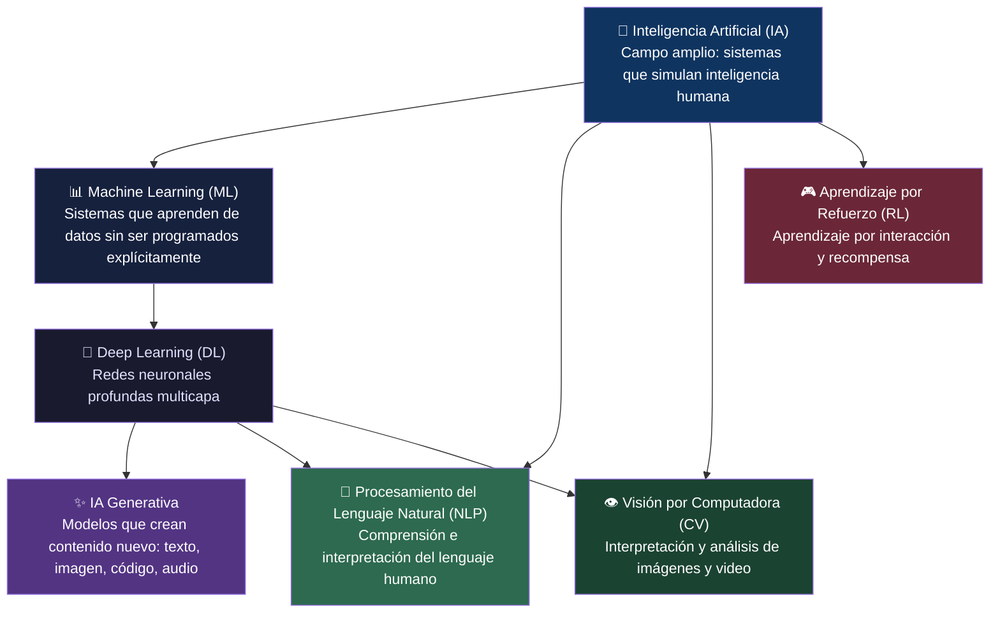

> 💡 **Regla de oro:** Todo Deep Learning es Machine Learning. Todo Machine Learning es IA. Pero no toda IA es Machine Learning, y no todo Machine Learning es Deep Learning.

---

## 📐 PARTE I — Los Tres Pilares: IA, ML y DL

### 1.1 🧠 Inteligencia Artificial (IA)

La **Inteligencia Artificial** es el campo más amplio. Su definición más aceptada la describe como la rama de la informática que busca construir sistemas capaces de realizar tareas que normalmente requieren inteligencia humana: aprender, razonar, reconocer patrones, adaptarse y tomar decisiones.

Es importante distinguir dos enfoques históricos:

| Enfoque | Descripción | Ejemplo |
|---------|------------|---------|
| **IA Simbólica (GOFAI)** | Reglas programadas manualmente por expertos. "Si X entonces Y" | Sistemas Expertos de los 80 (MYCIN, XCON) |
| **IA Estadística / Conexionista** | Aprende patrones a partir de datos. No se programan las reglas | Machine Learning, Deep Learning, LLMs |

La IA moderna es fundamentalmente del segundo tipo: aprende de los datos en lugar de seguir instrucciones explícitas.

---

### 1.2 📊 Machine Learning (ML) — Aprendizaje Automático

El Machine Learning es una rama de la inteligencia artificial que permite a los sistemas identificar patrones en grandes conjuntos de datos, mejorando con el tiempo sin ser programados explícitamente.

La clave está en esa última parte: **sin ser programados explícitamente**. Un programador tradicional escribe reglas: "si el email contiene la palabra 'príncipe nigériano', marcarlo como spam". Un sistema de ML analiza miles de emails marcados como spam y aprende por sí mismo qué características los definen.

#### Los tres paradigmas del ML:

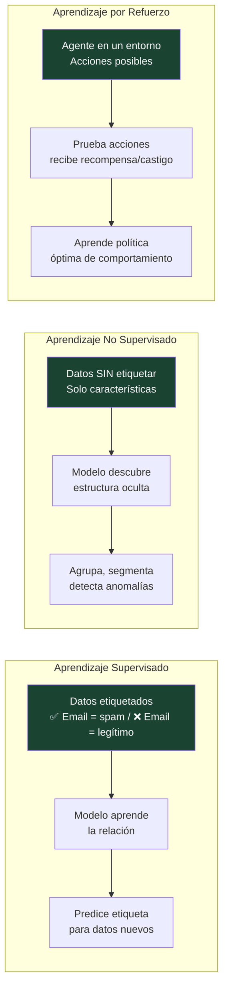

**Aprendizaje Supervisado:** El más común en producción. Se entrena con ejemplos etiquetados (pregunta + respuesta correcta). Aplicaciones: detección de spam, diagnóstico médico, reconocimiento de voz, precios de vivienda.

**Aprendizaje No Supervisado:** Sin etiquetas. El modelo busca estructura por sí solo. Aplicaciones: segmentación de clientes, detección de anomalías en redes, compresión de datos.

**Aprendizaje por Refuerzo (RL):** Un agente aprende interactuando con un entorno, maximizando recompensa acumulada. Fue la técnica detrás de AlphaGo, los coches autónomos, y hoy también parte del entrenamiento de LLMs (RLHF).

---

### 1.3 🔬 Deep Learning (DL) — Aprendizaje Profundo

El Deep Learning es un subcampo más avanzado del ML que utiliza redes neuronales multicapa para procesar información compleja.

La metáfora del cerebro no es perfecta, pero ayuda: las **redes neuronales artificiales** están formadas por nodos (neuronas artificiales) organizados en capas. Cada neurona recibe señales, aplica una transformación matemática y pasa el resultado a la siguiente capa.

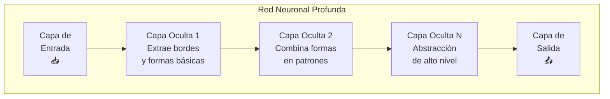

La "profundidad" se refiere al número de capas ocultas. Las redes modernas pueden tener cientos o miles de capas. Lo que hace que el Deep Learning sea transformador es su capacidad de **extraer automáticamente representaciones jerárquicas**: en una imagen de un rostro, las primeras capas detectan bordes, las intermedias detectan ojos y narices, y las últimas identifican la identidad.

#### Arquitecturas clave del DL:

| Arquitectura | Sigla | Qué hace bien | Aplicación típica |
|-------------|-------|--------------|-------------------|
| Redes Neuronales Convolucionales | CNN | Procesar imágenes y video | Clasificación de imágenes, visión médica |
| Redes Neuronales Recurrentes | RNN/LSTM | Secuencias y series temporales | Predicción financiera, speech-to-text |
| Transformers | — | Relaciones a larga distancia en texto | GPT, Claude, BERT, traducción |
| Redes Generativas Adversariales | GAN | Generar datos sintéticos realistas | Deepfakes, generación de imágenes |
| Autoencoders Variacionales | VAE | Comprimir y generar datos | Síntesis de imágenes, detección anomalías |

---

## 💬 PARTE II — Procesamiento del Lenguaje Natural (NLP)

### 2.1 ¿Qué es el NLP?

El Procesamiento del Lenguaje Natural (NLP) es una rama de la IA que se centra en la interacción entre computadoras y el lenguaje humano. Su objetivo es que las máquinas entiendan, interpreten y respondan al lenguaje de forma efectiva.

El lenguaje humano es extraordinariamente complejo. Está lleno de ambigüedad ("banco" puede ser una entidad financiera o un asiento), contexto dependiente ("está listo" cambia según quién lo dice), ironía, metáfora, doble sentido. Enseñar a una máquina a manejar todo eso fue uno de los problemas más difíciles de la IA durante décadas.

#### La evolución del NLP:

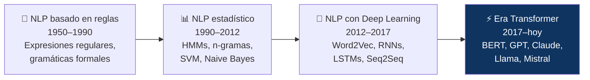

#### Tareas principales del NLP:

- **Clasificación de texto:** determinar si una reseña es positiva o negativa, categorizar soporte técnico
- **Reconocimiento de entidades (NER):** identificar personas, lugares, organizaciones en texto
- **Análisis de sentimiento:** detectar la carga emocional de un texto
- **Traducción automática:** DeepL, Google Translate
- **Resumen automático:** condensar documentos largos
- **Generación de texto:** ChatGPT, Claude, Copilot
- **Question Answering:** responder preguntas sobre un documento
- **Speech-to-Text:** transcripción de audio a texto (Whisper de OpenAI)

### 2.2 Grandes Modelos de Lenguaje (LLMs)

Los **Large Language Models** son la culminación actual del NLP. Son modelos Transformer entrenados sobre cantidades masivas de texto —prácticamente todo el texto disponible en internet— que aprenden las estructuras estadísticas del lenguaje con tal profundidad que emergen capacidades no entrenadas explícitamente: razonamiento, analogías, código, poesía.

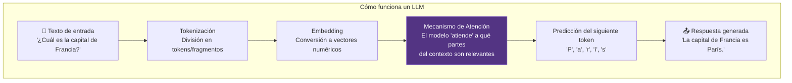

---

## 👁️ PARTE III — Visión por Computadora (Computer Vision)

La **Visión por Computadora** es la rama de la IA que permite a las máquinas interpretar y comprender el mundo visual: imágenes, video, profundidad espacial.

#### Aplicaciones en producción hoy:

| Aplicación | Tecnología | Impacto |
|-----------|-----------|---------|
| Diagnóstico médico por imagen | CNN especializadas | Detección de tumores con precisión equivalente o superior a radiólogos |
| Reconocimiento facial | FaceNet, DeepFace | Seguridad, desbloqueo de dispositivos |
| Vehículos autónomos | Redes multimodales + LIDAR | Detección de obstáculos, señales, peatones |
| Control de calidad industrial | Visión artificial | Detección de defectos en líneas de producción |
| Moderación de contenido | NSFW detectors | Filtrado automatizado a escala |
| Realidad aumentada | Pose estimation | Filtros de Instagram, cirugía asistida |

---

## 🎮 PARTE IV — Aprendizaje por Refuerzo (Reinforcement Learning)

El **RL** es el paradigma donde un agente aprende tomando decisiones en un entorno y recibiendo señales de recompensa o penalización. No hay un dataset previo: el agente genera su propia experiencia.

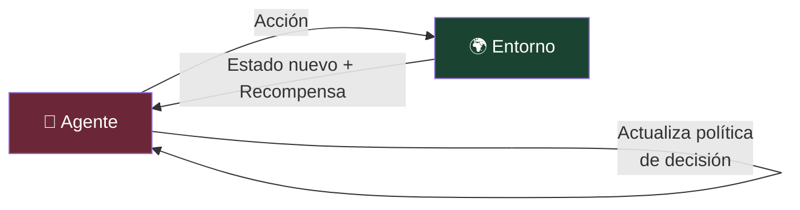

Fue la técnica central detrás de **AlphaGo** y **AlphaZero** (DeepMind), que aprendieron a jugar al Go, ajedrez y shogi a nivel sobrehumano sin conocimiento previo del juego, solo jugando millones de partidas contra sí mismos.

Hoy el RL también aparece en el entrenamiento de LLMs: el **RLHF** (Reinforcement Learning from Human Feedback) es el paso que convierte un modelo de predicción de texto en un asistente útil y alineado. Evaluadores humanos puntúan respuestas, y el modelo aprende a maximizar esas puntuaciones.

---

## ✨ PARTE V — IA Generativa

La **IA Generativa** es la categoría que más impacto visible ha tenido en el público general. Son modelos capaces de **crear contenido nuevo** —texto, imagen, audio, video, código— que no existía antes.

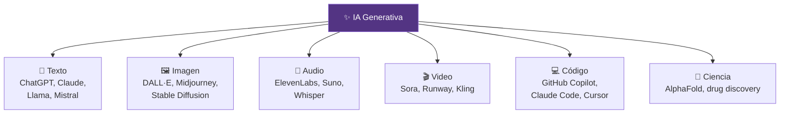

Lo que hace posible la IA Generativa moderna son tres componentes en combinación:

1. **Arquitectura Transformer** (2017) — capacidad de procesar contexto a larga distancia
2. **Entrenamiento a escala masiva** — datos y cómputo sin precedentes
3. **RLHF** — alineación con las preferencias humanas

---

## 🏷️ PARTE VI — Tipos de IA por Nivel de Capacidad: ANI, AGI, ASI

Esta es quizás la distinción más importante para entender el estado real del campo y sus debates más candentes.

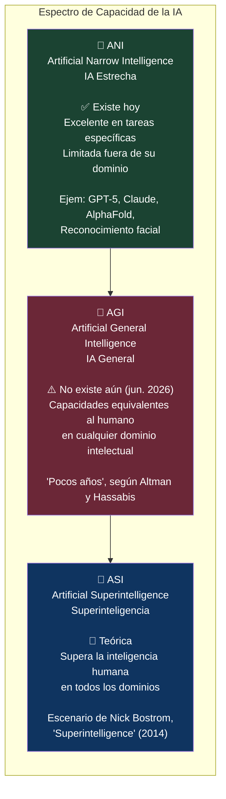

### ANI — La IA que vivimos hoy

La IA Estrecha (ANI) es la IA actual: excelente para tareas concretas, pero limitada. Por ejemplo, modelos como GPT-5 o Gemini resuelven problemas matemáticos, generan textos o imágenes, pero no razonan de forma general ni aprenden autónomamente fuera de su entrenamiento. Es como un especialista brillante en un área, pero incapaz de adaptarse a lo desconocido.

### AGI — El horizonte debatido

La AGI, o Inteligencia Artificial General, equivaldría a la inteligencia humana: un sistema capaz de realizar cualquier tarea intelectual, aprendiendo y razonando en contextos nuevos con creatividad. En 2025 aún no se había llegado a eso, pero los avances son rápidos. Líderes como Sam Altman (OpenAI) y Demis Hassabis (Google DeepMind) predicen que podría llegar en unos pocos años, quizás entre 2026 y 2030.

### ASI — El escenario teórico

La IA Superinteligente (ASI) es un concepto todavía más teórico que plantea que no solo igualaría, sino que superaría las capacidades intelectuales humanas en todos los dominios: creatividad, análisis, razonamiento lógico, resolución de problemas, empatía y toma de decisiones éticas.

---

## 🔧 PARTE VII — Conceptos Técnicos Esenciales

### 7.1 El Transformer y el Mecanismo de Atención

El artículo *"Attention Is All You Need"* (Google Brain, 2017) introdujo la arquitectura que lo cambió todo. El **mecanismo de atención** permite al modelo ponderar la importancia relativa de cada parte del input cuando genera cada parte del output.

Antes de los Transformers, los modelos procesaban el texto secuencialmente (palabra por palabra). Los Transformers procesan todo el contexto en paralelo y aprenden qué partes del texto son relevantes entre sí, independientemente de la distancia.

### 7.2 Tokens y Contexto

Los LLMs no trabajan con palabras sino con **tokens** — fragmentos de texto que pueden ser palabras completas, partes de palabras o caracteres individuales. La "ventana de contexto" es cuántos tokens puede procesar el modelo de una vez:

| Modelo | Ventana de contexto | Equivalencia aprox. |
|--------|--------------------|--------------------|
| GPT-3 (2020) | 4.096 tokens | ~3.000 palabras |
| GPT-4 (2023) | 128.000 tokens | ~96.000 palabras (~un libro) |
| GPT-5 (2025) | 400.000 tokens | ~300.000 palabras |
| Claude 3 (2024) | 200.000 tokens | ~150.000 palabras |

### 7.3 Parámetros

Los **parámetros** son los valores numéricos que el modelo ajusta durante el entrenamiento — son, en esencia, la "memoria" aprendida. Más parámetros generalmente significa más capacidad, pero también más cómputo y coste:

- GPT-1 (2018): **117 millones** de parámetros
- GPT-3 (2020): **175.000 millones** de parámetros
- Modelos actuales frontera: estimados en **varios billones**

### 7.4 Fine-Tuning, RAG y Prompting

Una vez entrenado un modelo base, hay tres formas principales de adaptarlo a casos de uso específicos:

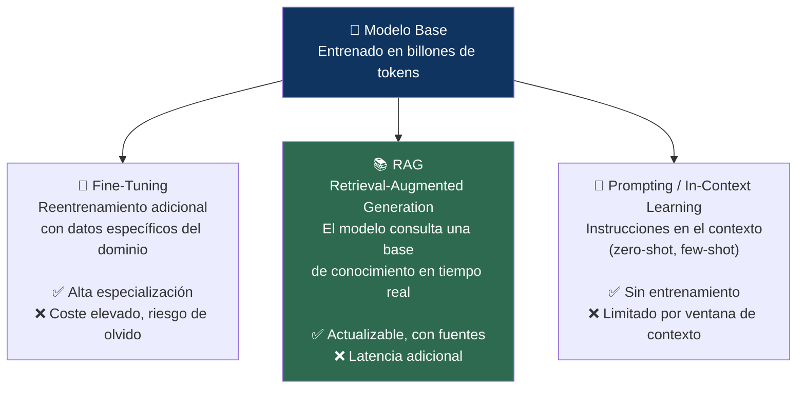

### 7.5 Alucinaciones

Las **alucinaciones** son uno de los problemas más conocidos de los LLMs: el modelo genera información que suena convincente pero es factualmente incorrecta. No las "inventa" maliciosamente — son el resultado de predecir el texto más probable estadísticamente, sin un mecanismo de verificación factual interno.

GPT-5 (2025) redujo las tasas de alucinación al ~6,2% en benchmarks estándar, frente a ~20% de modelos anteriores — una mejora significativa, pero no un problema resuelto.

### 7.6 Sesgo Algorítmico (Bias)

Los sistemas de IA pueden reproducir sesgos presentes en los datos con los que fueron entrenados, lo que puede generar discriminación en áreas como la contratación laboral, la seguridad y la justicia.

Si un modelo se entrena con textos históricos que reflejan desigualdades sociales, aprenderá y perpetuará esas desigualdades. Es uno de los desafíos de alineación más difíciles de resolver, porque los sesgos en datos históricos son inevitables.

---

## ⚖️ PARTE VIII — Pros y Contras de la Inteligencia Artificial

Esta es quizás la sección más importante de cara al debate público. La IA no es inherentemente buena ni mala — es una tecnología con enormes potencialidades y riesgos reales que deben gestionarse activamente.

---

### ✅ LOS PROS — Lo que la IA hace por nosotros

#### 1. 🚀 Automatización y Eficiencia Sin Precedentes

La IA facilita la automatización de procesos que antes requerían intervención humana. Es posible dejar en manos de las máquinas las tareas repetitivas y mecánicas que no requieren creatividad: desde la clasificación de correos electrónicos y el análisis de grandes datos, hasta la gestión de inventarios en tiempo real.

En entornos industriales, la IA posibilita el **mantenimiento predictivo**: analizar sensores en tiempo real para detectar fallos antes de que ocurran, evitando paradas no planificadas. La IA impulsa la automatización mediante robots inteligentes que realizan tareas repetitivas con mayor precisión y rapidez que los humanos y mejora el control de calidad mediante visión artificial.

#### 2. 🏥 Revolución en Salud y Medicina

Este es quizás el dominio donde el impacto positivo es más claro y menos contestado:

- **Diagnóstico por imagen:** modelos de Deep Learning detectan tumores, retinopatías diabéticas y fracturas con precisión comparable —y en algunos estudios superior— a especialistas humanos.
- **Descubrimiento de fármacos:** AlphaFold (DeepMind) resolvió el problema del plegamiento de proteínas que la biología estructural llevaba 50 años intentando resolver, abriendo una nueva era en diseño de medicamentos.
- **Medicina personalizada:** análisis genómico con IA para adaptar tratamientos al perfil individual del paciente.
- **Triaje automatizado:** sistemas que priorizan casos urgentes en urgencias hospitalarias.

#### 3. 🎓 Democratización del Conocimiento y la Educación

La IA pone al alcance de cualquier persona con conexión a internet un tutor personalizado, un asistente de programación, un traductor instantáneo, un redactor, un analista. Capacidades que hace una década estaban reservadas a quienes podían pagar por consultores especializados.

Las plataformas de streaming recomiendan contenido que se ajusta a nuestros gustos gracias a ella. Las aplicaciones de navegación redefinen rutas en tiempo real. Se utiliza para analizar grandes cantidades de datos, mejorar la eficiencia del trabajo y desarrollar estrategias de mercado más efectivas.

#### 4. 🔬 Aceleración de la Investigación Científica

La IA está comprimiendo décadas de investigación científica en años:

- Análisis de millones de papers en horas para identificar conexiones no evidentes
- Simulaciones físicas y químicas que antes requerían supercomputadores
- Descubrimiento de nuevos materiales (baterías, semiconductores, superconductores)
- Modelado climático con mayor precisión y a mayor resolución temporal

#### 5. 🌍 Accesibilidad y Asistencia

La IA ofrece capacidades transformadoras para personas con discapacidad:

- Síntesis de voz en tiempo real para personas con dificultades visuales
- Transcripción automática para personas con dificultades auditivas
- Interfaces por voz para personas con movilidad reducida
- Traducción en tiempo real eliminando barreras lingüísticas

#### 6. 🛡️ Seguridad y Detección de Amenazas

- Detección de fraude financiero en microsegundos analizando patrones en transacciones
- Ciberseguridad: identificación de amenazas y anomalías en tráfico de red
- Detección de malware mediante análisis de comportamiento
- Moderación de contenido a escala en plataformas con miles de millones de usuarios

---

### ❌ LOS CONTRAS — Los riesgos que no podemos ignorar

#### 1. 💼 Impacto en el Empleo y Desplazamiento Laboral

Este es el riesgo más debatido. La IA no solo automatiza trabajos manuales y repetitivos —como en revoluciones industriales anteriores— sino que comienza a automatizar trabajo cognitivo de nivel medio-alto: redacción, análisis, traducción, programación básica, soporte al cliente.

La concentración de riqueza derivada de la IA en pocas manos podría tener consecuencias de largo alcance en la economía global, generando desigualdades crecientes.

No todos los puestos desaparecerán, pero muchos se transformarán. No todos tienen la capacidad o los recursos para recalificarse. Mientras algunos pueden adaptarse, otros podrían quedarse atrás, atrapados en una espiral descendente.

#### 2. 🔒 Privacidad y Vigilancia Masiva

La posibilidad de que los algoritmos tomen decisiones autónomas plantea dilemas sobre la responsabilidad de los resultados. Un claro ejemplo es el uso de IA en sistemas de reconocimiento facial, que podría ser utilizado para vigilancia masiva y control de la población. La sociedad debe abordar estos temas y establecer normativas que garanticen un uso ético de la IA.

Los datos que alimentan los sistemas de IA son, frecuentemente, datos personales. Cada búsqueda, compra, movimiento y conversación puede ser analizado. Los sistemas de vigilancia con IA permiten una escala de monitoreo que no tiene precedente histórico.

#### 3. ⚖️ Sesgos, Discriminación y Falta de Explicabilidad

Los sistemas de IA pueden reproducir sesgos presentes en los datos con los que fueron entrenados, lo que puede generar discriminación en áreas como la contratación laboral, la seguridad y la justicia. Si no se aplican mecanismos de supervisión adecuados, estos sesgos pueden perpetuar desigualdades y reforzar prejuicios sin que los usuarios sean conscientes de ello.

Los modelos de Deep Learning son frecuentemente "cajas negras": no podemos explicar por qué tomaron una decisión concreta. Cuando esa decisión afecta a si alguien obtiene un crédito, una entrevista de trabajo o una libertad condicional, la falta de explicabilidad es un problema legal y ético de primer orden.

#### 4. 🤔 Desinformación, Deepfakes y Erosión de la Confianza

La IA generativa hace posible crear video, audio e imagen sintéticos prácticamente indistinguibles de los reales. Las implicaciones para la democracia, el periodismo, los procesos electorales y la confianza pública son profundas:

- Deepfakes de figuras políticas difundiendo mensajes falsos
- Generación masiva de desinformación a coste casi cero
- Erosión de la capacidad de distinguir lo real de lo sintético ("¿Es esto real o generado por IA?")
- Fraudes de identidad a escala

#### 5. 🌱 Impacto Medioambiental y Huella de Carbono

El entrenamiento de modelos grandes consume cantidades masivas de energía y agua. GPT-3 requirió aproximadamente 1.287 MWh de electricidad para entrenarse —equivalente al consumo anual de 120 hogares estadounidenses—. A medida que los modelos escalan, este impacto crece proporcionalmente.

El coste medioambiental de la IA es una variable frecuentemente ausente en el debate público, pero crítica para su evaluación honesta.

#### 6. 🔗 Dependencia Tecnológica y Concentración de Poder

La dependencia tecnológica es un riesgo real: si dejamos todas las decisiones críticas a las máquinas, nos volvemos vulnerables a sus fallos. Los costos elevados de implementar IA requieren infraestructura y talento, lo que deja a muchas organizaciones fuera de la carrera.

El poder de la IA frontera está concentrado en un puñado de empresas privadas —OpenAI, Anthropic, Google DeepMind, Meta— todas ubicadas mayoritariamente en un único país. Esta concentración tiene implicaciones geopolíticas, regulatorias y de soberanía tecnológica que apenas comenzamos a entender.

#### 7. 🛡️ Riesgos de Seguridad y Uso Malicioso

- Uso de IA para diseñar ciberataques más sofisticados y personalizados
- Generación automática de phishing altamente convincente
- Potencial uso en sistemas de armas autónomas
- Riesgo de modelos desalineados que actúen en contra de los intereses humanos

---

## 📊 Balance Visual: El Cuadro Completo

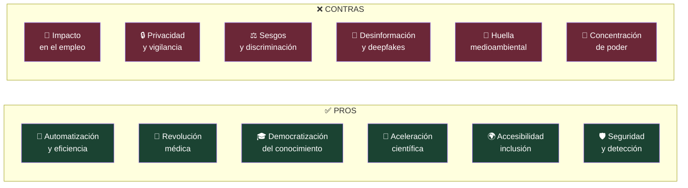

---

## 🔮 PARTE IX — El Marco Regulatorio: La UE toma la delantera

El debate sobre los contras de la IA ha impulsado respuestas regulatorias. La **Unión Europea** aprobó en 2024 el **AI Act** —el primer marco regulatorio integral de la IA en el mundo— que clasifica los sistemas de IA por nivel de riesgo:

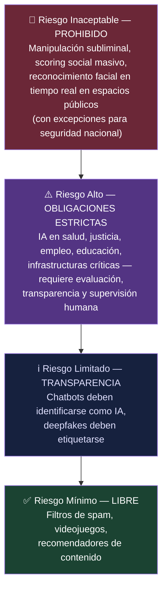

La sociedad debe abordar estos temas y establecer normativas que garanticen un uso ético de la IA, como trata de hacer el Reglamento de Inteligencia Artificial de la UE, con la prohibición de determinadas prácticas y el establecimiento de estrictas obligaciones para el resto, para asegurar que los beneficios no vayan en detrimento de la privacidad y libertad individual.

---

## 🧩 PARTE X — Glosario de Referencia Rápida

| Término | Definición |
|---------|-----------|
| **Algoritmo** | Conjunto de instrucciones que un sistema sigue para resolver un problema |
| **Parámetros** | Valores numéricos que el modelo ajusta durante el entrenamiento |
| **Entrenamiento** | Proceso por el que un modelo aprende patrones a partir de datos |
| **Inferencia** | Uso del modelo ya entrenado para generar predicciones o respuestas |
| **Token** | Unidad mínima de texto que procesa un LLM (palabra, sílaba o carácter) |
| **Embedding** | Representación vectorial de texto que captura significado semántico |
| **Prompt** | Texto de entrada que se proporciona a un modelo de IA |
| **Temperatura** | Parámetro que controla la creatividad/aleatoriedad en la generación |
| **Hallucination** | Información factualmente incorrecta generada con apariencia de verdad |
| **RLHF** | Aprendizaje por refuerzo a partir de retroalimentación humana |
| **Fine-tuning** | Reentrenamiento de un modelo en un dominio o tarea específica |
| **RAG** | Recuperación de información externa en tiempo real durante la inferencia |
| **Benchmark** | Prueba estandarizada para comparar capacidades de distintos modelos |
| **GPU** | Unidad de Procesamiento Gráfico — hardware central del entrenamiento de IA |
| **Transformer** | Arquitectura de red neuronal basada en atención, base de los LLMs modernos |
| **Multimodal** | Modelo capaz de procesar múltiples tipos de datos: texto, imagen, audio |
| **Agente IA** | Sistema que puede tomar acciones autónomas en un entorno para alcanzar objetivos |
| **Alineación** | Campo dedicado a asegurar que los sistemas de IA actúen conforme a valores humanos |

---

## 🔚 Conclusión

El ecosistema de la inteligencia artificial es vasto, pero no ininteligible. Tiene capas: la IA como campo, el ML como enfoque, el DL como técnica, los Transformers como arquitectura, los LLMs como aplicación. Comprender esas capas es la diferencia entre ser espectador del cambio tecnológico más relevante del siglo y ser agente activo en él.

Los pros de la IA son reales, medibles y en muchos casos ya están transformando vidas para mejor. Los contras también son reales, y la tendencia a ignorarlos o minimizarlos en aras del entusiasmo tecnológico es una forma de deshonestidad intelectual que nos perjudica como sociedad.

La postura más responsable no es ni el utopismo tecnológico ("la IA resolverá todos los problemas") ni el catastrofismo sistemático ("la IA nos destruirá"). Es la postura que exige **comprensión técnica honesta**, marcos regulatorios inteligentes, y participación activa de la sociedad —no solo de los ingenieros— en las decisiones sobre cómo se despliega esta tecnología.

Porque al final, como con cualquier herramienta poderosa, lo que importa no es qué puede hacer. Importa quién decide cómo se usa.

---

## 📚 Referencias y Fuentes

1. **ScienceDirect / Cisci Conference** (2025). *Fundamentals of Artificial Intelligence: Machine Learning, Deep Learning and Generative AI.* [https://www.sciencedirect.com/science/article/abs/pii/S0214158225000210](https://www.sciencedirect.com/science/article/abs/pii/S0214158225000210)

2. **Janiesch, C., Zschech, P., & Heinrich, K.** (2021). *Machine learning and deep learning.* Electronic Markets. arXiv:2104.05314. [https://arxiv.org/pdf/2104.05314](https://arxiv.org/pdf/2104.05314)

3. **Vaswani, A. et al.** (2017). *Attention Is All You Need.* Google Brain. arXiv:1706.03762. [https://arxiv.org/abs/1706.03762](https://arxiv.org/abs/1706.03762)

4. **Aprender21** (2025). *Tipos de Inteligencia Artificial: ANI vs AGI vs ASI.* [https://www.aprender21.com/blog/tipos-de-inteligencia-artificial-ani-agi-asi](https://www.aprender21.com/blog/tipos-de-inteligencia-artificial-ani-agi-asi)

5. **Xataka** (2025). *Qué es la SuperInteligencia Artificial (ASI).* [https://www.xataka.com/robotica-e-ia/que-superinteligencia-artificial-asi](https://www.xataka.com/robotica-e-ia/que-superinteligencia-artificial-asi)

6. **SAP Latinoamérica** (2025). *¿Qué son la IA General (AGI) y la IA Superinteligente (ASI)?* [https://www.sap.com/latinamerica/resources/what-is-agi-and-asi](https://www.sap.com/latinamerica/resources/what-is-agi-and-asi)

7. **Innovacion Digital 360** (2025). *Tipos de Inteligencia Artificial: ANI, AGI, ASI y más.* [https://www.innovaciondigital360.com/i-a/cuantos-tipos-de-ia-y-como-impactan-en-nuestra-vida/](https://www.innovaciondigital360.com/i-a/cuantos-tipos-de-ia-y-como-impactan-en-nuestra-vida/)

8. **Protecciondatos-lopd.com** (2025). *Ventajas y desventajas de la inteligencia artificial.* [https://protecciondatos-lopd.com/empresas/inteligencia-artificial/ventajas-desventajas/](https://protecciondatos-lopd.com/empresas/inteligencia-artificial/ventajas-desventajas/)

9. **Universidad VIU** (2025). *Todas las ventajas y desventajas de la inteligencia artificial.* [https://www.universidadviu.com/es/actualidad/nuestros-expertos/inteligencia-artificial-ventajas-y-desventajas](https://www.universidadviu.com/es/actualidad/nuestros-expertos/inteligencia-artificial-ventajas-y-desventajas)

10. **Escuela de Posgrado de Salamanca** (2025). *Ventajas y Desventajas de la Inteligencia Artificial.* [https://posgradosalamanca.lat/blog/ventajas-y-desventajas-de-la-inteligencia-artificial/](https://posgradosalamanca.lat/blog/ventajas-y-desventajas-de-la-inteligencia-artificial/)

11. **Learning Heroes** (2025). *Ventajas y desventajas de la inteligencia artificial.* [https://www.learningheroes.com/blog/aprende-ia/ventajas-de-la-inteligencia-artificial](https://www.learningheroes.com/blog/aprende-ia/ventajas-de-la-inteligencia-artificial)

12. **GoDaddy Resources** (2025). *Inteligencia Artificial: Pros y contras de su impacto.* [https://www.godaddy.com/resources/latam/inteligencia-artificial/ventajas-desventajas-inteligencia-artificial](https://www.godaddy.com/resources/latam/inteligencia-artificial/ventajas-desventajas-inteligencia-artificial)

13. **INESDI Business Techschool** (2025). *Ventajas y desventajas de la inteligencia artificial.* [https://www.inesdi.com/blog/ventajas-y-desventajas-de-la-inteligencia-artificial/](https://www.inesdi.com/blog/ventajas-y-desventajas-de-la-inteligencia-artificial/)

14. **LaudeMMedia** (2026). *Glosario Inteligencia Artificial: 263 Términos A-Z.* [https://www.laudemmedia.com/glosario-inteligencia-artificial/](https://www.laudemmedia.com/glosario-inteligencia-artificial/)

15. **Recmera / NLP Apuntes** (s.f.). *Machine Learning, Deep Learning y NLP.* [https://recmera.github.io/nlp-apuntes/chapters/01-introduccion/03-ml-dl-nlp.html](https://recmera.github.io/nlp-apuntes/chapters/01-introduccion/03-ml-dl-nlp.html)

---

*📅 Artículo elaborado en junio de 2026 | Serie: **Inteligencia Artificial — De la Teoría a la Práctica***
*🖊️ Parte 2 de N — Conceptos Fundamentales y Análisis Crítico*

---