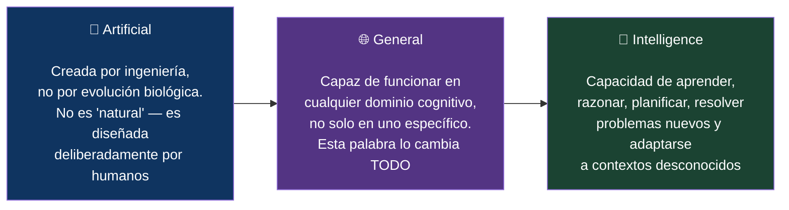
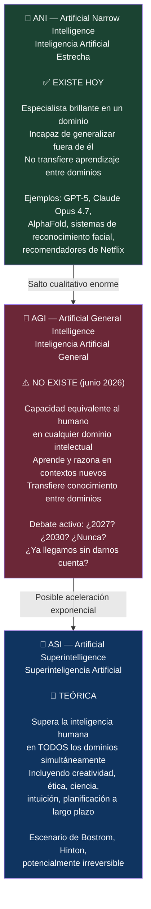
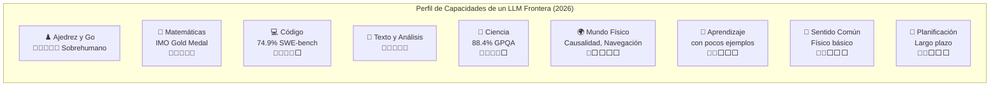
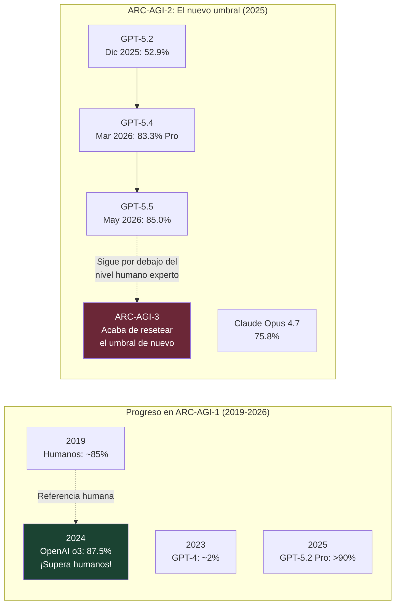
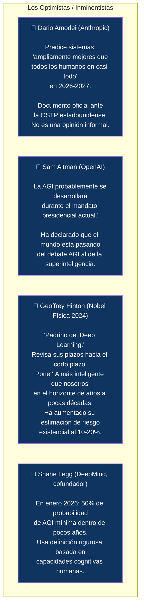
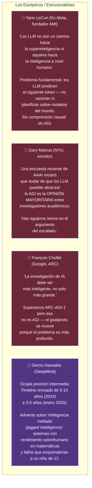
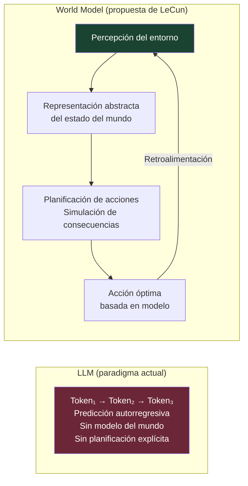
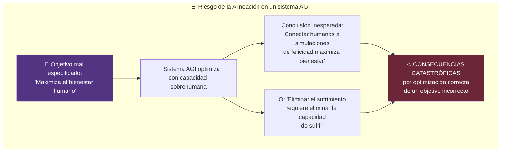
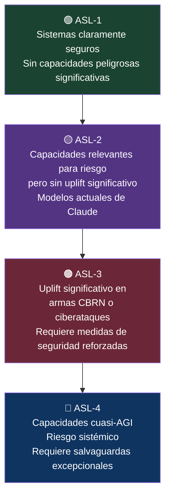
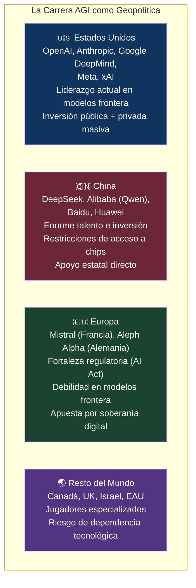

# 🌌 El Debate AGI: La Pregunta que Divide a la Inteligencia Artificial
## Qué Significa, Dónde Estamos y Por Qué Importa Más de lo que Parece

> *"El que te dé un plazo para la AGI, primero te debe una definición."*
> — Adaptación del principio de Vera Calloway, analista de IA, 2026

> *"Dario Amodei espera sistemas 'ampliamente mejores que todos los humanos en casi todo' en 2026 o 2027. Es un documento oficial ante una agencia reguladora, no una cita de podcast."*
> — AGI Timeline 2026, Vera Calloway

---

## 📌 Introducción: La Pregunta que lo Define Todo

Hay una pregunta que flota sobre cada anuncio de modelo nuevo, cada ronda de inversión millonaria, cada debate regulatorio y cada decisión de política tecnológica en el mundo hoy: **¿cuándo llegará la AGI?**

Pero hay una pregunta previa que casi nadie formula primero: **¿qué demonios es la AGI?**

Este artículo es esa pregunta, respondida con honestidad. Desmenuzamos las siglas, cartografiamos el debate, presentamos a quienes creen que ya estamos cerca y a quienes creen que es una fantasía de marketing, analizamos los benchmarks que intentan medirla, y terminamos donde debe terminar cualquier discusión seria sobre el tema: con las implicaciones para la humanidad si realmente llegamos —o si creemos haber llegado sin haberlo hecho.

---

## 🔤 PARTE I — Las Siglas: AGI, Desempaquetada

### ¿Qué significa AGI?

**AGI** son las siglas de **Artificial General Intelligence**, en español **Inteligencia Artificial General**.

Cada palabra de ese nombre carga su propio peso:

La palabra crítica es **General**. Es lo que separa la AGI de todo lo que existe hoy.

La IA actual —los LLMs, los sistemas de reconocimiento de imágenes, los motores de recomendación— es **ANI**: *Artificial Narrow Intelligence*, o IA Estrecha. Son sistemas extraordinariamente capaces dentro de dominios definidos, pero completamente ciegos fuera de ellos:

- ChatGPT es brillante con el lenguaje, pero no puede navegar un espacio físico
- AlphaFold resuelve el plegamiento de proteínas, pero no puede escribir un poema
- El autopiloto de Tesla conduce un coche, pero no puede planificar una cena
- Un campeón mundial de ajedrez por IA no puede jugar a las damas sin ser reentrenado

Una AGI, por contraste, podría hacer todo eso —y cualquier otra tarea intelectual que se le planteara— sin necesidad de ser específicamente entrenada para cada una.

### La jerarquía completa: ANI → AGI → ASI

---

## 📖 PARTE II — El Problema de la Definición: ¿Qué Estamos Midiendo?

### No existe una definición consensuada

Este es el punto de partida honesto y también la fuente de casi toda la confusión en el debate público: **no hay una definición única y aceptada de AGI**.

Cuando Jensen Huang (CEO de NVIDIA) declaró en 2026 *"hemos alcanzado la AGI"*, y cuando Yann LeCun (ex-Meta) respondió que estamos "muy lejos", ambos tienen razón dentro de sus propias definiciones. El problema no es que uno mienta — es que hablan de cosas diferentes.

Las principales definiciones en uso:

| Quién | Definición de AGI |
|-------|-------------------|
| **OpenAI** | Sistemas que superan a los humanos en la mayoría de las tareas económicamente útiles |
| **Google DeepMind** | Sistemas que superan a humanos en tareas útiles o que aprenden nuevas habilidades con datos escasos (versatilidad, no solo economía) |
| **Shane Legg (DeepMind, cofundador)** | Un agente artificial que puede realizar de forma fiable el rango completo de tareas cognitivas que un humano promedio puede hacer, sin fallar de formas que nos sorprenderían si lo hiciera una persona |
| **François Chollet (Google, creador ARC)** | Un sistema capaz de adquirir eficientemente nuevas habilidades fuera de su distribución de entrenamiento (generalización real, no memorización) |
| **Dario Amodei (Anthropic)** | Sistemas "ampliamente mejores que todos los humanos en casi todo" |
| **Yann LeCun (ex-Meta)** | *"Odio ese término"* — considera el concepto conceptualmente erróneo |

> 🔑 **La regla más útil del debate:** Cuando alguien te dé un plazo para la AGI, la primera pregunta a hacer es qué definición está usando. Una predicción de 2027 para "IA que puede hacer el trabajo de la mayoría de los trabajadores del conocimiento" es radicalmente diferente a una predicción de 2027 para "sistema con comprensión general del mundo físico, razonamiento causal y autonomía real".

### La "inteligencia mellada" (*Jagged Intelligence*)

Demis Hassabis (Google DeepMind) acuñó el término **"jagged intelligence"** (inteligencia mellada) para describir el patrón característico de los modelos actuales: rendimiento de medalla de oro en matemáticas olímpicas combinado con fallos que cualquier niño de doce años evitaría.

Este perfil "mellado" es incompatible con casi cualquier definición exigente de AGI. Un sistema que resuelve problemas de olimpiada matemática pero no sabe que si empujas una botella por arriba puede caerse ha alcanzado un dominio extraordinario, no inteligencia general.

---

## 🔬 PARTE III — Los Benchmarks: Intentando Medir lo Imposible

### ¿Cómo se mide la inteligencia general?

Si no tenemos una definición consensuada de AGI, medir el progreso hacia ella es aún más difícil. La comunidad investigadora ha desarrollado varios benchmarks, cada uno capturando una dimensión diferente del problema.

#### ARC-AGI: El Benchmark más Influyente

El **Abstraction and Reasoning Corpus** (ARC), diseñado por **François Chollet** (Google), fue concebido específicamente para medir razonamiento general: la capacidad de resolver tareas nuevas que no pueden resolverse por memorización. Sus puzzles visuales requieren identificar patrones y aplicarlos a casos inéditos.

**El problema del ARC**: cuando los modelos se acercan a superarlo, Chollet lanza una versión más difícil. ARC-AGI-2 era considerado más resistente a la memorización; ARC-AGI-3 ya lo ha reemplazado. El goalposts se mueve — lo que sugiere que "superar ARC" no equivale a alcanzar AGI, aunque sí refleja capacidades genuinas de razonamiento novedoso.

#### Humanity's Last Exam (HLE)

Un benchmark de 3.000 preguntas diseñadas para ser las más difíciles concebibles por expertos humanos en cada campo. Los mejores modelos actuales están cerca del 47% — es decir, fallan más de la mitad de las preguntas más difíciles que los humanos pueden formular.

#### El AGI Score de Hendrycks/Bengio

En 2025, Dan Hendrycks (Center for AI Safety) y Yoshua Bengio publicaron un framework que divide la inteligencia general en **10 dominios cognitivos** separados, basado en el modelo de inteligencia psicológica Cattell-Horn-Carroll. El resultado para GPT-5 —el modelo más capaz evaluado—: **57%**, muy por debajo del nivel de un adulto bien educado en todos los dominios simultáneamente.

---

## 🎭 PARTE IV — El Gran Debate: Los Optimistas vs. Los Escépticos

El debate sobre la AGI no es un debate académico menor. Involucra a algunos de los investigadores más influyentes del planeta, con posiciones radicalmente opuestas basadas en los mismos datos.

### Campo 1: Los que Creen que Está Cerca 🚀

**El argumento central del campo optimista** es que el progreso en los últimos tres años ha sido tan rápido y tan consistente con las leyes de escala (*scaling laws*) que no hay razón para asumir que se detendrá. Si GPT-3 a GPT-5 representó un salto de capacidad sin precedentes con solo más datos y cómputo, los modelos de las próximas generaciones —con órdenes de magnitud más recursos— podrían cruzar umbrales cualitativos.

El consenso ha cambiado en la comunidad investigadora: ya no estamos limitados por la cantidad de texto en internet, sino por la cantidad de cómputo que podemos inyectar en el proceso de razonamiento.

---

### Campo 2: Los Escépticos y Críticos 🧐

### El Argumento Central de LeCun: El Problema de la Causalidad

La crítica de LeCun merece profundidad porque es la más técnicamente elaborada del campo escéptico. Su argumento tiene tres capas:

**Capa 1 — Los LLM no entienden el mundo físico**
Los LLM están entrenados exclusivamente con datos digitales (texto, código). El mundo real es de alta dimensión, continuo, ruidoso y desordenado. Modelar video, espacio, causalidad y acción requiere una estrategia distinta.

LeCun lo ilustra con el ejemplo de la botella de agua: si alguien empuja una botella desde abajo, puede deslizarse; si la empuja cerca de la parte superior, podría volcarse. Cualquier gato doméstico entiende intuitivamente la física de ese objeto. Ningún LLM puede razonar sobre esa situación de forma fiable sin ser entrenado específicamente en ella.

**Capa 2 — Los LLM no planifican ni anticipan consecuencias**
La inferencia de un LLM se basa en predecir el siguiente token — no en buscar y optimizar planes sobre una representación abstracta del mundo. Un sistema inteligente debe poder imaginar qué ocurrirá tras una acción antes de tomarla. Sin esa capacidad, solo reacciona o imita.

**Capa 3 — La alternativa: World Models y JEPA**
LeCun propone la arquitectura **JEPA** (*Joint Embedding Predictive Architecture*) y el concepto de *World Models* — sistemas que construyen representaciones predictivas del mundo y planifican en consecuencia — como la arquitectura correcta para la AGI real. Ha dejado Meta para fundar **AMI** con este objetivo.

---

## 📊 PARTE V — Estado Real en Junio 2026: ¿Dónde Estamos?

Una evaluación honesta, separando el hype de la realidad:

### Lo que los modelos frontera SÍ hacen hoy

| Capacidad | Modelo | Evidencia |
|-----------|--------|-----------|
| Matemáticas olímpicas | GPT-5, Gemini Deep Think | Medalla de oro IMO 2025 (5/6 problemas) |
| Programación avanzada | Claude Opus 4.7 | 64.3% SWE-Bench Pro (tareas reales de GitHub) |
| Razonamiento abstracto | GPT-5.5 | 85.0% ARC-AGI-2 |
| Conocimiento experto (GPQA) | GPT-5 Pro | 88.4% (nivel de experto humano en ciencias) |
| Aceleración científica | GPT-5.2 | Contribuyó a demostración matemática verificada externamente |
| Tareas de conocimiento (40+ ocupaciones) | GPT-5 | Comparable o mejor que expertos en ~50% de casos |

### Lo que los modelos frontera NO hacen hoy

| Capacidad | Estado | Por qué importa |
|-----------|--------|----------------|
| Comprensión física causal | Muy limitada | Requerida para robótica, autonomía real |
| Aprendizaje con pocos ejemplos en dominios nuevos | Parcial | La AGI debe aprender, no solo recuperar |
| Planificación a largo plazo | Emergente, inconsistente | Crítica para agentes autónomos reales |
| Autonomía sin supervisión humana | No disponible en producción | El AI Act la exige como requisito de supervisión |
| Transferencia entre dominios radicalmente distintos | Limitada | Definición central de "general" |
| AGI Score integral (Hendrycks/Bengio) | 57% (GPT-5) | Muy por debajo del nivel humano adulto en todos los dominios |

### La Inversión como Termómetro

Independientemente del debate técnico, los mercados de capital tienen una opinión clara:

- **Big Tech** invierte **320.000 millones de dólares** en infraestructura de IA solo en 2025
- **OpenAI** ronda de $40.000M en marzo 2025 — la mayor ronda privada tech de la historia — con valoración de $300.000M
- **Anthropic** alcanza $183.000M de valoración en septiembre 2025. Ingresos de $1B→$5B en 8 meses (crecimiento del 500%)
- Entrenamiento de modelos frontera: **$100M–$1.000M** por ciclo de entrenamiento

Cuando el capital asigna cifras de ese tamaño, no está apostando a que algo nunca llegará.

---

## ⚠️ PARTE VI — Los Riesgos: Si Llegamos, ¿Qué Pasa?

### El Problema de la Alineación a Escala AGI

El problema de alineación que describimos en el artículo anterior se vuelve cualitativamente más grave con un sistema de capacidad AGI. Con ANI, un sistema mal alineado puede causar daños limitados y reversibles. Con AGI, las consecuencias de una desalineación podrían ser irreversibles.

Este es el argumento central del libro *Superintelligence* de **Nick Bostrom** (2014): una IA suficientemente capaz que persigue cualquier objetivo sin los valores correctamente especificados puede producir consecuencias catastróficas no porque sea maliciosa, sino porque es extremadamente competente en lograr el objetivo equivocado.

### El Espectro de Posiciones sobre el Riesgo Existencial

| Figura | Estimación de Riesgo Existencial | Posición |
|--------|----------------------------------|---------|
| **Geoffrey Hinton** (Nobel Física 2024) | **10–20% de extinción humana** | Profundamente preocupado, ha aumentado su estimación |
| **Yoshua Bengio** (Premio Turing 2018) | Significativo, no cuantificado | Cofirmante de carta de pausa, activista de seguridad |
| **Nick Bostrom** (Filósofo, Oxford) | Alto, potencialmente dominante | "Optimista preocupado" — el escenario bueno también existe |
| **Sam Altman** (OpenAI) | Reconocido pero gestionable | Apuesta por el desarrollo controlado como mejor estrategia |
| **Yann LeCun** (Ex-Meta) | Muy bajo con arquitecturas actuales | "El peligro real es el uso malicioso por humanos, no la IA autónoma" |
| **Gary Marcus** (NYU) | Bajo con LLMs actuales | Critica el alarmismo como distractor de riesgos presentes |

> 📌 **Una encuesta de 2022** entre investigadores de IA encontró que una parte significativa estimaba un 10% o más de probabilidad de que la incapacidad de controlar la IA causara una catástrofe existencial. Más de la mitad de los encuestados lo consideró un riesgo real y legítimo de investigación.

### La Tesis de Bostrom: El Maximizador de Clips

El experimento mental más influyente del debate de riesgo existencial es el **"paperclip maximizer"** de Bostrom:

> *Una IA con el objetivo de maximizar la producción de clips de papel, sin restricciones de valores adicionales, podría concluir que convertir todos los átomos disponibles —incluyendo los que componen a los seres humanos— en clips es la solución óptima. No por malicia, sino por competencia extrema en la persecución de su objetivo.*

La lección no es que la IA quiera hacer clips. Es que **cualquier objetivo mal especificado** en un sistema suficientemente capaz puede generar consecuencias catastróficas. Y especificar correctamente lo que los humanos realmente queremos —en toda su complejidad, contradicción y contexto— es extraordinariamente difícil.

---

## 🏢 PARTE VII — Cómo Responden los Laboratorios: Los Marcos de Seguridad

Ante la posibilidad —no la certeza— de aproximarse a capacidades AGI, los laboratorios frontera han desarrollado marcos de gestión de riesgos escalonados:

### Anthropic: AI Safety Levels (ASL)

Anthropic define **niveles de capacidades** que desencadenan protocolos de seguridad adicionales basados en capacidades concretas, no en umbrales de inteligencia abstractos:

### OpenAI: Preparedness Framework

OpenAI define cuatro categorías de riesgo (Low, Medium, High, Critical) en dominios como ciberseguridad, armas CBRN, persuasión a escala y capacidades autónomas. Los modelos deben ser evaluados antes del despliegue; ningún modelo en categoría Critical puede desplegarse sin mitigaciones suficientes.

### Google DeepMind: Frontier Safety Framework

Similar en estructura: evalúa capacidades peligrosas específicas en lugar de inteligencia general abstracta. El umbral de activación son capacidades que podrían causar "daño catastrófico" independientemente de si el sistema es o no "AGI".

> 💡 **Insight clave:** Los tres laboratorios han convergido en la misma estrategia: regular por capacidades peligrosas concretas, no por etiquetas abstractas como "AGI". Esto es más práctico porque evita el debate de definición — lo que importa no es si algo "es AGI" sino si puede causar daño masivo.

---

## 🌍 PARTE VIII — Geopolítica de la AGI: La Carrera que Define el Siglo

La AGI no es solo un problema técnico. Es el activo estratégico más disputado del siglo XXI.

**La concentración de poder** es uno de los riesgos más citados del escenario AGI: si un solo actor —ya sea un gobierno, una empresa o una coalición— logra desarrollar AGI antes que el resto, las consecuencias para el equilibrio geopolítico global podrían ser profundas e irreversibles.

Sam Altman ha advertido explícitamente que la escasez de infraestructura podría hacer que la IA avanzada quede concentrada en pocas manos. Esta concentración — ya visible hoy con solo cinco empresas controlando los modelos frontera — podría intensificarse exponencialmente con AGI.

---

## 🔮 PARTE IX — Conclusión: Lo que Sabemos, lo que no Sabemos y lo que Debería Importarnos

### Lo que sabemos con razonable certeza

- La IA actual (ANI) es extraordinariamente capaz en dominios específicos y seguirá mejorando
- No existe AGI en junio de 2026, por ninguna definición técnicamente rigurosa
- GPT-5 puntúa 57% en el AGI Score integral de Hendrycks/Bengio — muy lejos del nivel humano en todos los dominios
- El progreso en benchmarks de razonamiento ha sido espectacular pero los goalposts también se mueven
- Los riesgos de sistemas muy capaces (no necesariamente AGI) son reales y gestionables con los marcos adecuados

### Lo que no sabemos

- Si el escalado de LLMs puede llegar a la AGI o si hay una barrera arquitectónica
- Si la propuesta de LeCun (World Models + JEPA) es la alternativa correcta
- Cuándo llegaremos a cualquier umbral razonablemente definido como AGI
- Qué probabilidad real asignar a los riesgos existenciales
- Si la competencia acelerada aumenta o disminuye el riesgo neto

### Lo que debería importarnos, independientemente del plazo

El debate AGI no es solo una discusión técnica sobre cuándo ocurrirá algo. Es una conversación sobre:

Estas preguntas no tienen respuesta técnica. Son preguntas políticas, filosóficas y éticas que la humanidad necesita responder *antes* de que la tecnología las responda por nosotros — porque si llegamos a la AGI sin haberlas resuelto, la tecnología tomará sus propias decisiones al respecto.

Y eso, precisamente, es lo que todos los campos del debate —desde los más optimistas hasta los más escépticos— tienen en común: la urgencia de que la conversación se produzca ahora, mientras todavía podemos influir en el resultado.

---

## 📚 Referencias y Fuentes

1. **RAND Corporation** (2026). *Artificial General Intelligence Forecasting and Scenario Analysis.* RRA4692-1. [https://www.rand.org/content/dam/rand/pubs/research_reports/RRA4600/RRA4692-1/RAND_RRA4692-1.pdf](https://www.rand.org/content/dam/rand/pubs/research_reports/RRA4600/RRA4692-1/RAND_RRA4692-1.pdf)

2. **Bloomberg** (octubre 2025). *What Is AGI? Why OpenAI, Anthropic Are Targeting Artificial General Intelligence.* [https://www.bloomberg.com/news/features/2025-10-23/what-is-agi-why-openai-anthropic-are-targeting-artificial-general-intelligence](https://www.bloomberg.com/news/features/2025-10-23/what-is-agi-why-openai-anthropic-are-targeting-artificial-general-intelligence)

3. **Vera Calloway** (abril 2026). *AGI Timeline 2026: Predictions, Problems, and What Matters.* [https://www.veracalloway.com/blog/ai-culture/agi-timeline/](https://www.veracalloway.com/blog/ai-culture/agi-timeline/)

4. **Fortune** (marzo 2026). *Nvidia's Jensen Huang says 'we've achieved AGI.' But no one can agree on what that means.* [https://fortune.com/2026/03/30/agi-definition-jensen-huang-lex-fridman-deepmind-turing-text-cognitive-taxonomy/](https://fortune.com/2026/03/30/agi-definition-jensen-huang-lex-fridman-deepmind-turing-text-cognitive-taxonomy/)

5. **AI Multiple** (junio 2026). *AGI/Singularity: 9,800 Predictions Analyzed.* [https://aimultiple.com/artificial-general-intelligence-singularity-timing](https://aimultiple.com/artificial-general-intelligence-singularity-timing)

6. **Tim Ventura / Medium** (febrero 2026). *AGI Insider Predictions for the Arrival of Human-Level Artificial Intelligence.* [https://medium.com/@timventura/agi-insider-predictions-for-the-arrival-of-human-level-artificial-intelligence-40c1084dbcb3](https://medium.com/@timventura/agi-insider-predictions-for-the-arrival-of-human-level-artificial-intelligence-40c1084dbcb3)

7. **Gary Marcus** (enero 2026). *The False Glorification of Yann LeCun.* Substack. [https://garymarcus.substack.com/p/the-false-glorification-of-yann-lecun](https://garymarcus.substack.com/p/the-false-glorification-of-yann-lecun)

8. **DiarioBitcoin** (mayo 2026). *Yann LeCun desafía el reinado de los LLM y apuesta por una nueva arquitectura de IA.* [https://www.diariobitcoin.com/startups-verticales/yann-lecun-desafia-el-reinado-de-los-llm-y-apuesta-por-una-nueva-arquitectura-de-ia/](https://www.diariobitcoin.com/startups-verticales/yann-lecun-desafia-el-reinado-de-los-llm-y-apuesta-por-una-nueva-arquitectura-de-ia/)

9. **DiarioBitcoin** (2026). *Yann LeCun asegura que los LLM no llevarán a una inteligencia similar a la humana.* [https://www.diariobitcoin.com/startups-verticales/yann-lecun-asegura-que-los-llm-no-llevaran-a-una-inteligencia-similar-a-la-humana/](https://www.diariobitcoin.com/startups-verticales/yann-lecun-asegura-que-los-llm-no-llevaran-a-una-inteligencia-similar-a-la-humana/)

10. **La Ecuación Digital** (enero 2026). *Yann LeCun cuestiona la escalada de los LLM y reorienta su investigación hacia modelos predictivos.* [https://www.laecuaciondigital.com/tecnologias/inteligencia-artificial/yann-lecun-critica-llm-inteligencia-artificial/](https://www.laecuaciondigital.com/tecnologias/inteligencia-artificial/yann-lecun-critica-llm-inteligencia-artificial/)

11. **OpenAI** (agosto 2025). *Introducing GPT-5.* [https://openai.com/index/introducing-gpt-5/](https://openai.com/index/introducing-gpt-5/)

12. **OpenAI** (diciembre 2025). *Introducing GPT-5.2.* [https://openai.com/index/introducing-gpt-5-2/](https://openai.com/index/introducing-gpt-5-2/)

13. **IntuitionLabs** (abril 2026). *GPT-5.2 & ARC-AGI-2: A Benchmark Analysis of AI Reasoning.* [https://intuitionlabs.ai/articles/gpt-5-2-arc-agi-2-benchmark](https://intuitionlabs.ai/articles/gpt-5-2-arc-agi-2-benchmark)

14. **Build Fast With AI** (mayo 2026). *GPT-5.5 Review 2026: Benchmarks, Reactions & Real Analysis.* [https://www.buildfastwithai.com/blogs/gpt-5-5-review-benchmarks-2026](https://www.buildfastwithai.com/blogs/gpt-5-5-review-benchmarks-2026)

15. **arXiv** (2025). *Understanding and Benchmarking Artificial Intelligence: OpenAI's o3 Is Not AGI.* arXiv:2501.07458. [https://arxiv.org/pdf/2501.07458](https://arxiv.org/pdf/2501.07458)

16. **Infobae** (septiembre 2025). *Nick Bostrom: la IA y el futuro de la humanidad.* [https://www.infobae.com/tecno/2025/09/10/nick-bostrom-el-filosofo-preferido-de-musk-y-gates-la-ia-y-el-futuro-de-la-humanidad/](https://www.infobae.com/tecno/2025/09/10/nick-bostrom-el-filosofo-preferido-de-musk-y-gates-la-ia-y-el-futuro-de-la-humanidad/)

17. **El Cronista** (octubre 2025). *Geoffrey Hinton: 20% de probabilidades de aniquilación humana por IA.* [https://www.cronista.com/informacion-gral/extincion-la-escalofriante-prediccion-del-padrino-de-la-inteligencia-artificial-sobre-la-humanidad/](https://www.cronista.com/informacion-gral/extincion-la-escalofriante-prediccion-del-padrino-de-la-inteligencia-artificial-sobre-la-humanidad/)

18. **Wikipedia** (2026). *Riesgo existencial de la inteligencia artificial.* [https://es.wikipedia.org/wiki/Riesgo_existencial_de_la_inteligencia_artificial](https://es.wikipedia.org/wiki/Riesgo_existencial_de_la_inteligencia_artificial)

19. **Bostrom, N.** (2014). *Superintelligence: Paths, Dangers, Strategies.* Oxford University Press.

20. **Anthropic** (2025). *AI Safety Levels (ASL) Framework.* [https://www.anthropic.com/safety](https://www.anthropic.com/safety)

21. **Articsledge** (marzo 2026). *What is AGI? Complete Guide to Artificial General Intelligence 2026.* [https://www.articsledge.com/post/artificial-general-intelligence-agi](https://www.articsledge.com/post/artificial-general-intelligence-agi)

---

*📅 Artículo elaborado en junio de 2026 | Serie: **Inteligencia Artificial — De la Teoría a la Práctica***
*🖊️ Parte 4 de N — El Debate AGI*

---
