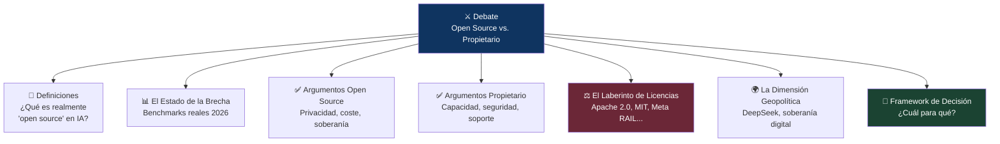
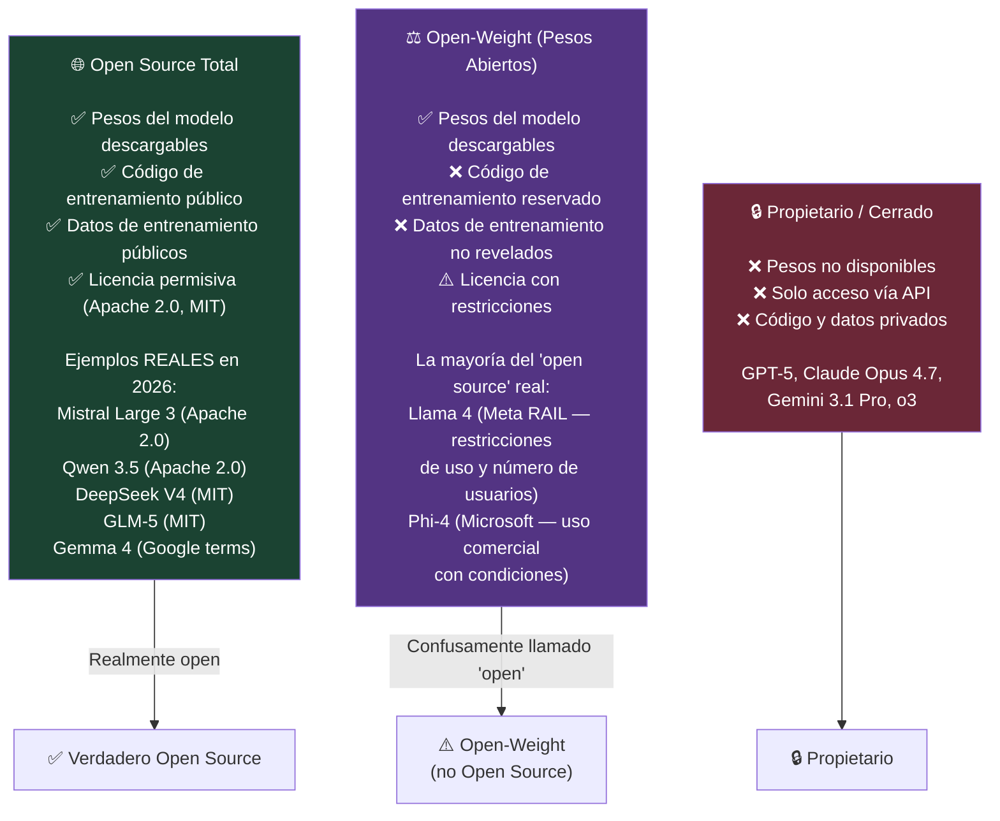
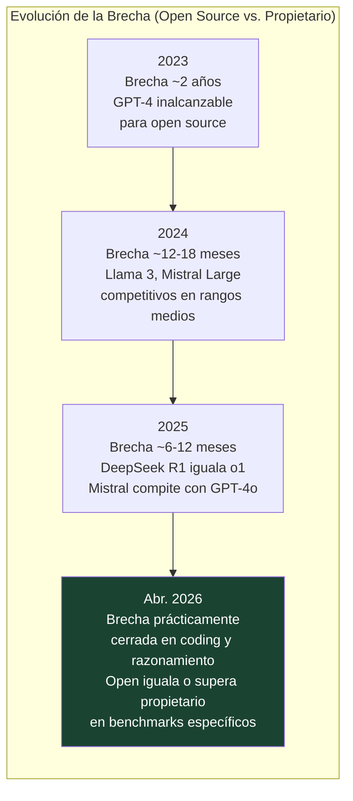
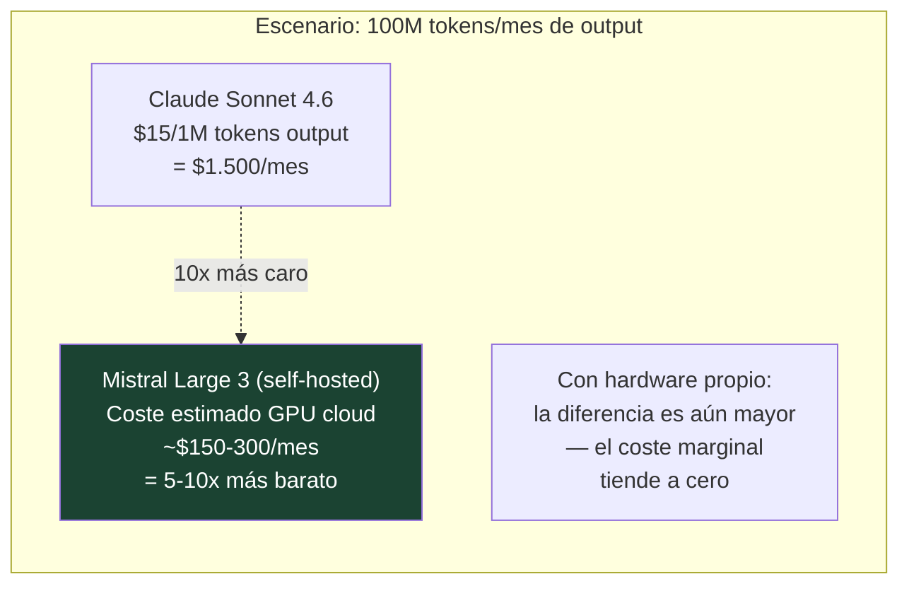
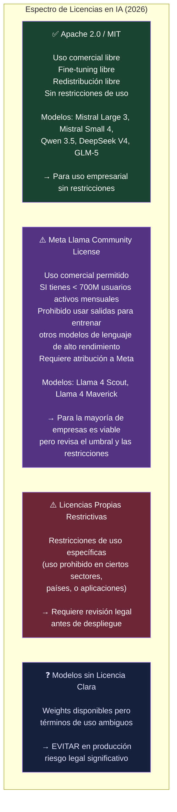
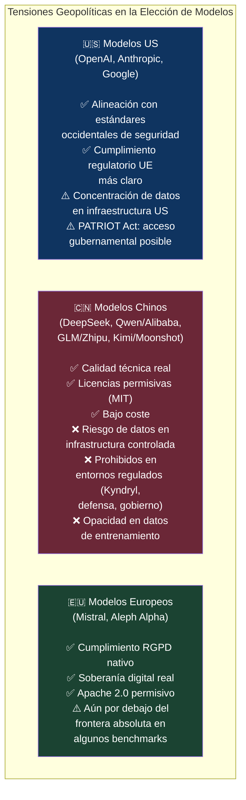
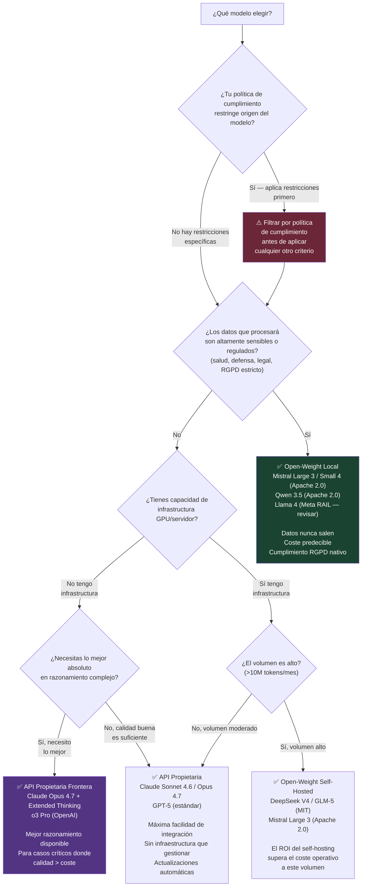

# ⚔️ Open Source vs. Modelos Propietarios
## El Debate que Define la Soberanía Tecnológica en IA

> *"2025 fue el año en que el open source cerró la brecha con los modelos propietarios. En 2026, están a la par en muchas áreas — o por delante."*
> — Till Freitag, abril 2026

> *"Las empresas no deben elegir un LLM solo porque ocupa el primer lugar en un leaderboard. Necesitan claridad de licencia, control de despliegue, seguridad, privacidad de datos, observabilidad, output estructurado, previsibilidad de costes e independencia del vendor."*
> — AceCloud AI, mayo 2026

---

## 📌 Introducción

Durante años, el debate fue simple: los modelos propietarios (GPT-4, Claude, Gemini) eran claramente superiores, y los modelos open source eran para experimentación. Ese debate ha terminado. En 2026, modelos de pesos abiertos como GLM-5.1, MiniMax M2.5, DeepSeek V4 o Qwen 3.5 igualan o superan a modelos propietarios en benchmarks específicos — incluyendo codificación, razonamiento matemático y tareas agénticas.

Pero eso no significa que la decisión sea obvia. Significa que ahora depende de **otras variables**: licencias, soberanía de datos, coste de infraestructura, cumplimiento normativo, alineación de seguridad, y estrategia de largo plazo. Este artículo desmonta el debate con datos reales de 2026 y ofrece un framework de decisión práctico.

---

## 🗺️ Mapa del Debate

---

## 📖 PARTE I — Definiciones: "Open Source" en IA No es lo que Crees

El primer problema del debate es terminológico. En software tradicional, "open source" significa que el código fuente es público y libremente modificable. En IA, la situación es mucho más compleja:

> ⚠️ **El detalle crítico:** <cite index="157-1">Las licencias son donde "open source" se complica. Algunos modelos son verdaderamente permisivos (Apache 2.0, MIT), mientras que otros vienen con límites de uso, restricciones geográficas, o prohibiciones de entrenar modelos derivados. Hay que leer la letra pequeña antes de construir un producto sobre cualquiera de ellos.</cite>

La distinción práctica que más importa para empresas: **¿puedo descargar y ejecutar los pesos localmente?** Si sí, es open-weight al menos. Si la licencia además lo permite para uso comercial sin restricciones, es genuinamente open source.

---

## 📊 PARTE II — El Estado Real de la Brecha en 2026

### La convergencia que nadie predijo en 2023

### Benchmarks clave a junio 2026

<cite index="159-1">La tendencia clave en open source para 2026: la brecha con los modelos propietarios se ha cerrado efectivamente en tareas de codificación. MiniMax M2.5 logra 80.2% en SWE-bench, igualando a Claude Opus 4.6 (80.8%), y GLM-5 lidera el Arena Elo entre modelos abiertos con 1451. Los modelos con licencia MIT/Apache 2.0 se aproximan a los modelos propietarios frontera en casi todos los benchmarks, con un coste por token 10-100 veces inferior.</cite>

| Modelo | Tipo | SWE-Bench | MMLU | Licencia | $/1M tokens (aprox.) |
|--------|------|-----------|------|---------|----------------------|
| **Claude Opus 4.7** | Propietario | 64.3% | ~90% | Propietario | $75 output |
| **GPT-5.4** | Propietario | 57.7% | ~91% | Propietario | $10-40 output |
| **GLM-5.1** | Open-Weight | **58.4%** 🥇 | ~88% | MIT | $0.1-0.5 self-hosted |
| **MiniMax M2.5** | Open-Weight | 80.2% | ~87% | Apache 2.0 | $0.1-0.5 self-hosted |
| **DeepSeek V4** | Open-Weight | ~75% | ~88% | MIT | $0.1-0.3 self-hosted |
| **Llama 4 Maverick** | Open-Weight | ~70% | **85.5%** | Meta RAIL | $0.1-0.4 self-hosted |
| **Mistral Large 3** | Open-Weight | ~65% | ~85% | Apache 2.0 | $0.1-0.4 self-hosted |
| **Qwen 3.5** | Open-Weight | 76.4% | ~84% | Apache 2.0 | $0.05-0.2 self-hosted |

> 💡 **La lectura correcta:** Los modelos propietarios frontera (Claude Opus 4.7, o3 Pro) siguen liderando en **razonamiento complejo general, seguridad/alineación y tareas multimodales avanzadas**. En **codificación, RAG, y tareas de dominio específico**, los mejores open-weight ya los igualan o superan a una fracción del coste.

---

## ✅ PARTE III — Los Argumentos del Open Source

### 3.1 🔒 Privacidad y Soberanía de Datos

Este es el argumento más poderoso y el menos cuestionable. Con un modelo open-weight desplegado localmente:

- **Ningún dato sale del perímetro de la organización** — crítico para datos de salud, legal, defensa, financiero
- **Cumplimiento RGPD nativo** — no hay transferencia de datos a terceros, no hay cláusulas de procesamiento de datos que gestionar
- **Cumplimiento AI Act más simple** — el control del sistema es total, la trazabilidad es nativa
- **Sin logs en servidores externos** — conversaciones, documentos internos, código propietario permanecen locales

<cite index="162-1">Para empresas, esto significa más control, menos dependencia del vendor, y mejor cumplimiento GDPR.</cite>

### 3.2 💰 Coste: La Matemática a Escala

La diferencia de coste entre APIs propietarias y self-hosting es dramática a escala:

<cite index="159-1">El coste por token de los modelos con licencia MIT/Apache 2.0 es 10-100 veces inferior al de los propietarios.</cite> Para organizaciones con alto volumen de inferencia, esta diferencia justifica inversión en infraestructura propia incluso considerando los costes de operación.

### 3.3 🔧 Personalización Sin Límites

Con acceso a los pesos, puedes:
- **Fine-tuning completo** en datos propietarios sin compartirlos con nadie
- **Quantización** para optimizar latencia/coste según tu hardware
- **Modificación de la arquitectura** para casos de uso muy específicos
- **Despliegue en edge** — en dispositivos, en zonas sin conectividad, en entornos air-gapped

### 3.4 🏛️ Independencia del Vendor

Las APIs propietarias son servicios con términos de uso que pueden cambiar:
- Precios pueden aumentar sin previo aviso
- Capacidades pueden limitarse o modificarse
- El servicio puede discontinuarse
- Las políticas de uso aceptable pueden excluir tu caso de uso

Con modelos open-weight, los pesos que tienes hoy funcionarán en cinco años. La independencia operativa es total.

### 3.5 🔬 Auditabilidad e Investigación

Los modelos open source pueden ser auditados, investigados y mejorados por la comunidad. Para organizaciones que necesitan justificar técnicamente sus sistemas de IA ante reguladores, la auditabilidad del modelo es una ventaja significativa. Permite también detectar sesgos, vulnerabilidades y comportamientos inesperados de forma independiente.

---

## ✅ PARTE IV — Los Argumentos de los Modelos Propietarios

### 4.1 🧠 Capacidad en la Frontera Absoluta

En tareas de razonamiento muy complejo, los modelos propietarios siguen liderando. o3 Pro de OpenAI, Claude Opus 4.7 con Extended Thinking, y Gemini 3.1 Pro en multimodal mantienen ventajas reales en:

- **Razonamiento de múltiples pasos** en dominios complejos
- **Humanity's Last Exam** y benchmarks de dificultad extrema
- **Seguridad y alineación** — inversión desproporcionada de los laboratorios propietarios
- **Multimodalidad avanzada** — integración nativa de texto, imagen, audio, video

Para tareas que requieren lo mejor disponible sin importar el coste, los propietarios siguen siendo la opción.

### 4.2 🛡️ Seguridad y Alineación

Los laboratorios propietarios —especialmente Anthropic y OpenAI— invierten recursos masivos en alineación, evaluación de riesgos y red teaming. Los modelos propietarios tienen:

- **Evaluaciones ASL/Preparedness** antes de cada release
- **RLHF extensivo** con evaluadores bien entrenados
- **Constitutional AI / RLAIF** para alineación escalable
- **Guardrails integrados** probados en producción con millones de usuarios

Los modelos open-weight pueden ser fine-tuned para eliminar sus restricciones de seguridad — lo que es una ventaja para investigadores y una vulnerabilidad para despliegues descuidados.

### 4.3 ⚡ Facilidad de Integración y SLA

Con una API propietaria:
- **Cero infraestructura** que gestionar
- **Escalado automático** — picos de tráfico absorbidos sin planificación
- **SLA garantizado** con soporte empresarial
- **Actualizaciones automáticas** — siempre la última versión sin esfuerzo
- **Ecosistema de herramientas** (Claude Code, GPT Store, Gemini extensions) maduro

Para equipos pequeños o proyectos en fases tempranas, el coste de la infraestructura self-hosted supera el ahorro en tokens.

### 4.4 🔄 Velocidad de Innovación

Los laboratorios propietarios lanzan mejoras continuas — nuevas capacidades, mejor razonamiento, contexto extendido — que los usuarios de API reciben automáticamente. Seguir el ritmo de innovación con modelos self-hosted requiere ciclos de actualización, evaluación y redepliegue que consumen recursos de ingeniería.

---

## ⚖️ PARTE V — El Laberinto de Licencias

La licencia es la variable más ignorada y más importante en la decisión. No todos los "open source" son iguales:

> 🔑 **Regla práctica:** Si la licencia es ambigua o no es Apache 2.0 / MIT, consulta a legal antes de construir un producto sobre ese modelo. El coste de un problema de licencia supera ampliamente el coste de la revisión previa.

---

## 🌍 PARTE VI — La Dimensión Geopolítica

El debate open source vs. propietario tiene una dimensión que trasciende la tecnología: **la soberanía digital y la geopolítica de la IA**.

### DeepSeek y el shock de enero 2025

En enero de 2025, DeepSeek R1 — desarrollado en China, entrenado por 5,6 millones de dólares frente a los cientos de millones de sus competidores, y publicado con licencia MIT — igualó el rendimiento de OpenAI o1. El impacto fue sísmico:

- Las acciones de NVIDIA cayeron un 17% en un día ($593.000M de capitalización borrados)
- El modelo fue descargado millones de veces en 48 horas
- Demostró que la ventaja de los laboratorios occidentales en eficiencia no era tan absoluta como se asumía

Para entornos corporativos con restricciones de cumplimiento — como el entorno Kyndryl/masorange con prohibición de modelos de origen chino — esta dimensión es determinante. La calidad técnica de DeepSeek o Qwen es irrelevante si su uso está prohibido por política de cumplimiento.

---

## 🧭 PARTE VII — Framework de Decisión: ¿Cuál para Qué?

Con todos los factores sobre la mesa, aquí el árbol de decisión práctico:

### La Respuesta Pragmática: Estrategia Híbrida

En la práctica, las organizaciones maduras de 2026 no eligen uno u otro — usan ambos estratégicamente:

| Capa | Modelo | Razón |
|------|--------|-------|
| **Tareas críticas / datos sensibles** | Open-weight local (Mistral, Qwen) | Privacidad, cumplimiento, coste a escala |
| **Tareas complejas de alto valor** | Claude Opus 4.7 / o3 Pro (API) | Máxima capacidad cuando importa |
| **Tareas de volumen medio** | Claude Sonnet 4.6 (API) | Balance calidad/coste |
| **Experimentación y dev** | Open-weight local (Llama 4, Mistral Small) | Cero coste, libertad de prueba |
| **Modelos especializados** | Fine-tuning sobre open-weight | Máxima eficiencia en tareas repetitivas |

---

## 🔮 Conclusión: El Debate Ha Evolucionado

El debate ya no es "open source vs. propietario" como si fueran campos irreconciliables. Es un debate sobre **qué combinación de modelos sirve mejor a los objetivos de cada organización** en función de sus datos, su regulación, su presupuesto y su estrategia tecnológica.

Lo que sí es claro en 2026:

- **El open source ha ganado la batalla de la legitimidad** — nadie puede ya descartar los modelos abiertos como inferiores en todos los dominios
- **Los modelos propietarios mantienen ventajas reales** en la frontera absoluta del razonamiento y en la facilidad de integración
- **La licencia importa tanto como el rendimiento** — y más que el rendimiento en entornos regulados
- **La geopolítica es una variable técnica** — el origen del modelo tiene implicaciones de cumplimiento que no pueden ignorarse
- **La soberanía digital es un activo estratégico** — depender completamente de APIs de tres empresas privadas estadounidenses es un riesgo que muchas organizaciones europeas ya están gestionando activamente

El profesional de IA en 2026 no elige entre open source y propietario. Entiende ambos, conoce sus trade-offs, y construye la arquitectura que mejor sirve a los objetivos reales de su organización.

---

## 📚 Referencias

1. **Till Freitag** (abr. 2026). *Open-Source LLMs Compared 2026 — 25+ Models.* [https://till-freitag.com/en/blog/open-source-llm-comparison](https://till-freitag.com/en/blog/open-source-llm-comparison)
2. **AceCloud AI** (may. 2026). *Best Open Source LLMs In 2026: Benchmarks, Licenses And GPU Deployment Guide.* [https://acecloud.ai/blog/best-open-source-llms/](https://acecloud.ai/blog/best-open-source-llms/)
3. **Lushbinary** (abr. 2026). *Best Open-Source LLMs April 2026: Benchmarks, Licensing & Deployment Guide.* [https://lushbinary.com/blog/best-open-source-llms-april-2026-comparison-guide/](https://lushbinary.com/blog/best-open-source-llms-april-2026-comparison-guide/)
4. **iternal.ai** (jun. 2026). *Which LLM to Choose in 2026? Selection Guide + Benchmarks.* [https://iternal.ai/llm-selection-guide](https://iternal.ai/llm-selection-guide)
5. **ComputingForGeeks** (mar. 2026). *Open Source LLM Comparison Table 2026.* [https://computingforgeeks.com/open-source-llm-comparison/](https://computingforgeeks.com/open-source-llm-comparison/)
6. **Kairntech** (abr. 2026). *Top Open-Source LLMs 2026: The Best Models & Comparison.* [https://kairntech.com/blog/articles/top-open-source-llm-models-in-2026/](https://kairntech.com/blog/articles/top-open-source-llm-models-in-2026/)
7. **Pinggy** (jun. 2026). *Best Open Source Self-Hosted LLMs for Coding in 2026.* [https://pinggy.io/blog/best_open_source_self_hosted_llms_for_coding/](https://pinggy.io/blog/best_open_source_self_hosted_llms_for_coding/)
8. **TECHSY** (jun. 2026). *Best Open-Source LLM 2026: 8 Tested, 3 Beat GPT-4.* [https://techsy.io/en/blog/best-open-source-llms-2026](https://techsy.io/en/blog/best-open-source-llms-2026)
9. **CodeSOTA** (2026). *Open Source LLM Leaderboard 2025–2026.* [https://www.codesota.com/llm/open-models](https://www.codesota.com/llm/open-models)
10. **Firecrawl** (jun. 2026). *The best open source frameworks for building AI agents in 2026.* [https://www.firecrawl.dev/blog/best-open-source-agent-frameworks](https://www.firecrawl.dev/blog/best-open-source-agent-frameworks)
11. **Touvron, H. et al.** (2023). *Llama 2: Open Foundation and Fine-Tuned Chat Models.* Meta AI. arXiv:2307.09288.
12. **DeepSeek** (ene. 2025). *DeepSeek-R1: Incentivizing Reasoning Capability in LLMs via Reinforcement Learning.* arXiv:2501.12948.

---

*📅 Artículos elaborados en junio de 2026 | Serie: **Inteligencia Artificial — De la Teoría a la Práctica***
*🖊️ Artículos: Sistemas Agénticos + Debate Open Source vs. Propietario*

---
