# 🧠 Computing Machinery and Intelligence (1950)
## *Alan Turing y el Nacimiento de la Inteligencia Artificial*

> *"I propose to consider the question, 'Can machines think?'"*
> — Alan Mathison Turing, 1950

---

## 📋 Índice

1. [Contexto Histórico](#contexto-histórico)
2. [El Autor: Alan Mathison Turing](#el-autor)
3. [El Juego de Imitación — The Imitation Game](#el-juego-de-imitación)
4. [Críticas y Objeciones que Turing Anticipó](#críticas-y-objeciones)
5. [Las Máquinas Digitales Discretas](#las-máquinas-digitales-discretas)
6. [¿Pueden las Máquinas Pensar? — Análisis Profundo](#pueden-las-máquinas-pensar)
7. [El Aprendizaje de las Máquinas — Child Machines](#el-aprendizaje-de-las-máquinas)
8. [Impacto y Legado en la IA Moderna](#impacto-y-legado)
9. [Vigencia en la Era de los LLMs](#vigencia-en-la-era-de-los-llms)
10. [Conclusiones](#conclusiones)

---

## 🗺️ 1. Contexto Histórico

El año es **1950**. Europa aún cicatriza las heridas de la Segunda Guerra Mundial. Los primeros computadores electrónicos — ENIAC, EDSAC, Manchester Mark 1 — apenas balbuceaban sus primeras instrucciones en silicio y válvulas de vacío. La palabra *"inteligencia artificial"* no existía aún como concepto formalizado (ese término lo acuñaría John McCarthy en 1956, en Dartmouth). Y sin embargo, un matemático inglés de 37 años, que había pasado la guerra descifrando los códigos Enigma en Bletchley Park, publicó en la revista *Mind* un artículo de 34 páginas que cambiaría para siempre la historia del pensamiento computacional.

Ese artículo se llamaba **"Computing Machinery and Intelligence"**, y su autor era **Alan Mathison Turing**.

```
Línea de tiempo del contexto:

1936 ──► Turing publica "On Computable Numbers" — nace la Máquina de Turing
1943 ──► Colossus descifra Lorenz en Bletchley Park
1945 ──► ENIAC, primer computador electrónico de propósito general
1950 ──► "Computing Machinery and Intelligence" publicado en Mind
1956 ──► Conferencia de Dartmouth — nace oficialmente la IA como campo
1966 ──► ELIZA, primer chatbot de historia (Joseph Weizenbaum)
1997 ──► Deep Blue derrota a Kasparov en ajedrez
2023 ──► ChatGPT supera 100M usuarios — ¿Test de Turing superado?
```

En ese 1950 de posguerra, preguntar si **una máquina podía pensar** no era filosofía de café. Era una pregunta técnica, filosófica y casi existencial que tocaba el núcleo de lo que significa ser humano. Turing lo sabía. Y en lugar de atacar la pregunta de frente — algo que, como demostraría él mismo, era impreciso e irresoluble en esos términos — propuso un experimento mental que se convertiría en uno de los conceptos más citados, debatidos y malinterpretados de toda la historia de la ciencia.

---

## 👤 2. El Autor: Alan Mathison Turing

Antes de sumergirnos en el artículo, conviene entender quién era el hombre detrás de él.

**Alan Mathison Turing** (Londres, 23 de junio de 1912 — Wilmslow, 7 de junio de 1954) fue matemático, lógico, criptógrafo, filósofo y pionero de la informática. Sus contribuciones abarcan:

- 📐 **1936** — La *Máquina de Turing*: modelo teórico que define los límites de lo computable, fundamento de toda la informática moderna.
- 🔐 **1939-1945** — Trabajo en Bletchley Park, donde lideró el equipo que descifró Enigma, acortando probablemente la guerra en dos años.
- 💻 **1945-1950** — Diseño del ACE (Automatic Computing Engine) en el NPL, y trabajo en Manchester con el Mark 1.
- 🧠 **1950** — *"Computing Machinery and Intelligence"*, la semilla de la IA.
- 🌱 **1952** — *"The Chemical Basis of Morphogenesis"*, fundamento de la biología teórica moderna.

Su vida terminó trágicamente en 1954 — oficial y controversialmente catalogada como suicidio por cianuro — después de haber sido procesado y químicamente castrado por el Estado británico debido a su homosexualidad. En 2013, la Reina Isabel II le otorgó el indulto póstumo. En 2021, su imagen apareció en el billete de 50 libras esterlinas.

> 🏆 El **Premio Turing** — el Nobel de la Informática — lleva su nombre desde 1966.

---

## 🎮 3. El Juego de Imitación — *The Imitation Game*

### 3.1 La pregunta original

El artículo abre con una declaración disruptiva:

> *"I propose to consider the question, 'Can machines think?' This should begin with definitions of the meaning of the terms 'machine' and 'think'."*

Turing observa que si intentamos definir "pensar" y "máquina" de manera ordinaria —basada en las opiniones populares— llegaríamos a definiciones absurdas o inútiles. Su solución es brillante por su elegancia: **reemplazar la pregunta por un experimento operacional**.

### 3.2 El juego original de tres participantes

El punto de partida de Turing no es el test hombre-máquina que popularmente se conoce. Es algo más sutil. El **juego de imitación original** tiene **tres participantes**:

- 🧑 **A** — Un hombre
- 👩 **B** — Una mujer
- 🕵️ **C** — El interrogador (puede ser de cualquier género)

El interrogador está en una habitación separada. El objetivo de **A** es *imitar* a una mujer y engañar al interrogador. El objetivo de **B** es ayudar al interrogador a identificar correctamente quién es quién. La comunicación se hace por escrito (o teletipo) para eliminar pistas de voz o apariencia.

Turing usa este juego como **analogía**, no como el test final. A continuación, lanza la pregunta verdadera:

> *"What will happen when a machine takes the part of A in this game? Will the interrogator decide wrongly as often when the game is played like this as he does when the game is played between a man and a woman?"*

### 3.3 El Test de Turing como lo conocemos hoy

La versión simplificada — y más famosa — es la **versión binaria**: un humano interrogador dialoga con dos entidades (una máquina y un humano) sin saber cuál es cuál. Si el interrogador no puede distinguir de manera consistente cuál es la máquina, se dice que la máquina ha pasado el test.

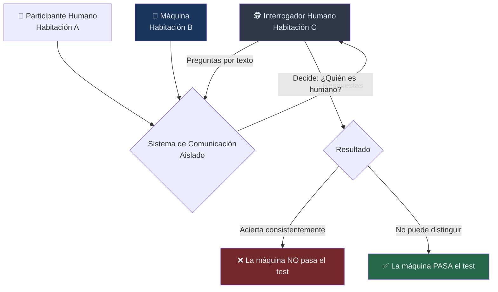

### 3.4 Por qué esta pregunta es más inteligente que la original

Turing argumenta que preguntar *"¿puede una máquina pensar?"* es filosóficamente estéril porque:

1. **"Pensar"** no tiene definición operacional clara
2. Caemos en el **solipsismo** (teoría filosófica que afirma que la propia mente es lo único de lo cuya existencia se puede tener certeza): yo solo sé que yo pienso, no puedo saberlo de nadie más
3. El debate se vuelve semántico, no científico

Al reemplazarlo por *"¿puede una máquina engañar a un humano haciéndole creer que habla con otro humano?"*, Turing convierte la pregunta en **testeable, observable y falsificable**. Es un movimiento filosófico de enorme sofisticación, digno de la tradición del positivismo lógico que dominaba la filosofía anglosajona de la época.

---

## ⚔️ 4. Críticas y Objeciones que Turing Anticipó

Uno de los aspectos más asombrosos del artículo es que Turing **anticipa y responde nueve objeciones** que imagina le harán a su propuesta. Esta sección es la más rica filosóficamente del texto.

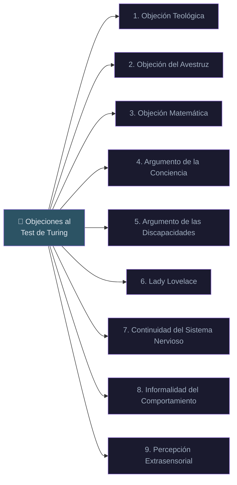

### 4.1 🙏 La Objeción Teológica

*"Pensar es una función del alma inmortal del hombre. Dios ha otorgado el alma inmortal a los hombres y mujeres, pero no a los animales ni a las máquinas."*

**Respuesta de Turing:** Turing responde con elegancia que esta objeción limita el poder omnipotente de Dios. Si Dios puede dar alma a los humanos, ¿no podría igualmente darla a una máquina si lo deseara? Además, señala que este argumento fue usado históricamente para negar alma a personas de otras razas o culturas. Es un argumento de autoridad teológica, no de razón.

### 4.2 🙈 La Objeción del Avestruz

*"Las consecuencias de que las máquinas pudieran pensar serían demasiado terroríficas; esperemos y creamos que no pueden."*

**Respuesta de Turing:** Reconoce que esta objeción es emocionalmente honesta pero intelectualmente deshonesta. El miedo a una conclusión no es argumento contra ella.

### 4.3 📐 La Objeción Matemática

*"El teorema de incompletitud de Gödel (1931) muestra que hay límites a lo que pueden demostrar los sistemas formales. Por tanto, las máquinas tienen limitaciones que los humanos no tienen."*

Esta es la objeción más técnica y más interesante. Se basa en los resultados de **Gödel** y también en el propio trabajo de Turing sobre los problemas de decisión (*Entscheidungsproblem*).

**Respuesta de Turing:** Turing concede que hay afirmaciones verdaderas que una máquina no puede demostrar dentro de su sistema formal. Pero señala dos puntas críticas:

1. No sabemos que los humanos no tienen exactamente las mismas limitaciones
2. Si hay una limitación, afecta a **una máquina específica** ante **una pregunta específica** — no es una limitación general sobre el pensamiento

> 💡 *Esta objeción reaparecería décadas después con más fuerza en los argumentos de Roger Penrose en "The Emperor's New Mind" (1989) y "Shadows of the Mind" (1994)*

### 4.4 🌀 El Argumento de la Conciencia

*"No podemos decir que una máquina piensa a menos que pueda escribir un soneto o componer un concierto por los pensamientos y emociones que siente, no por la coincidencia fortuita de símbolos."*

Esta objeción, atribuida por Turing al profesor G.E.M. Anscombe y al profesor Geoffrey Jefferson (en su discurso Lister Oration de 1949), introduce el concepto de **qualia** — la experiencia subjetiva interna.

**Respuesta de Turing:** Esta posición, argumenta, lleva inevitablemente al **solipsismo**. Si solo podemos creer en la conciencia de otro ser cuando somos ese ser, entonces nunca podremos afirmar que ningún otro humano es consciente tampoco. La única forma racional de inferir conciencia ajena es por el **comportamiento observable**.

### 4.5 🚫 El Argumento de las Discapacidades

*"Hay cosas que una máquina nunca podrá hacer: ser amable, ingeniosa, hermosa, amigable, tener iniciativa, tener sentido del humor, distinguir el bien del mal, cometer errores..."*

**Respuesta de Turing:** Turing desmonta esto con humor. Señala que muchas de estas afirmaciones son simplemente **falacias de ignorancia** — porque no podemos imaginarlo, concluimos que es imposible. Además, señala algo delicioso: *"la lista suele crecer a medida que las máquinas aprenden a hacer cada cosa que se decía que nunca podrían."*

> 🔥 Esta observación de 1950 sigue siendo perfectamente válida en 2025. Cada capacidad que "solo los humanos pueden hacer" va cayendo una a una.

### 4.6 💃 La Objeción de Lady Lovelace

Esta es quizás la más famosa de las objeciones que Turing discute. Ada Lovelace — matemática y colaboradora de Charles Babbage, a menudo considerada la primera programadora de la historia — escribió en 1842:

> *"La Máquina Analítica no tiene pretensión alguna de originar nada. Puede hacer aquello que sabemos cómo ordenarle que haga."*

En otras palabras: **las máquinas no pueden crear, solo ejecutan lo que se les programa**.

**Respuesta de Turing:** Esta es una de sus respuestas más brillantes. Turing señala que:

1. No tenemos evidencia de que las máquinas no puedan *sorprender* a sus creadores
2. De hecho, Turing mismo afirma que **sus propias máquinas lo sorprendían frecuentemente**
3. La objeción asume que las máquinas no pueden aprender, pero Turing propone explícitamente máquinas que *sí* aprenden
4. Cuando un humano "origina" algo, ¿no está también siguiendo las "instrucciones" grabadas por la evolución, la educación y la experiencia?

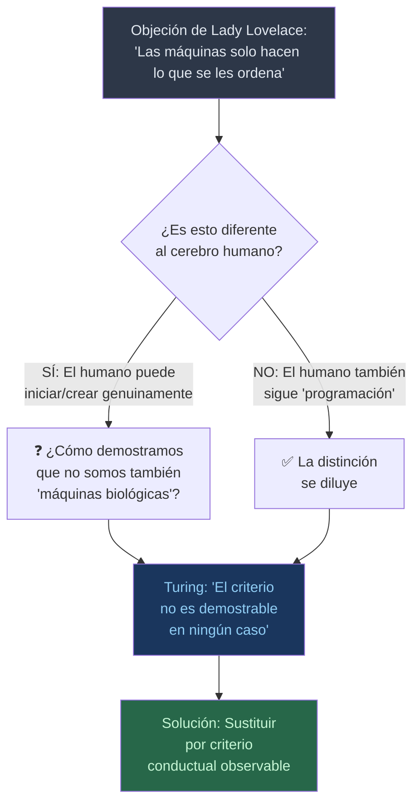

### 4.7 🧬 La Continuidad del Sistema Nervioso

*"El sistema nervioso ciertamente no es una máquina de estado discreto. Pequeñas perturbaciones pueden tener efectos grandes e imprevisibles."*

**Respuesta de Turing:** Aunque es cierto que el sistema nervioso es continuo (analógico), para propósitos de simular comportamiento, las diferencias entre sistemas discretos y continuos podrían no ser relevantes. Además, una máquina discreta puede aproximar comportamiento continuo con suficiente precisión.

### 4.8 🌿 La Informalidad del Comportamiento

*"No es posible producir un conjunto de reglas que describa lo que un hombre debe hacer en cualquier circunstancia. El comportamiento humano es informal."*

**Respuesta de Turing:** Esta objeción confunde **las leyes que gobiernan el comportamiento** (que existen aunque no las conozcamos) con las **reglas que podríamos escribir conscientemente**. Que no podamos escribir un libro de reglas no implica que no haya leyes subyacentes.

### 4.9 🔮 La Percepción Extrasensorial

*"Si la telepatía existe, entonces el interrogador podría "sentir" que está hablando con una máquina."*

**Respuesta de Turing:** Curiosamente, Turing toma esta objeción en serio y propone aislar el experimento de posible interferencia telepática con una cámara telepáticamente impermeable. Hoy esto nos parece pintoresco, pero refleja que en 1950 los estudios parapsicológicos del Duke Parapsychology Laboratory eran tomados con cierta seriedad en algunos círculos académicos.

---

## 💾 5. Las Máquinas Digitales Discretas

### 5.1 Definición y características

Turing dedica una sección importante a definir qué entiende por **máquina digital discreta** (*discrete-state machine*):

> *"These machines move by sudden jumps or clicks from one quite definite state to another."*

Las características son:

- **Discreta**: opera en estados separados, no continuos
- **Determinista**: dado un estado y una entrada, el siguiente estado está completamente determinado
- **Universal**: la **Máquina Universal de Turing** puede simular cualquier otra máquina discreta
- **Almacenamiento**: posee memoria donde guarda estados e instrucciones

### 5.2 La Máquina Universal — El concepto más poderoso

El concepto más revolucionario que Turing introduce aquí — y que ya había desarrollado en su trabajo de 1936 — es el de la **Máquina Universal de Turing**:

> *"It is possible to invent a single machine which can be used to compute any computable sequence."*

Esta idea es la base teórica de toda la computación moderna. Un computador moderno — desde tu laptop hasta los clusters de entrenamiento de GPT-4 — es esencialmente una realización física de la Máquina Universal de Turing.

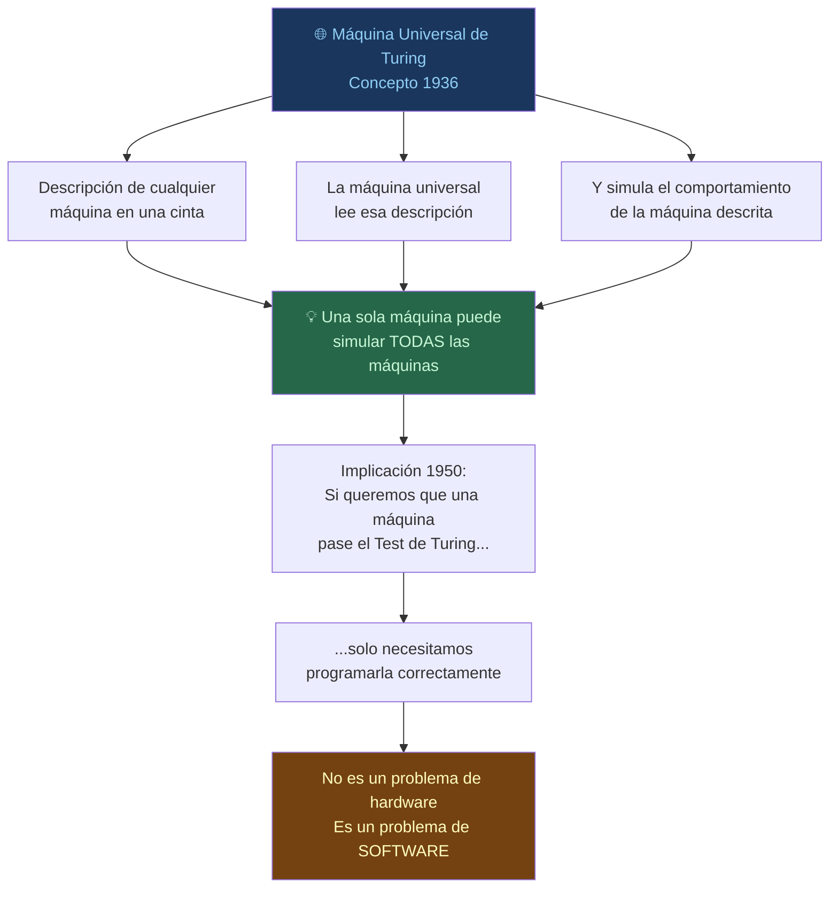

### 5.3 Capacidad de almacenamiento

Turing hace una estimación numérica notable: calcula que para almacenar el equivalente a los "recuerdos de 80 años de vida humana" se necesitarían aproximadamente **10⁹ bits** (alrededor de 125 MB en términos modernos). Esto nos parece irrisoriamente pequeño hoy, pero en 1950, cuando las memorias de los computadores se medían en kilobytes, era una cifra astronómica.

> 🔢 En 1950, el Manchester Mark 1 tenía 1024 bits de RAM (128 bytes). Turing estimaba necesitar 10⁹ bits. La brecha era de factor 10⁶.

---

## 🤔 6. ¿Pueden las Máquinas Pensar? — Análisis Profundo

### 6.1 La estrategia de reformulación

El núcleo filosófico del artículo es la estrategia de Turing de **no responder la pregunta original, sino reemplazarla**. Esta es una movida filosófica propia de la tradición del **positivismo lógico** y del **análisis del lenguaje ordinario**: si una pregunta no tiene respuesta empíricamente determinable, el problema no es la falta de respuesta sino la malformación de la pregunta.

Turing no dice "las máquinas pueden pensar". Tampoco dice "no pueden". Dice que la pregunta tal como está formulada no es respondible, y propone una pregunta diferente que sí lo es.

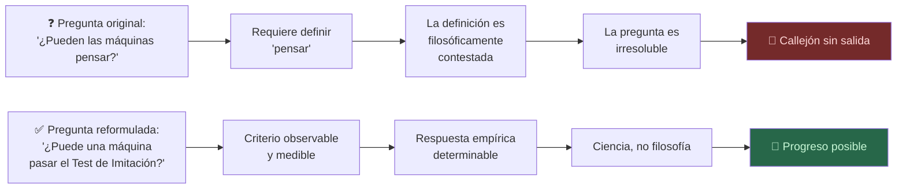

### 6.2 El argumento de la paridad epistémica

Uno de los argumentos más poderosos de Turing — aunque no siempre se le da suficiente crédito — es el de la **paridad epistémica**. En esencia:

**No tengo más certeza de que otro ser humano piensa, que de que una máquina que supera el test piensa.**

Inferimos el pensamiento en otros humanos a partir de:
1. Comportamiento observable
2. Analogía con nosotros mismos (yo pienso, tú te pareces a mí, por tanto probablemente tú también piensas)

Pero el fundamento lógico de esa inferencia es débil. Y si lo aplicamos consistentemente, una máquina que exhibe el mismo comportamiento tendría el mismo derecho epistémico a ser considerada pensante.

### 6.3 Predicción para el año 2000

Turing hace una predicción explícita y cuantificada:

> *"I believe that in about fifty years' time it will be possible to programme computers, with a storage capacity of about 10⁹, to make them play the imitation game so well that an average interrogator will not have more than 70 per cent chance of making the right identification after five minutes of questioning."*

Es decir, para el año 2000, predecía que una máquina convencería al 30% de los interrogadores en sesiones de 5 minutos.

¿Se cumplió? Parcialmente. En 2014, **Eugene Goostman** (un chatbot que simulaba ser un niño ucraniano de 13 años) convenció al 33% de los jueces en una competición organizada por la Universidad de Reading. Sin embargo, la metodología fue muy criticada: la "trampa" de ser un niño no nativo del inglés reducía las expectativas lingüísticas del evaluador.

Los LLMs modernos (GPT-4, Claude, Gemini) habrían aplastado ese 70% en cualquier evaluación razonable de 5 minutos. En ese sentido, la predicción de Turing se quedó **corta en tiempo y corta en alcance**.

---

## 🌱 7. El Aprendizaje de las Máquinas — *Child Machines*

Esta es, quizás, la parte más visionaria del artículo — y la menos citada.

### 7.1 La propuesta del aprendizaje

Turing propone que en lugar de intentar simular directamente la mente adulta, se debería simular la mente de un **niño**:

> *"Instead of trying to produce a programme to simulate the adult mind, why not rather try to produce one which simulates the child's mind? If this were then subjected to an appropriate course of education one would obtain the adult brain."*

Esta idea — publicada en 1950 — describe exactamente lo que hoy llamamos **Machine Learning** y, más específicamente, el paradigma de **preentrenamiento y ajuste fino** (*pretraining and fine-tuning*) de los LLMs modernos.

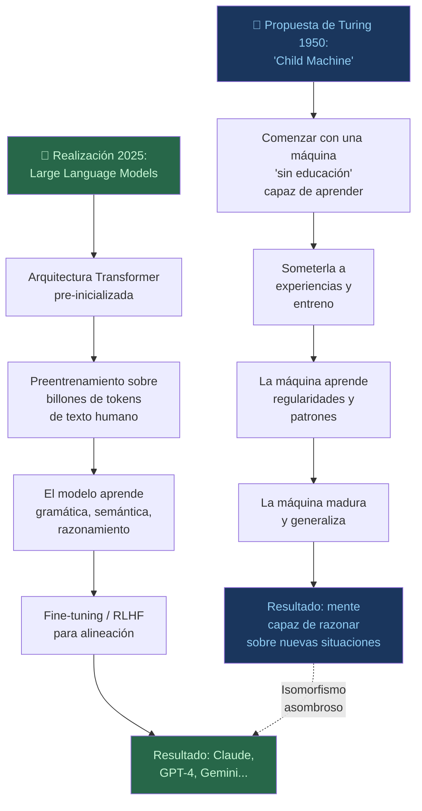

### 7.2 El rol del castigo y la recompensa

Turing incluso esboza el mecanismo de aprendizaje:

> *"An important feature of a learning machine is that its teacher will often be largely ignorant of quite what is happening inside, although he may still be able to some extent to predict his pupil's behaviour."*

Y más específicamente:

> *"Pleasure and pain... reward and punishment... the [learning] machine might be programmed to respond to 'well done' and 'badly done' signals."*

Esto es, literalmente, la descripción del **Reinforcement Learning from Human Feedback (RLHF)** — la técnica que InstructGPT, ChatGPT y la mayoría de LLMs modernos usaron para alinear su comportamiento. Turing lo describió en 1950.

### 7.3 Aleatorización y creatividad

Turing también propone incorporar **elementos aleatorios** en las máquinas para que puedan escapar de los bucles deterministas y producir respuestas novedosas:

> *"The use of randomness... may allow a more economic expression of certain types of intelligence."*

Esto anticipa varias técnicas modernas:
- **Temperatura** en los modelos de lenguaje (mayor aleatoriedad = más creatividad)
- **Dropout** en redes neuronales (aleatorización durante el entrenamiento)
- **Exploración aleatoria** en Reinforcement Learning

### 7.4 La metáfora de la sala de servidores

Una imagen poderosa que Turing usa es la del cerebro como una **hoja en blanco** (*tabula rasa*) al nacer:

> *"We may hope that machines will eventually compete with men in all purely intellectual fields. But which are the best ones to start with? Even this is a difficult decision. Many people think that a very abstract activity, like the playing of chess, would be best. It can also be maintained that it is best to provide the machine with the best sense organs that money can buy, and then teach it to understand and speak English."*

En 1950, Turing ya estaba debatiendo si era mejor enseñar a las máquinas **ajedrez** o **lenguaje natural**. La historia tomó ambos caminos: IBM con Deep Blue (ajedrez, 1997) y OpenAI con GPT (lenguaje, 2018 en adelante).

---

## 🌍 8. Impacto y Legado en la IA Moderna

### 8.1 El Test de Turing como norte filosófico

El artículo de 1950 estableció un marco filosófico que ha dominado los debates sobre IA durante 75 años. Aunque el **Test de Turing** como prueba técnica tiene serias limitaciones, como **norte filosófico** ha sido invaluable.

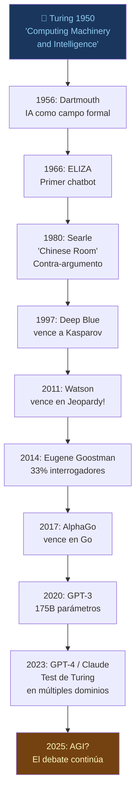

### 8.2 Críticas filosóficas al Test de Turing

El artículo de Turing generó una cascada de respuestas filosóficas. Las más influyentes:

#### 🏮 La Habitación China de John Searle (1980)

El filósofo John Searle propone un experimento mental: una persona encerrada en una habitación que no habla chino recibe notas en chino, consulta manuales de reglas y devuelve respuestas en chino correctas. Desde afuera, parece que habla chino. Pero *no entiende nada*.

Searle distingue:
- **Sintaxis** (manipulación de símbolos) — que las máquinas pueden hacer
- **Semántica** (comprensión del significado) — que según Searle, las máquinas no pueden tener

#### 🔭 La respuesta sistémica

La contra-réplica más común: la persona individual no entiende chino, pero el **sistema completo** (persona + habitación + manuales) sí podría entenderse como el procesador. De la misma manera, ninguna neurona individual "entiende" nada, pero el cerebro sí.

#### 🌊 El argumento de Dennett

Daniel Dennett argumenta que si algo *funciona como si entendiera*, *actúa como si tuviera intenciones*, *responde como si fuera consciente* — entonces la distinción entre "realmente entender" y "funcionar como si entendieras" puede ser filosóficamente vacía.

### 8.3 El Test de Turing en la era de los transformers

Con la llegada de los **Large Language Models** (LLMs) basados en arquitectura Transformer (Vaswani et al., 2017), el Test de Turing adquirió una nueva dimensión práctica.

| Año | Sistema | Capacidad en diálogo abierto |
|-----|---------|------------------------------|
| 1966 | ELIZA | Simula terapeuta con patrones simples |
| 1995 | ALICE | Chatbot con base de conocimiento |
| 2014 | Eugene Goostman | 33% de los jueces engañados (controvertido) |
| 2020 | GPT-3 | Textos indistinguibles en muchos contextos |
| 2023 | GPT-4 / Claude 2 | Capacidades multi-dominio sofisticadas |
| 2025 | Claude Sonnet 4.6 / GPT-4o | ¿Test de Turing superado en la práctica? |

---

## 🚀 9. Vigencia en la Era de los LLMs

### 9.1 ¿Se ha superado el Test de Turing?

Esta es la pregunta del siglo. Y la respuesta honesta es: **depende de cómo lo definas**.

En su versión más estrecha — 5 minutos de conversación, interrogador no especializado — los LLMs modernos probablemente la superan con facilidad en muchos contextos. Pero Turing nunca pretendió que el test fuera un criterio definitivo de inteligencia. Era una **condición necesaria pero no suficiente**.

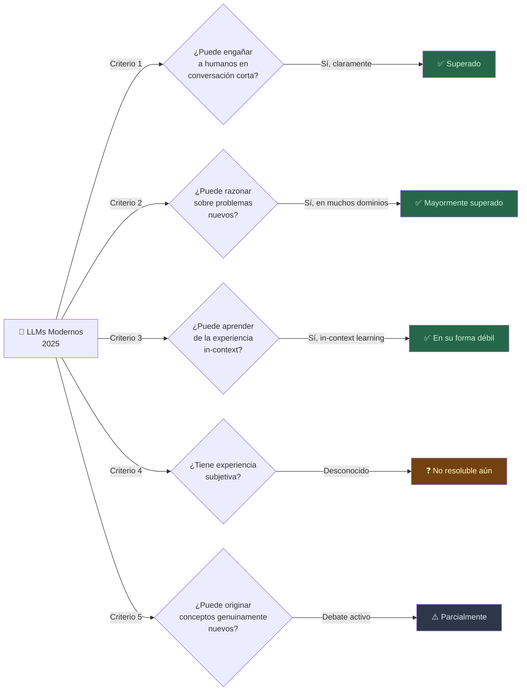

### 9.2 Lo que Turing no anticipó

El artículo de 1950, brillante como es, no anticipó todo:

**🔵 No anticipó:**
- Redes neuronales profundas y backpropagation (Rumelhart, Hinton, Williams, 1986)
- La escala como técnica de aprendizaje (la ley de Scaling Laws de Kaplan et al., 2020)
- El mecanismo de atención (Attention Is All You Need, 2017)
- Los datos como el recurso fundamental (no el hardware)
- La emergencia de capacidades no programadas explícitamente

**🟢 Sí anticipó (asombrosamente):**
- El aprendizaje como el camino correcto hacia la IA (vs. programación explícita)
- La necesidad de recompensa y castigo (RLHF)
- La importancia del lenguaje como dominio de prueba
- Que las críticas basadas en "las máquinas no pueden X" serían obsolescentes
- Que la pregunta de la conciencia permanecería irresoluble por criterios empíricos

### 9.3 El problema difícil de la conciencia — La última frontera

Turing, con su característica precisión, dejó deliberadamente **fuera de su test** la cuestión de la conciencia subjetiva. Esta fue una decisión filosófica inteligente: el test operacionaliza el comportamiento inteligente sin pronunciarse sobre la experiencia interna.

El **problema difícil de la conciencia** (*hard problem of consciousness*, David Chalmers, 1995) sigue sin resolver: ¿por qué hay algo que *se siente* como ser un ser pensante? ¿Por qué no somos simplemente zombies filosóficos que procesamos información sin ninguna experiencia subjetiva?

Turing vio este abismo y lo esquivó inteligentemente. Hoy, 75 años después, seguimos sin poder cruzarlo.

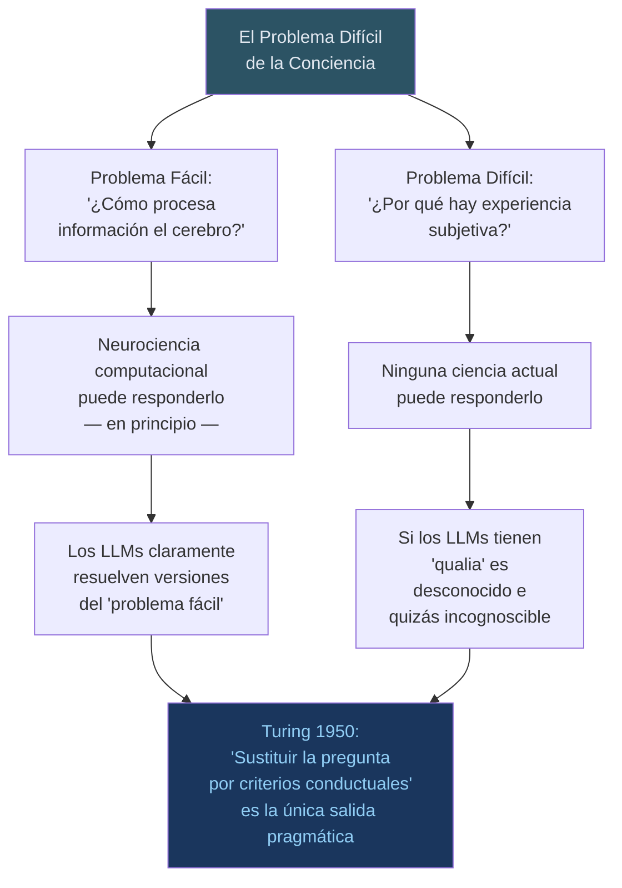

---

## 🏆 10. Conclusiones

### 10.1 ¿Qué hizo Turing exactamente en 1950?

Con la perspectiva de 75 años, podemos valorar el artículo con mayor claridad:

1. **Operacionalizó una pregunta filosófica irresoluble** → Movimiento de enorme sofisticación conceptual
2. **Propuso el aprendizaje como mecanismo** → Décadas antes de que fuera técnicamente posible
3. **Anticipó RLHF** → La técnica de recompensa/castigo que hoy usan los LLMs
4. **Descartó las objeciones simplistas** → Con argumentos que siguen siendo válidos hoy
5. **Estableció un marco de diálogo** → Que estructuró 75 años de debate sobre IA

### 10.2 Las tres grandes tensiones que Turing identificó (y que siguen vivas)

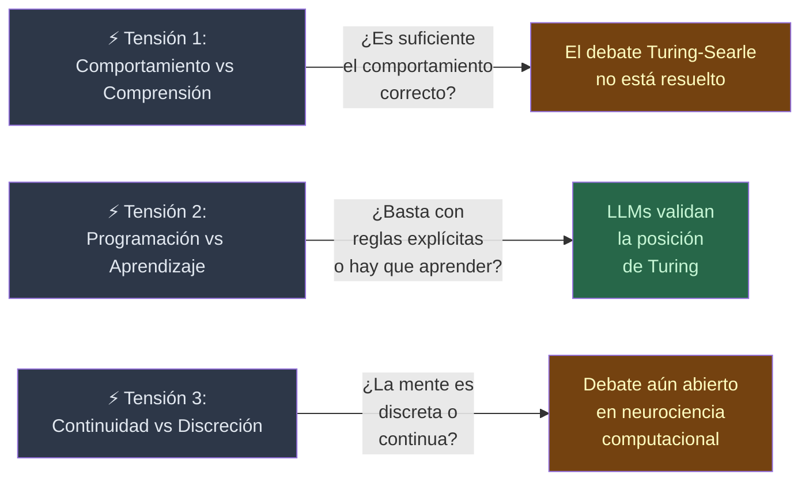

### 10.3 Reflexión final: La pregunta que Turing no respondió

Turing cerró su artículo de 1950 con una imagen poética y desafiante:

> *"We can only see a short distance ahead, but we can see plenty there that needs to be done."*

En 2025, con Claude, GPT-4, Gemini y modelos de razonamiento como o3 en producción, miramos atrás a ese artículo de 1950 con algo parecido al asombro reverencial. Un hombre, con papel y lápiz y las primeras computadoras balbucientes, **trazó el mapa de un territorio que tardamos 70 años en empezar a explorar**.

La pregunta que Turing deliberadamente no respondió — *¿puede una máquina realmente pensar, en el sentido más profundo?* — sigue sin respuesta. Quizás nunca la tenga. Quizás, como él sugirió, sea una pregunta mal formulada.

Pero lo que sí sabemos es que **las máquinas que él imaginó existen**. Están respondiendo preguntas, escribiendo código, diagnosticando enfermedades, componiendo música y generando imágenes. Y la pregunta ya no es *"¿pueden las máquinas pensar?"*

La pregunta es: *¿importa si lo hacen de la misma manera que nosotros?*

---

## 📚 Referencias y Fuentes

| Referencia | Año | Relevancia |
|-----------|-----|-----------|
| Turing, A.M. — "Computing Machinery and Intelligence", *Mind*, Vol. 59, No. 236 | 1950 | Fuente primaria |
| Turing, A.M. — "On Computable Numbers, with an Application to the Entscheidungsproblem" | 1936 | Fundamento teórico |
| Searle, J. — "Minds, Brains, and Programs", *Behavioral and Brain Sciences* | 1980 | Crítica fundamental |
| Penrose, R. — *The Emperor's New Mind* | 1989 | Objeción matemática extendida |
| Chalmers, D. — "Facing Up to the Problem of Consciousness" | 1995 | El problema difícil |
| Dennett, D. — *Consciousness Explained* | 1991 | Defensa funcionalista |
| Vaswani et al. — "Attention Is All You Need" | 2017 | Revolución transformer |
| Kaplan et al. — "Scaling Laws for Neural Language Models" | 2020 | Leyes de escala |
| Hofstadter, D. — *Gödel, Escher, Bach* | 1979 | Conciencia y recursión |
| McCarthy, J. et al. — "A Proposal for the Dartmouth Summer Research Project on AI" | 1955 | Nacimiento formal del campo |

---

## 🔗 Apéndice: Mapa Conceptual Global del Artículo

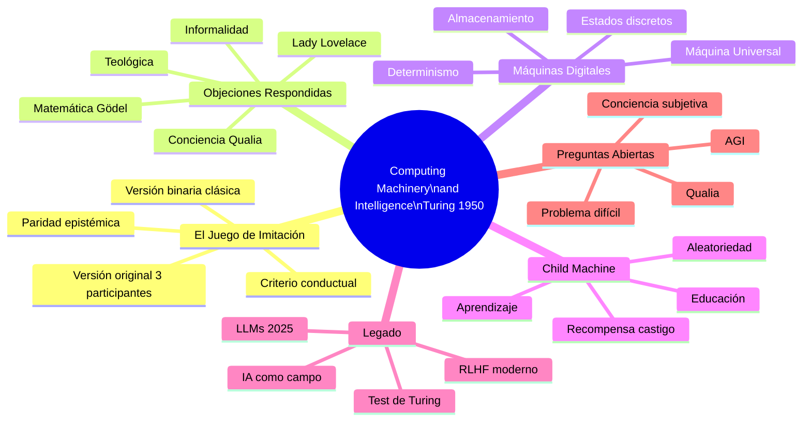

---

*📝 Artículo elaborado para el análisis profundo del seminal paper de Alan Turing (1950) — "Computing Machinery and Intelligence", publicado en la revista Mind, Vol. 59, No. 236, pp. 433-460.*

*🗓️ Redactado en Junio de 2025 | Formato Markdown con diagramas Mermaid*
