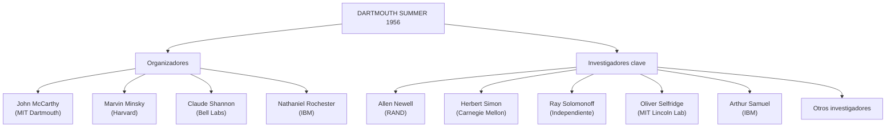

# 🤖 La Conferencia de Dartmouth, 1956
## El Verano en que Nació la Inteligencia Artificial

---

## 📋 Ficha Técnica del Evento

| Aspecto | Detalle |
|--------|---------|
| 🏛️ **Nombre oficial** | Dartmouth Summer Research Project on Artificial Intelligence |
| 📅 **Fechas** | 18 de junio – 17 de agosto de 1956 (6–8 semanas) |
| 📍 **Lugar** | Dartmouth College, Hanover, New Hampshire, EE.UU. |
| 👥 **Organizadores** | John McCarthy, Marvin Minsky, Nathaniel Rochester, Claude Shannon |
| 💰 **Financiación** | Rockefeller Foundation — $7.500 (de $13.500 solicitados) |
| 🎯 **Formato** | Taller de brainstorming intensivo, sin actas formales |
| 🔬 **Participantes** | ~10 investigadores de distintas instituciones |
| 🎖️ **Resultado clave** | Acuñación del término "Inteligencia Artificial" como campo propio |

---

## 📝 Resumen Ejecutivo

> El verano de **1956** marcó un hito irrepetible en la historia del pensamiento humano. En los tranquilos bosques de New Hampshire, un grupo de **matemáticos, ingenieros y psicólogos** se reunió durante casi dos meses con una pregunta audaz: 
> 
> **¿Puede una máquina pensar?**

Lo que salió de aquellas semanas de debate no fue un *paper* definitivo ni un prototipo revolucionario. Fue algo **más duradero**: un nombre, una misión y una comunidad.

La Conferencia de Dartmouth **no resolvió** el problema de la inteligencia artificial. Lo **inventó**. 

Este artículo reconstruye, con la mayor fidelidad histórica posible, el **contexto**, los **protagonistas**, los **debates**, los **logros** y las **limitaciones** de ese encuentro fundacional, y traza la línea que une aquel verano con los sistemas de IA que hoy transforman la industria global.

---

## 1️⃣ El Mundo en 1956: Contexto Histórico y Tecnológico

### 1.1 La Posguerra y la Carrera Tecnológica ⚛️

El año **1956** se sitúa en plena **Guerra Fría**. Solo once años antes había concluido la **Segunda Guerra Mundial**, conflicto que había acelerado de forma extraordinaria el desarrollo tecnológico:

- 📡 **Radar** — defensa aérea
- 🔐 **Criptografía** — desciframiento de códigos
- 💻 **Computación electrónica** — máquinas de cálculo
- ☢️ **Física nuclear** — armas estratégicas

El mundo emergía de ese cataclismo **transformado**, con dos superpotencias midiendo fuerzas en cada frente posible, incluido el **científico**.

En ese contexto, los gobiernos occidentales —especialmente el **estadounidense**— invertían masivamente en investigación básica a través de:

```
┌─────────────────────────────────────┐
│   AGENCIAS Y FUNDACIONES (1950s)    │
├─────────────────────────────────────┤
│ • DARPA (Defense Advanced...)       │
│ • ONR (Office of Naval Research)    │
│ • Rockefeller Foundation            │
│ • National Science Foundation       │
└─────────────────────────────────────┘
```

**La ciencia no era solo conocimiento: era seguridad nacional.** Y en la actualidad lo es.(Mythos)

### 1.2 El Estado de la Computación 🖥️

Las computadoras de la época eran **máquinas colosales**:

- 📏 Ocupaban **salas enteras**
- 🎴 Se programaban con **tarjetas perforadas**
- 🏢 Eran accesibles solo para **grandes instituciones**
- ⚡ Consumían cantidades masivas de **energía**

El **IBM 701**, diseñado por **Nathaniel Rochester** —uno de los organizadores de la conferencia—, era el primer ordenador científico de **producción masiva** de IBM.

**Para la mayoría, la noción de que estas máquinas pudieran 'razonar' era ciencia ficción.**

Sin embargo, para un pequeño grupo de visionarios, las señales apuntaban en otra dirección:

| Año | Contribución | Autor(es) |
|-----|-------------|----------|
| 1950 | *"Computing Machinery and Intelligence"* | **Alan Turing** |
| 1948 | Teoría matemática de la información | **Claude Shannon** |
| 1948-49 | Cibernética formal | **Norbert Wiener** |
| 1950s | Teoría de autómatas | **John von Neumann** |

**Los ingredientes intelectuales estaban sobre la mesa; faltaba alguien que los cocinara juntos.**

### 1.3 El Problema de la Fragmentación Disciplinar 🔀

Antes de 1956, la investigación sobre "máquinas pensantes" estaba **dispersa** en múltiples campos sin conexión formal:

```
┌─────────────────┬──────────────────┬─────────────────┐
│  CIBERNÉTICA    │   TEORÍA DE      │     LÓGICA      │
│  (Wiener)       │   AUTÓMATAS      │    MATEMÁTICA   │
│                 │   (von Neumann)  │                 │
├─────────────────┼──────────────────┼─────────────────┤
│  NEUROLOGÍA     │    PSICOLOGÍA    │  TEORÍA DE LA   │
│  COMPUTACIONAL  │    COGNITIVA     │  INFORMACIÓN    │
└─────────────────┴──────────────────┴─────────────────┘
                  ↓
         Cada grupo usaba:
      • Vocabulario propio
      • Revistas distintas
      • Raramente se citaban entre sí
      ↓
    LO QUE FALTABA: Una identidad común
```

**Esa identidad la proporcionó John McCarthy con dos palabras que cambiarían la historia:**

> **ARTIFICIAL INTELLIGENCE**

---

## 2️⃣ Los Protagonistas: Perfiles de los Organizadores

### 2.1 John McCarthy (1927–2011) — El Arquitecto 🏗️

**McCarthy** era, en 1956, un **joven profesor de matemáticas** de 28 años en el Dartmouth College.

#### Biografía breve
- 📍 **Nacimiento**: Boston, 1927
- 👨‍👩 Hijo de carpintero irlandés y activista judía
- 🌲 Creció en California
- 🎓 Doctorado en Princeton (ecuaciones diferenciales parciales)

#### Su obsesión fundacional
Desde niño demostró una capacidad matemática extraordinaria, pero su **verdadera obsesión** era la pregunta que **Turing** había planteado:

> **¿Pueden pensar las máquinas?**

McCarthy no se conformaba con la pregunta; **quería construir el programa de investigación** para responderla.

#### Sus aportaciones a Dartmouth

| Aportación | Impacto |
|-----------|--------|
| **Idea de la conferencia** | Convencer a otros de sumarse |
| **Redacción de la propuesta** | Presentación formal a Rockefeller |
| **Acuñación del término** | "Artificial Intelligence" (IA) |
| **Enfoque deliberado** | Evitar asociaciones con cibernética |

#### Legado posterior
- 📍 Fundó el Stanford Artificial Intelligence Laboratory (SAIL)
- 🖥️ Inventó el lenguaje de programación **LISP**
- 🏆 Premio Turing en **1971**

### 2.2 Marvin Minsky (1927–2016) — El Teórico de la Mente 🧠

**Coetáneo exacto de McCarthy**, Minsky llegó a la conferencia como **Junior Fellow** en matemáticas y neurología en Harvard.

#### Background multidisciplinar
- 📚 Estudios en **psicología** + **matemáticas**
- 🧬 Interés profundo en el **cerebro humano**
- 🔬 Búsqueda de lecciones para máquinas inteligentes

#### Construcción del SNARC (1951)
Años antes había construido el **SNARC** (*Stochastic Neural Analog Reinforcement Calculator*):

```
SNARC = 40 neuronas artificiales analógicas
        ↓
        Primer ejemplo de red neuronal física
        ↓
        Prototipo de machine learning primitivo
```

#### Su postura en Dartmouth
**Adoptaría una posición que dominaría décadas**: el **enfoque simbólico y representacional** era más prometedor que el **conexionismo neuronal**.

> ⚠️ **Nota histórica**: Esta decisión, por controversial que resultara **en retrospectiva**, daría forma a dos generaciones de investigadores en IA.

#### Legado
- 🏆 Premio Turing en **1969**
- 📖 *"The Society of Mind"* (1986) — obra influyente sobre cognición artificial
- 💭 Fundador del MIT AI Laboratory

### 2.3 Claude Shannon (1916–2001) — El Padre de la Información 📡

Shannon era, en 1956, **probablemente el más famoso** de los cuatro organizadores.

#### Carrera en Bell Labs
- 🔬 **Matemático** en los Bell Telephone Laboratories
- 📊 Publicó en 1948: *"A Mathematical Theory of Communication"*
- 🎯 **Fundó la teoría de la información**

#### Su obra maestra

```
A Mathematical Theory of Communication (1948)
       ↓
Concepto de ENTROPÍA
Concepto de BITS (información digital)
Concepto de CANALES (transmisión datos)
       ↓
Infraestructura invisible del mundo digital actual
```

#### Rol en Dartmouth
- ✅ **Validador prestigioso** del proyecto
- ✅ Su firma fue **determinante** para que Rockefeller aprobara la financiación
- ⚠️ No pasó mucho tiempo en Hanover (participación parcial)

**Su contribución: demostrar que la información podía formalizarse matemáticamente** — precisamente el puente que necesitaba la IA naciente.

### 2.4 Nathaniel Rochester (1919–2001) — El Ingeniero 🔧

Rochester era **director de investigación en informática** en el centro de investigación de IBM.

#### Logros técnicos
- 💻 **Diseñador del IBM 701** — primer ordenador científico comercial
- 🧠 Intento de simulación de **redes neuronales** en computadora digital (1956)
- 🛠️ **Experiencia práctica** con hardware real

#### Su rol en Dartmouth
Aportaba algo que los otros tres **no tenían en la misma medida**:

> **PRAGMATISMO EMPÍRICO**

Era el **ancla empírica del grupo** — garantizaba que las discusiones no se alejaran demasiado de las **limitaciones y posibilidades reales** de las máquinas existentes.

---

## 3️⃣ La Génesis: De la Idea a la Propuesta

### 3.1 El Verano de 1955 en Poughkeepsie 🏢

La historia de Dartmouth empieza, paradójicamente, en las **oficinas de IBM** en Poughkeepsie, Nueva York.

En el **verano de 1955**, McCarthy fue invitado por **Rochester** a pasar la temporada en su departamento de investigación. 

**Allí, McCarthy y Rochester convencieron a Minsky y Shannon de sumarse a una idea audaz:**

> *Organizar una gran reunión de verano donde los mejores cerebros en "máquinas pensantes" pudieran trabajar juntos sin las restricciones de una conferencia académica formal.*

### 3.2 La Propuesta del 2 de Septiembre de 1955 📄

El **2 de septiembre de 1955** —casi un año antes de que se celebrara la conferencia— los cuatro firmaron y enviaron a la **Rockefeller Foundation** una propuesta formal.

#### El documento histórico
- 📄 **Extensión**: apenas unas páginas
- 🏆 **Importancia**: uno de los textos más importantes de la historia de la informática
- 💡 **Impacto**: definió el campo de la IA

#### La frase central (traducida del inglés)

> *"Proponemos que un estudio de 2 meses de 10 personas sobre inteligencia artificial se realice en el verano de 1956 en Dartmouth College. El estudio procede sobre la base de la conjetura de que **cada aspecto del aprendizaje o cualquier otra característica de la inteligencia puede describirse con suficiente precisión para que una máquina pueda simularla**."*

#### Dos afirmaciones extraordinarias

```
SUPUESTO 1: La inteligencia PUEDE describirse
            con precisión suficiente
            ↓
            (Hipótesis del cognitivismo computacional)

SUPUESTO 2: Esa descripción ES IMPLEMENTABLE
            en una máquina
            ↓
            (Hipótesis de la máquina física universal)

                    ↓
           Enunciada con DÉCADAS de anticipación
```

#### Las Siete Áreas de Investigación

La propuesta detallaba siete áreas —un mapa que, con distintos nombres, sigue siendo **el mapa de la IA actual**:

| Área | Descripción |
|------|-----------|
| 1️⃣ **Lenguaje Natural** | Procesamiento automático del lenguaje |
| 2️⃣ **Redes Neuronales** | Simulación de sistemas biológicos |
| 3️⃣ **Teoría de la Computación** | Fundamentos matemáticos |
| 4️⃣ **Abstracción de Conceptos** | Formación de representaciones |
| 5️⃣ **Autoaprendizaje** | Sistemas que mejoran con experiencia |
| 6️⃣ **Aleatoriedad y Creatividad** | Generación de comportamiento novel |
| 7️⃣ **Complejidad de Comportamientos** | Escalabilidad de sistemas |

### 3.3 La Financiación Parcial 💰

La Rockefeller Foundation, aunque **intrigada** por la propuesta, solo aprobó **$7.500** de los **$13.500** solicitados.

#### Presupuesto original
```
$1.200 por participante de nivel docente
  + $700 por estudiante de posgrado
  + Gastos de viaje
  + Soporte administrativo
  = $13.500 (solicitado)
```

#### Lo que realmente financió
```
$7.500 (aprobado) ≈ 56% del presupuesto
La fundación admitió que el proyecto era "difícil de comprender"
El resto fue cubierto por las instituciones empleadoras
```

#### Dato revelador 🎯

> **Por menos del coste de un coche nuevo en 1956, se plantó la semilla de una de las revoluciones tecnológicas más transformadoras de la historia humana.**

---

## 4️⃣ Los Participantes: Un Quién es Quién de la IA Fundacional

### 4.1 El Grupo Completo 👥

Además de los cuatro organizadores, la conferencia atrajo a una **constelación de investigadores** que, en retrospectiva, forman el **panteón fundacional de la IA**.



#### Lista de participantes clave

| Nombre | Institución | Contribución | Presencia |
|--------|-----------|--------------|-----------|
| **Allen Newell** | RAND Corporation | Logic Theorist | Total |
| **Herbert Simon** | Carnegie Mellon | Logic Theorist + Teoría cognitiva | Total |
| **Ray Solomonoff** | Independiente | Inferencia inductiva | ✅ Máxima |
| **Oliver Selfridge** | MIT Lincoln Lab | Reconocimiento de patrones | Parcial |
| **Arthur Samuel** | IBM | Machine Learning en damas | Parcial |
| **Trenchard More** | Princeton | Lógica matemática | Parcial |
| **W. Ross Ashby** | — | Cibernética | Parcial |
| **W.S. McCulloch** | — | Neurona artificial | Parcial |
| **Peter Milner** | — | Investigador asociado | Parcial |

#### Dato crucial

> ⚠️ **Solo McCarthy, Minsky y Solomonoff permanecieron durante toda la duración del evento.**

El resto participó durante períodos variables, algunos solo unos días. **La asistencia fluctuante fue uno de los factores que limitaron la cohesión de la conferencia.**

### 4.2 Perfiles Destacados Adicionales 🌟

#### Allen Newell y Herbert Simon — La Dupla Ganadora

Si hubo una **estrella de la conferencia**, fue el dúo **Newell-Simon**.

##### Lo que los hacía especiales
- ✅ Llegaron con algo que **nadie más tenía**: un programa **funcionando**
- ✅ El **Logic Theorist** era la primera demostración práctica
- ✅ Convirtieron la conferencia de especulativa a **empirical**

**Herbert Simon** era, además:
- 🧠 **Psicólogo cognitivo**
- 💰 **Economista** (futuro Premio Nobel, 1978)
- 🏢 **Teórico de la organización**

Su visión: **la IA como modelo de la cognición humana**, no solo como herramienta.

#### Arthur Samuel — El Precursor del Machine Learning

Samuel trabajaba en IBM en un proyecto que hoy consideraríamos el **primer ejemplo claro de machine learning**:

```
Un programa para jugar a las DAMAS
        ↓
    Mejoraba su rendimiento
        ↓
    Con la EXPERIENCIA
        ↓
    Sin ser reprogramado explícitamente
```

En **1959** acuñaría el término **"Machine Learning"**.

> **Demostración**: Las máquinas podían aprender de sus errores sin reprogramación explícita.

Concepto que tardaría décadas en alcanzar su pleno potencial (años 2010-2020 con deep learning).

#### Oliver Selfridge — El Padre de la Percepción Máquina

Selfridge desarrollaría el **Pandemonium**, uno de los primeros modelos de **reconocimiento de patrones**:

- 🎯 Clave para el desarrollo del **perceptrón**
- 🧠 Base para las **redes neuronales profundas** (siglo XXI)
- 👁️ Conocido como el *"padre de la percepción máquina"*

---

## 5️⃣ El Desarrollo de la Conferencia

### 5.1 Formato y Dinámica 📋

**La Conferencia de Dartmouth NO fue una conferencia en el sentido académico convencional.**

```
CONFERENCIA TRADICIONAL          ≠    DARTMOUTH 1956
─────────────────────────────────────────────────────
✓ Ponencias formales             X    Sin ponencias programadas
✓ Agenda estructurada            X    Agenda abierta
✓ Sesiones plenarias             X    Sin sesiones estructuradas
✓ Actas publicadas               X    Sin documentación formal
```

#### Características reales

**Dartmouth fue un campamento intelectual de verano**:

- 🏕️ **Espacio abierto** para trabajar en proyectos propios
- 💬 **Discusiones informales** sin restricciones
- 🚶 **Paseos por el campus** entre sesiones
- 🍽️ **Comidas compartidas** para debatir ideas
- 🎯 **Emergencia espontánea** de conexiones interdisciplinarias

#### El diseño deliberado de McCarthy

> McCarthy quería que **las ideas emergieran del intercambio espontáneo**, no de la presentación de resultados ya consolidados.

#### El precio de la informalidad 📉

- ❌ **Falta de documentación**: Rockefeller nunca recibió informe formal
- ❌ **Registros dispersos**: Memorias personales de participantes
- ❌ **Notas incompletas**: Especialmente las de Ray Solomonoff
- ❌ **Pérdida de detalles**: Décadas después, algunos debates se olvidaron

### 5.2 Los Grandes Temas de Debate 🎭

#### Debate 1: ¿Redes Neuronales o Símbolos? 🧠 vs 📝

Uno de los debates **más fundamentales** de la conferencia —y que definiría la IA durante **décadas**—:

```
CONEXIONISMO                        vs    SIMBOLISMO
(Inspirado en el cerebro)                 (Lógica y representación)
────────────────────────────────────────────────────────

Minsky había trabajado               Minsky se convenció
en SNARC (redes neuronales)         del enfoque SIMBÓLICO

        ↓                                  ↓
                    DECISIÓN EN DARTMOUTH:
                    "El enfoque simbólico es
                    más prometedor"
                    
        ↓                                  ↓
    1960s-1980s: Domina SIMBOLISMO   1980s-1990s: Resurgimiento
    ("Primer invierno para neuronales")   ("Renacimiento conexionista")
```

**Impacto histórico**:
- ✅ Avanzó la IA simbólica y sistemas expertos
- ❌ Posergó redes neuronales (1 década + media)
- ⚡ **2010s-2020s**: Las redes neuronales profundas (LLMs) dominan
- 🔄 **2026**: Síntesis inesperada — redes masivas con razonamiento simbólico emergente

#### Debate 2: Heurística versus Búsqueda Exhaustiva 🔍

¿Cómo deben resolver problemas las máquinas?

```
OPCIÓN A: Búsqueda EXHAUSTIVA           OPCIÓN B: HEURÍSTICAS
─────────────────────────────            ──────────────────────
• Probar TODAS las posibilidades       • Atajos cognitivos
• Garantía de solución optimal         • Inspirados en humanos
• Muy costoso computacionalmente       • Más eficiente prácticamente
• Impracticable para problemas         
  complejos

Newell-Simon defendían OPCIÓN B
El Logic Theorist era su argumento viviente
```

**Resonancias actuales** (2026):
- LLMs usan generación masiva de tokens (quasi-exhaustiva)
- Con razonamiento heurístico emergente
- Síntesis de ambos enfoques

#### Debate 3: El Rol del Aprendizaje 📚

¿Deben las máquinas ser programadas explícitamente o **aprender** de la experiencia?

```
PREGUNTA FUNDAMENTAL: ¿Conocimiento EXPLÍCITO o APRENDIDO?
──────────────────────────────────────────────────────────

1956 Estado: PREGUNTA ABIERTA
Arthur Samuel apuntaba en dirección correcta (damas)
Pero paradigma dominante: SIMBÓLICO y EXPLÍCITO

1956-1980: Enfoque simbólico prevalece
1980-2010: Resurgimiento del aprendizaje automático
2010-2026: Deep Learning domina (redes aprenden de datos masivos)

2026 RESPUESTA: El aprendizaje es CENTRAL
```

#### Debate 4: Lenguaje Natural 🗣️

La capacidad de comunicarse en **lenguaje humano** fue desde el principio **piedra angular** del proyecto.

```
McCarthy soñaba con:
┌──────────────────────────────────────┐
│ Programas capaces de:               │
│ • Entender lenguaje natural         │
│ • Producir lenguaje natural         │
│ • Comunicarse con humanos           │
└──────────────────────────────────────┘
             ↓
    1956-2024: 70 AÑOS DE INVESTIGACIÓN
             ↓
    2020s: LLMs lo hacen a escala masiva
    (ChatGPT, Claude, Gemini, etc.)
```

---

## 6️⃣ El Logic Theorist: La Estrella de la Conferencia ⭐

### 6.1 ¿Qué Era el Logic Theorist?

El **Logic Theorist** (LT) —también conocido como **Logic Theory Machine**— fue desarrollado por **Allen Newell**, **Herbert Simon** y **J.C. Shaw** en el **RAND Corporation** durante los meses previos a la conferencia.

#### Hito histórico
- 🏆 **Primer programa de computadora** diseñado específicamente para imitar razonamiento lógico humano
- 🧠 **No mediante búsqueda exhaustiva** sino mediante **heurísticas cognitivas**
- 📖 Objetivo: demostrar teoremas del capítulo 2 de *Principia Mathematica*

#### La estrategia

```
Aplicar REGLAS DE INFERENCIA de manera SELECTIVA
        ↓
    Guiado por HEURÍSTICAS que priorizan pasos prometedores
        ↓
    Exactamente como lo haría un matemático HUMANO
        ↓
    No una búsqueda ciega entre todas las posibilidades
```

### 6.2 Los Resultados 🎯

En Dartmouth, **Newell y Simon** presentaron resultados preliminares:

#### Logros demostrados
- ✅ Demostró **38 de los primeros 52 teoremas** del segundo capítulo del Principia Mathematica
- ✅ **Para el Teorema 2.85**, encontró una prueba **más corta y elegante** que la publicada por **Whitehead y Russell** mismos

#### El momento icónico 💡

Simon, entusiasmado, **compartió la nueva prueba** con el propio **Bertrand Russell**:

> Russell respondió **con deleite**. 

Fue uno de esos raros momentos en que **la realidad supera la ambición inicial del programa**.

#### La declaración de Simon (enero 1956)

> *"We have invented a computer program capable of thinking non-numerically, and thereby solved the venerable mind-body problem."*
>
> (Hemos inventado un programa de computadora capaz de pensar de manera no-numérica, y con ello hemos resuelto el venerable problema mente-cuerpo.)

**⚠️ Nota**: Esta declaración refleja el **optimismo casi mesiánico** del momento. En retrospectiva era **excesiva**; en contexto, era **comprensible**.

### 6.3 Impacto y Legado 🚀

El Logic Theorist estableció **dos precedentes fundamentales**:

#### Precedente 1: Viabilidad de la IA Simbólica ✅

```
DEMOSTRACIÓN PRÁCTICA: Las máquinas podían
realizar RAZONAMIENTO FORMAL de alto nivel

        ↓
    Silencia escépticos
    Atrae financiación DARPA
    Define paradigma dominante de la IA
```

#### Precedente 2: Programación Heurística como Paradigma 🎯

```
Influencias directas:
├─ General Problem Solver (Newell-Simon, 1957)
├─ Sistemas Expertos (1960s-1980s)
└─ Toda la tradición simbólica de IA

Influencias indirectas:
└─ Fundamentos de razonamiento automatizado
```

#### El lenguaje IPL → LISP

El **Information Processing Language (IPL)** en que fue escrito el LT:

```
IPL (1956)
  ↓
  Precursor directo
  ↓
LISP (McCarthy, 1958)
  ↓
Lenguaje estándar de IA durante DÉCADAS (1960-1990)
  ↓
Base para Scheme, Clojure y lenguajes funcionales modernos
```

---

## 7️⃣ Resultados y Legado Inmediato

### 7.1 Lo Que Sí Se Logró ✅

Sería un **error** juzgar la conferencia de Dartmouth por lo que **no produjo**. 

**Lo que produjo**, aunque **intangible**, fue de **valor incalculable**:

#### Logro 1: Un Nombre 📛

```
ANTES: Dispersión de términos
├─ "Cibernética" (Wiener)
├─ "Teoría de Autómatas" (von Neumann)
├─ "Máquinas Pensantes" (Turing)
└─ "Procesamiento de Información" (Simon)

DESPUÉS: "Artificial Intelligence"
└─ Término UNIFICADOR del campo
```

#### Logro 2: Una Hipótesis Fundacional 💡

> **La inteligencia es computable y, por tanto, reproducible en máquinas.**

Hipótesis central del **cognitivismo computacional**, enunciada con **décadas de anticipación**.

#### Logro 3: Una Comunidad 👥

Los participantes se reconocieron como **miembros de un mismo proyecto intelectual**, con:
- 🎯 Agenda compartida
- 📚 Vocabulario común
- 🤝 Red de colaboración
- 🏆 Identidad colectiva

#### Logro 4: Una Agenda de Investigación 🗓️

Las **siete áreas** de la propuesta trazaron el **mapa de décadas de trabajo**:

```
1956 ─────────────────────────────────────→ 2026

Lenguaje Natural
├─ Linguistics Computational (1960s-1980s)
├─ Machine Translation (1950s-ongoing)
└─ Large Language Models (2010s-2026) ✅ ÉXITO

Redes Neuronales
├─ Primer invierno (1974-1980)
├─ Renacimiento (1986+)
└─ Deep Learning & LLMs (2010s-2026) ✅ ÉXITO

Machine Learning
├─ Arthur Samuel, damas (1950s)
├─ Sistemas expertos (1960s-1980s)
└─ Deep Learning (2010s-2026) ✅ ÉXITO
```

#### Logro 5: Una Demostración de Viabilidad ⚡

El **Logic Theorist** probó que el programa **no era ciencia ficción**.

Era posible construir máquinas que **razonaran**, **demostraran teoremas** y **ejecutaran funciones cognitivas complejas**.

### 7.2 Las Limitaciones ⚠️

La conferencia también exhibió limitaciones que anticiparon los ciclos de **boom-y-decepción** que caracterizarían la IA:

#### Limitación 1: Falta de Síntesis Colectiva ❌

```
Cada investigador trabajó en SU PROPIO PROYECTO
        ↓
No emergió UNA SÍNTESIS COMÚN
        ↓
Futuro: Tradiciones paralelas (MIT vs Stanford vs CMU)
```

#### Limitación 2: Optimismo Excesivo 📈

Las predicciones fueron **radicalmente equivocadas**:

```
PREDICCIÓN 1956: "AGI en 20 años" (≈1975)
REALIDAD 2026: Aún sin AGI 70 años después ⏰

PREDICCIÓN: "Campeones de ajedrez en 20 años"
REALIDAD: 1997 Deep Blue vence a Kasparov (41 años después) ⏰

PREDICCIÓN: "Traducción automática fluida en 20 años"
REALIDAD: 2020s Google Translate + LLMs lo logran (70+ años) ⏰

PREDICCIÓN: "Comprensión del lenguaje hablado en 20 años"
REALIDAD: 2010s Siri, Alexa, etc. (50+ años) ⏰
```

#### Limitación 3: Asistencia Irregular 👥

- ❌ Muchos participantes solo estuvieron **unos días**
- ❌ Fragmentación de la **continuidad intelectual**
- ❌ Pérdida de **cohesión grupal**

#### Limitación 4: Documentación Insuficiente 📄

- ❌ **Sin actas formales**
- ❌ Registros dispersos en memorias personales
- ❌ **Falta de difusión inmediata** de debates

### 7.3 El Nacimiento del Lenguaje LISP 🖥️

Una de las consecuencias **más duraderas** de la conferencia fue **indirecta**.

McCarthy, **estimulado por los debates** sobre representación del conocimiento y manipulación simbólica, desarrolló entre **1956 y 1958** el lenguaje **LISP** (*LISt Processor*).

#### ¿Por qué LISP fue revolucionario?

```
LISP = Primer lenguaje diseñado ESPECÍFICAMENTE PARA:
├─ Manipulación SIMBÓLICA
├─ Procesamiento de LISTAS
└─ Representación del CONOCIMIENTO
```

#### Impacto histórico

```
1958: LISP nace
  ↓
1960-1990: Lenguaje DOMINANTE de la IA
  ↓
Successores: Scheme, Dylan, Clojure
  ↓
2020s: Lenguajes funcionales retoman ideas LISP
```

### 7.4 La Creación de los Laboratorios Fundacionales 🏛️

Directamente **inspirados por el espíritu de Dartmouth**, se fundaron:

#### MIT AI Laboratory (1959)

```
Fundadores: John McCarthy + Marvin Minsky
Impacto: Epicentro mundial de IA por 3+ décadas
Línea: SIMBÓLICA
Legado: Sistemas expertos, IA clásica
```

#### Stanford AI Laboratory (1963)

```
Fundador: John McCarthy
Impacto: Investigación teórica en IA
Línea: Formal, LISP, representación del conocimiento
Legado: Robolab, sistemas de razonamiento
```

#### Carnegie Mellon AI Group

```
Fundadores: Newell, Simon
Impacto: Modelos cognitivos, sistemas de problemas
Línea: Psicología cognitiva computacional
Legado: SOAR, arquitectura cognitiva
```

**Estos tres laboratorios definieron los paradigmas dominantes de la IA hasta bien entrados los años 90.**

---

## 8️⃣ El Primer Invierno de la IA y la Resiliencia del Campo

### 8.1 El Optimismo Desmedido 📈

Uno de los **legados más problemáticos** de Dartmouth fue el **optimismo que generó**.

#### Las Predicciones Audaces

Los participantes predijeron que en **20 años** (≈1975-1976):

```
✅ Las máquinas serían CAMPEONES MUNDIALES de AJEDREZ
✅ Demostrarían NUEVOS TEOREMAS matemáticos importantes
✅ TRADUCIRÍAN idiomas con FLUIDEZ
✅ COMPRENDERÍAN el lenguaje hablado
✅ Algunos incluso hablaban de INTELIGENCIA GENERAL
```

#### Consecuencias

```
↓
FINANCIACIÓN MASIVA (1960s)
Especialmente de DARPA
Dinero prácticamente ilimitado para proyectos IA
↓
Pero también:
EXPECTATIVAS DESMEDIDAS creadas
↓
DESENCANTO cuando los límites se hicieron evidentes
(Especialmente traducción automática, PLN)
↓
PÉNDULO OSCILA hacia el ESCEPTICISMO
```

### 8.2 El Informe Lighthill y el Primer Invierno ❄️

En **1973**, el matemático británico **James Lighthill** publicó un informe **devastador** para el gobierno del Reino Unido.

#### Contenido del informe

> *"Ninguno de los objetivos prometidos se ha logrado y es improbable que se logren en el futuro próximo."*

#### Impacto inmediato

```
1973: Informe Lighthill
  ↓
RECORTES MASIVOS en Reino Unido
  ↓
Desfinanciamiento de IA en Europa
  ↓
1974-1980: "PRIMER INVIERNO DE LA IA"
          • Reducción drástica de inversión
          • Pérdida de entusiasmo académico
          • Cierre de laboratorios
          • Rechazo de propuestas IA
```

#### Segundo Invierno (1987–1993)

```
1980s: AUGE de SISTEMAS EXPERTOS
        (El nuevo paradigma post-Dartmouth)
        Prometían automatizar expertise humana
        
↓
1980s-late: Los límites se hacen evidentes
        • Frágiles y específicos de dominios
        • Muy costosos de mantener
        • Difíciles de adaptar a cambios
        
↓
1987-1993: SEGUNDO INVIERNO
           Crash del mercado de IA
           Fin del boom de sistemas expertos
```

### 8.3 El Renacimiento: Del Conexionismo al Aprendizaje Profundo 🌅

La IA no murió en esos **inviernos**; **hibernó**.

Y el camino hacia el **renacimiento** pasó, paradójicamente, por el **enfoque que Minsky había descartado en Dartmouth**:

#### Las Redes Neuronales Renacen 🧠

```
Timeline del Renacimiento:
─────────────────────────

1986: Backpropagation (Rumelhart, Hinton, Williams)
      └─ Resuelve problema del entrenamiento en capas múltiples

1990s: Redes Convolucionales (LeCun)
      └─ Aplicadas a reconocimiento de dígitos

1997: LSTM (Hochreiter, Schmidhuber)
      └─ Soluciona dependencias a largo plazo

2010s: Deep Learning Revolution
      • AlexNet (2012) — ganador ImageNet
      • ResNets, Inception
      • Visión por computadora revolucionada

2017: Transformer (Vaswani et al.)
      └─ Mecanismo de atención
      └─ Base de LLMs modernos

2018-2026: LLMs dominen la IA
      • BERT (2018)
      • GPT-2, GPT-3, GPT-4 (OpenAI)
      • BERT (Google)
      • Claude 3 (Anthropic)
      • Gemini (Google)
      • Llama 2 (Meta)
```

#### La Historia Completa de la IA 🎯

```
┌─────────────────────────────────────────────────────┐
│  TENSIÓN NUNCA RESUELTA ENTRE DOS ENFOQUES:        │
├─────────────────────────────────────────────────────┤
│                                                     │
│  SIMBÓLICO                vs    CONEXIONISTA       │
│  (Dartmouth favoreció)          (Olvidado 1970s)  │
│                                                     │
│  1950-1980s: PREDOMINIO SIMBÓLICO                 │
│  1980-2000s: RESURGIMIENTO CONEXIONISTA           │
│  2010-2026:  SÍNTESIS INESPERADA                  │
│              LLMs = sistemas masivamente            │
│              conexionistas que exhiben             │
│              razonamiento simbólico EMERGENTE      │
│                                                     │
└─────────────────────────────────────────────────────┘
```

---

## 9️⃣ Dartmouth a los 50 Años: El Evento AI@50

### 9.1 El Reencuentro de 2006 🎉

En **2006**, exactamente **medio siglo** después de la conferencia original, **Dartmouth College** organizó un evento conmemorativo:

#### **AI@50 — The Dartmouth Artificial Intelligence Conference: The Next Fifty Years**

Objetivo dual:
- 📊 **Hacer balance** de los cincuenta años transcurridos
- 🔮 **Proyectar el futuro** del campo

#### Participantes vivos

Algunos de los participantes originales que aún vivían:
- ✅ Asistieron en persona
- ✅ Enviaron comunicaciones reflexivas
- ✅ Compartieron perspectivas históricas

#### La reflexión de Minsky

**Marvin Minsky** reflexionó sobre por qué había **abandonado** el trabajo en **redes neuronales** antes de la conferencia original:

> *"Me convencí de que el enfoque simbólico era más prometedor. En 2006 reconozco que el campo ha avanzado en múltiples direcciones, no solo en la que yo favorecí."*

**Admisión notable** de alguien que había influido en décadas de investigación.

### 9.2 El Balance en 2006 ⚖️

En **2006**, los asistentes habían vivido:

```
Timeline de Ciclos:
─────────────────
1956-1974: PRIMER BOOM
           Optimismo, financiación, investigación explosiva

1974-1980: PRIMER INVIERNO
           Desfinanciamiento, escepticismo

1980-1987: SEGUNDO BOOM
           Sistemas expertos prometen todo
           Inversión masiva en IA

1987-1993: SEGUNDO INVIERNO
           Crash del mercado IA

1993-2006: RESURGIMIENTO LENTO
           Machine Learning, redes neuronales en recuperación
           Primeros succesos: Deep Blue (ajedrez, 1997)
           Primeros robots industriales reales
```

#### Tecnología disponible en 2006

- 🌐 **Internet** — acceso a datos masivos
- 🔎 **Motores de búsqueda** — Google índiza Web
- 🎤 **Reconocimiento de voz** — incipiente (Dragon, primeros smartphones)
- 📺 **Sistemas de recomendación** — Netflix, Amazon
- 📷 **Clasificación de imágenes** — redes convolucionales emergentes

#### El Consenso de 2006 📊

```
✅ Progreso ENORME en aplicaciones ESPECÍFICAS (IA estrecha)
✅ Muchos problemas con múltiples soluciones operativas

❌ Inteligencia General Artificial (AGI) = horizonte LEJANO e INCIERTO

PREDICCIÓN 2006: "AGI en 40-50 años" (≈2050)
REALIDAD 2026: Aún incierto, pero horizonte más cercano
```

---

## 🔟 La Conferencia de Dartmouth en la Perspectiva de 2026

### 10.1 Lo Que Acertaron ✅

Setenta años después, es posible hacer un **balance más ecuánime** de las intuiciones de Dartmouth.

**Los organizadores acertaron en lo fundamental:**

#### Acierto 1: La Inteligencia es Computable ✅

```
HIPÓTESIS: La inteligencia puede reproducirse en máquinas

EVIDENCIA 2026:
├─ LLMs demuestran que sistemas matemáticos
│  pueden exhibir comportamientos similares a
│  "comprensión del lenguaje"
├─ ChatGPT, Claude, Gemini resuelven
│  tareas cognitivas complejas
└─ Funcionalmente indistinguibles de inteligencia
   (según pruebas prácticas)

VEREDICTO: ACERTADO
```

#### Acierto 2: El Aprendizaje Automático es Central ✅

```
HIPÓTESIS: Las máquinas deben APRENDER de la experiencia

EVIDENCIA 2026:
├─ Arthur Samuel señaló el camino correcto
├─ Deep Learning basado en datos masivos
├─ 70 años de refinamiento → LLMs
└─ Paradigma dominante hoy

VEREDICTO: ACERTADO (aunque tardó 70 años)
```

#### Acierto 3: El Procesamiento del Lenguaje es la Prueba Definitiva ✅

```
HIPÓTESIS: El lenguaje natural = test definitivo de IA

EVIDENCIA 2026:
├─ ChatGPT, Claude, Gemini entienden
│  y producen lenguaje natural
├─ Modelos de lenguaje grandes (LLMs)
│  son la frontera de la IA práctica
└─ Mayor hype, inversión y aplicaciones

VEREDICTO: ACERTADO
```

#### Acierto 4: La Interdisciplinaridad es Esencial ✅

```
COMPOSICIÓN DE DARTMOUTH:
Matemáticos + Psicólogos + Ingenieros + Teóricos

COMPOSICIÓN DE IA MODERNA:
├─ Matemáticos (álgebra lineal, análisis)
├─ Ingenieros (hardware, sistemas)
├─ Neurocientíficos (inspiración biológica)
├─ Lingüistas (semántica, sintaxis)
├─ Filósofos (ética, epistemología)
└─ Psicólogos (cognición, comportamiento)

VEREDICTO: ACERTADO
El campo más interdisciplinario que nunca
```

### 10.2 Lo Que No Vieron ❌

Pero también **erraron**, o **no alcanzaron a ver**, aspectos cruciales:

#### Error 1: La Escala ⚖️

```
ASUNCIÓN DARTMOUTH: Elegancia matemática + claridad lógica

REALIDAD 2026:
Se necesitaban BILLONES de parámetros
+ EXABYTES de datos
+ Computación masiva paralela

COMPARACIÓN:
Logic Theorist ≈ 15 kilobytes en disco
GPT-4 ≈ 100+ terabytes en entrenamiento

La solución vino del TAMAÑO, no de la ELEGANCIA

ERROR: Subestimación dramática de SCALE
```

#### Error 2: El Hardware 🖥️

```
ASUNCIÓN: Máquinas secuenciales clásicas

REALIDAD 2026:
├─ GPUs (Graphics Processing Units)
│  └─ 100,000+ cores paralelos
├─ TPUs (Tensor Processing Units)
│  └─ Diseño específico para redes neuronales
├─ NPUs (Neural Processing Units)
│  └─ En cada smartphone
├─ Computación distribuida en cloud
│  └─ 1000s de máquinas en paralelo

La revolución GPU fue IMPENSABLE en 1956

ERROR: Subestimación de importancia del HARDWARE
```

#### Error 3: El Riesgo ⚠️

```
DARTMOUTH 1956: Discusión sobre...
├─ Máquinas pensantes (philosophical)
├─ Problemas cognitivos (intellectual)
├─ Oportunidades de investigación (academic)

AUSENTE completamente:
├─ Riesgos de sistemas autónomos
├─ Alineamiento de valores (alignment)
├─ Impacto laboral y social
├─ Concentración de poder
├─ Sesgos y discriminación
├─ Información falsa
└─ Superinteligencia existencial

2026 REALIDAD:
├─ Toda una disciplina de AI Safety
├─ Investigación en alineamiento (DeepMind, Anthropic)
├─ Regulación emergente (EU AI Act)
├─ Movimientos de derechos digitales
└─ Debate público sobre futuro de la humanidad

ERROR: Optimismo ciego ante consecuencias
```

#### Error 4: El Tiempo ⏰

```
PREDICCIÓN DARTMOUTH: "20 años para AGI"

REALIDAD:
1956 + 20 = 1976 ❌ No logrado
1956 + 50 = 2006 ❌ No logrado
1956 + 70 = 2026 ❓ Aún incierto, pero MÁS CERCA

FACTOR SUBESTIMADO: Explosión Combinatoria de Complejidad

Cada avance abre nuevas preguntas
Cada solución revela nuevos problemas
El "final de la jornada" se aleja a medida que avanzamos

ERROR: Subestimación dramática de COMPLEJIDAD temporal
```

### 10.3 La Herencia Viva 🌱

La **Conferencia de Dartmouth no es solo historia**. 

**Es la razón por la que hoy existe un campo llamado 'Inteligencia Artificial'**, con:

```
┌──────────────────────────────────────┐
│ Departamentos universitarios         │
│ Conferencias internacionales         │
│ Empresas multi-billonarias          │
│ Regulaciones nacionales              │
│ Controversias públicas               │
│ Movimientos sociales                 │
│ Preocupaciones existenciales         │
└──────────────────────────────────────┘
```

#### Un Hilo Invisible Conecta...

```
1956: Dartmouth Summer Project
  ↓
1959: MIT AI Lab + LISP
  ↓
1960-1974: Primer boom de IA
  ↓
1974-1980: Primer invierno
  ↓
1980-1987: Era de sistemas expertos
  ↓
1987-1993: Segundo invierno
  ↓
1993-2010: Resurgimiento machine learning
  ↓
2010-2018: Deep learning revolution
  ↓
2017: Transformer revoluciona NLP
  ↓
2018-2022: GPT-2, GPT-3, BERT, T5
  ↓
2022-2026: ChatGPT, Claude, Gemini
  ↓
HOY: Cada respuesta de un LLM
       Cada decisión de un algoritmo
       Cada imagen generada por IA
       Cada robot autónomo
       Cada predicción de una red neuronal
       
    ↓
    LLEVA UN HILO INVISIBLE DE VUELTA A...
    
    AQUELLA TARDE DE VERANO EN NEW HAMPSHIRE
    18 DE JUNIO DE 1956
```

#### El Nombre Que Lo Cambió Todo 🏷️

McCarthy quería un nombre que:

```
❌ No atara el campo a ninguna tecnología específica
❌ No lo subordinara a ninguna autoridad académica preexistente
✅ Fuera lo bastante amplio para contener futuras innovaciones
✅ Fuera lo bastante específico para marcar un dominio propio
```

**"Artificial Intelligence"** fue un nombre **vacío de contenido técnico** pero **cargado de ambición**.

Setenta años después, ese nombre sigue siendo lo suficientemente **amplio** como para contener:

```
✅ Sistemas expertos (1980s)
✅ Machine learning (1990s)
✅ Deep learning (2010s)
✅ LLMs (2020s)
✅ Sistemas multimodales (2020s)
✅ Agentes autónomos (2020s)
✅ TODO lo que aún está por construir
```

---

## 🎯 Conclusiones

### El Paradoja de Dartmouth 🤔

La Conferencia de Dartmouth de **1956** fue, en términos prácticos:

```
✗ Un modesto taller de verano
✗ Mal documentado
✗ Financiado con $7.500 de una fundación privada
✗ En una universidad de tamaño mediano
✗ Con una decena de investigadores de asistencia irregular

Por CUALQUIER métrica convencional:
UN EVENTO MENOR
```

**Y, sin embargo, cambió el mundo.**

### Por Qué Cambió el Mundo 🌍

No fue por papel, prototipo o descubrimiento puntual.

**Fue porque produjo una NARRATIVA.**

```
UNA NARRATIVA QUE DECÍA:

"Las máquinas PUEDEN pensar.

Este es un problema LEGÍTIMO y EMOCIONANTE.

Merece DEDICACIÓN de los mejores cerebros.

Y tiene un NOMBRE propio:

ARTIFICIAL INTELLIGENCE"
```

### El Poder de las Narrativas 📖

Las narrativas son el **combustible de la ciencia**:

```
Antes de que exista el DATO
    ↑
    está la HIPÓTESIS
    ↑
    está la IMAGINACIÓN
    ↑
    está el LENGUAJE
    ↑
    está la NARRATIVA
```

McCarthy le dio a la IA **un lenguaje en el que expresarse**.

Y con ese lenguaje, la hizo **posible**.

### La Pregunta Aún Abierta 🔮

Hoy, en **2026**, vivimos en un mundo donde:

```
✅ Los modelos de lenguaje grandes realizan
   tareas que en 1956 eran IMPENSABLES

✅ Máquinas traducen idiomas
✅ Reconocen caras
✅ Generan imágenes realistas
✅ Juegan a videojuegos
✅ Conducen automóviles
✅ Descubren proteínas
✅ Escriben código
✅ Comprenden contexto emocional
```

**Y sin embargo, el debate central de Dartmouth sigue ABIERTO:**

```
❓ ¿Qué significa que una máquina ENTIENDA?

❓ ¿Es el COMPORTAMIENTO suficiente,
  o hace falta algo MÁS?

❓ ¿Hay algo en la INTELIGENCIA HUMANA
  que NO sea, en principio, COMPUTABLE?

❓ ¿Son nuestros LLMs simplemente
  ESTADÍSTICA sofisticada,
  o emerge algo genuinamente nuevo
  en sistemas de este tamaño?

❓ ¿Hacia dónde vamos?
```

### El Legado Eterno 👑

La conferencia de Dartmouth **no respondió** esas preguntas.

**Las hizo posibles.**

Y en la historia del pensamiento humano, **eso es suficiente para la inmortalidad.**

---

## 📚 Referencias y Fuentes

### Fuentes Primarias

- **McCarthy, J., Minsky, M., Rochester, N., Shannon, C.E.** (1955). *A Proposal for the Dartmouth Summer Research Project on Artificial Intelligence*. Stanford University Archives.

- **Solomonoff, R.J.** (1956). *Notes on the Dartmouth Conference*. Personal archives, publicadas posteriormente.

- **McCarthy, J.** (n.d.). *The Dartmouth Workshop — as planned and as it happened*. Stanford Formal Reasoning Group.

### Fuentes Secundarias Académicas

- <cite index="1-1">**Newell, A., Simon, H.A.** (1956). "The Logic Theory Machine: A Complex Information Processing System." IRE Transactions on Information Theory, 2(3), 61–79.</cite>

- **Turing, A.M.** (1950). "Computing Machinery and Intelligence." *Mind*, 59(236), 433–460.

- **Shannon, C.E.** (1948). "A Mathematical Theory of Communication." *Bell System Technical Journal*, 27, 379–423.

- **Lighthill, J.** (1973). *Artificial Intelligence: A General Survey*. Science Research Council, UK.

- **Moor, J.H.** (2006). "The Dartmouth College Artificial Intelligence Conference: The Next Fifty Years." *AI Magazine*, 27(4), 87–91.

### Recursos Web Consultados

- Wikipedia: Dartmouth Workshop
- OpenDigitalAI: The Dartmouth Conference (1956)
- Allen Newell — Wikipedia
- Logic Theorist — Wikipedia
- History of Information: Newell & Simon

---

**Documento completado — Junio 2026**

*Alejandro Santacana Canton*  
*Associate Director, Cloud Architecture & Modernization · Kyndryl*

---

