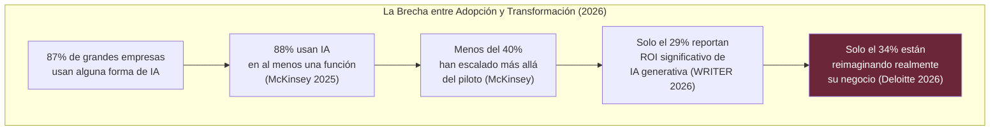
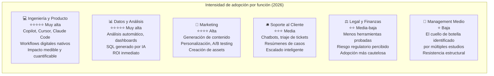
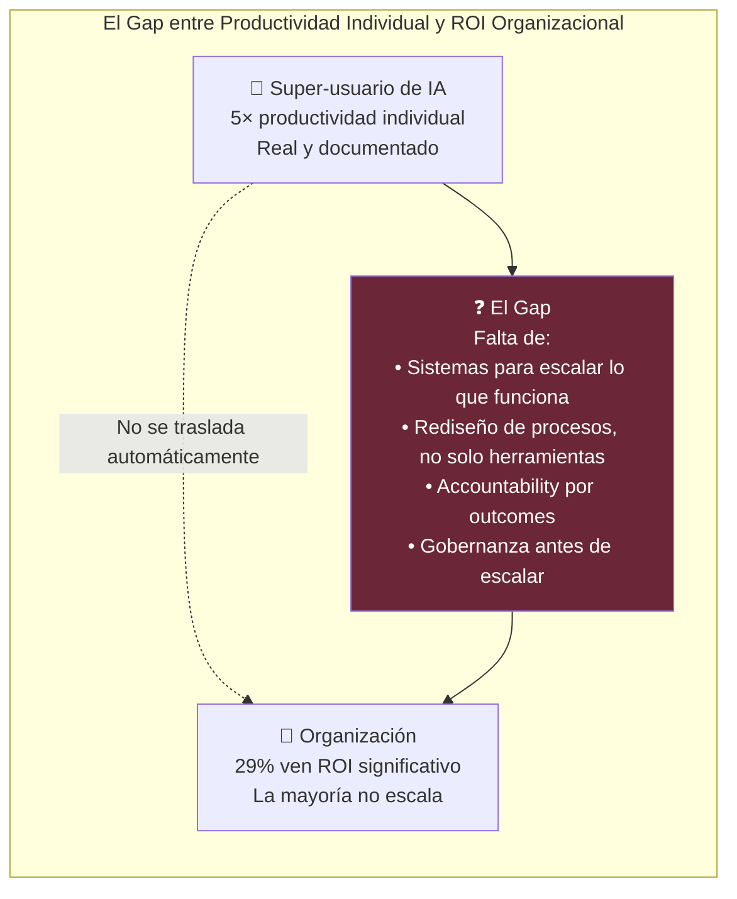
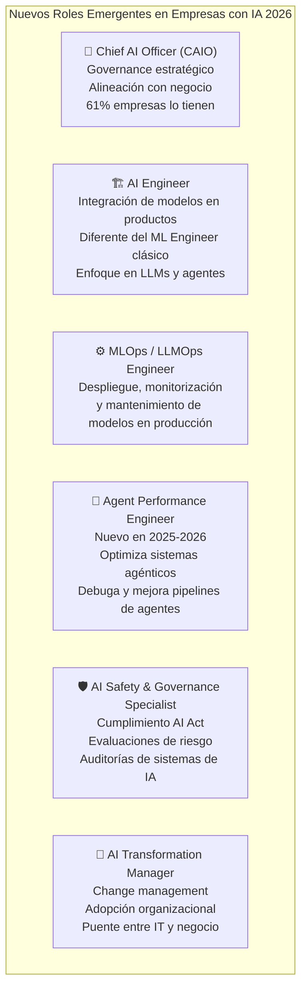

# 🏢 II-1 — IA en la Empresa: Cómo las Organizaciones Están Adoptando la IA de Verdad
## Entre la Transformación Real y la Estrategia de Escaparate

> *"El 75% de los ejecutivos admiten que la estrategia de IA de su empresa es 'más para aparentar' que para guía interna real."*
> — WRITER Enterprise AI Report, 2026

> *"La IA entrega mejoras en eficiencia y productividad. Pero solo el 34% de las organizaciones están reimaginando realmente el negocio."*
> — Deloitte, State of AI in the Enterprise, 2026

---

### 📌 Introducción

Hay dos versiones paralelas de la adopción empresarial de la IA en 2026. La versión de los comunicados de prensa —donde toda empresa está "transformándose con IA", donde los CEOs hablan de "revolución" y donde los decks de PowerPoint abundan en porcentajes de eficiencia— y la versión que revelan los datos de encuestas a líderes reales.

Las dos versiones son radicalmente diferentes. Y la diferencia entre ellas es exactamente lo que este artículo explora.

---

### 📊 1.1 El Estado Real de la Adopción en 2026

Los números de adopción superficial son impresionantes: <cite index="28-1">con el 87% de las grandes empresas implementando soluciones de IA en 2025, la adopción ha alcanzado el estatus de corriente principal.</cite>

Pero el diablo está en los detalles. <cite index="31-1">El 95% de los pilotos de IA generativa fracasan en pasar de la fase experimental, según el informe GenAI Divide del MIT. Y el 56% de los CEOs encuestados por PwC en su Global CEO Survey 2026 reportan obtener "nada" de sus esfuerzos de adopción de IA.</cite>

La conclusión que emerge de los datos: hay una **brecha enorme entre el despliegue de herramientas de IA y la transformación real del negocio**. Las organizaciones están comprando licencias de Copilot, usando ChatGPT para emails y haciendo demos de chatbots. Pocas están rediseñando sus procesos fundamentales.

---

### 🔥 1.2 La Crisis del Ejecutivo: Estrés y Estrategia de Aparador

<cite index="30-1">El 79% de las organizaciones enfrentan desafíos en la adopción de IA — un incremento de dos dígitos respecto a 2025 — con el 54% de ejecutivos de C-suite admitiendo que la adopción de IA está "desgarrando su empresa". Esto ocurre a pesar de que el 59% de las empresas invierten más de un millón de dólares anuales en tecnología de IA.</cite>

Las razones de ese estrés son reveladoras:

<cite index="30-1">El 73% de los CEOs reportan estrés o ansiedad sobre la estrategia de IA de su empresa, con un 38% experimentando niveles de estrés altos o paralizantes. Casi dos tercios temen perder su trabajo si no logran liderar la transición de IA. Bajo esa presión, tres cuartas partes de los ejecutivos admiten que la estrategia de IA de su empresa es "más para aparentar" que guía interna real.</cite>

Este fenómeno — la **estrategia de IA como performance pública** — es uno de los rasgos más característicos del momento actual. Las empresas anuncian iniciativas de IA para tranquilizar a sus inversores, clientes y juntas directivas, mientras internamente el despliegue real es caótico, fragmentado o directamente inexistente.

---

### 📈 1.3 Dónde Funciona de Verdad: Los Sectores y Funciones que Lideran

No toda la adopción es igual. <cite index="28-1">La adopción está especialmente avanzada en manufactura, logística y defensa, donde la robótica, los vehículos autónomos y los drones ya están rediseñando las operaciones.</cite>

Por función, el gradiente de adopción real es pronunciado:

<cite index="31-1">La brecha entre la función superior e inferior es de 4 veces. Las mismas organizaciones, el mismo liderazgo, los mismos presupuestos — con una intensidad de adopción radicalmente diferente.</cite>

Los factores que explican qué funciones adoptan antes:
- **Flujos de trabajo nativamente digitales** donde la IA encaja de forma natural
- **Outputs medibles** — cuando el impacto es fácil de cuantificar, la inversión sigue
- **Madurez del ecosistema de herramientas** — Ingeniería tiene Copilot, Cursor y docenas de alternativas; Legal y Finanzas tienen menos opciones probadas

---

### 💰 1.4 El ROI: Lo que los Datos Dicen Realmente

Los beneficios reales, cuando existen, son concretos:

<cite index="28-1">Las organizaciones que implementan IA reportan mejoras de negocio significativas: ganancias del 34% en eficiencia operacional y reducción de costes del 27% dentro de los 18 meses de implementación. Dos tercios de las organizaciones reportan ganancias en productividad y eficiencia.</cite>

Pero hay una trampa fundamental: <cite index="30-1">los super-usuarios de IA están entregando ganancias de productividad de 5 veces, pero solo el 29% de las organizaciones ven ROI significativo de la IA generativa. La brecha entre ganancias individuales y resultados organizacionales revela lo que falta: transformación estructural, no solo despliegue de herramientas.</cite>

---

### 🎭 1.5 Los Cinco Patrones de Fallo

<cite index="30-1">Los datos revelan cinco patrones distintos que separan a las organizaciones que logran transformación de las que luchan por escalar el éxito más allá de la productividad individual.</cite>

**Patrón 1 — El problema bottom-up:** <cite index="32-1">Muchas empresas cometen un error comprensible: en lugar de que el liderazgo dirija con un programa top-down, adoptan un enfoque bottom-up, convirtiendo iniciativas dispersas en algo parecido a una estrategia. El resultado: proyectos que raramente coinciden con las prioridades de la empresa y casi nunca llevan a transformación.</cite>

**Patrón 2 — La IA en silos técnicos:** Las herramientas de IA quedan atrapadas dentro de los equipos técnicos, creando cuellos de botella que estrangula la adopción. Los equipos de negocio no tienen acceso ni autonomía.

**Patrón 3 — Shadow AI sin gobernanza:** <cite index="30-1">El 67% de los ejecutivos cree que su empresa ya ha sufrido una brecha de datos debido a herramientas de IA no aprobadas.</cite> Los empleados usan ChatGPT, Copilot y otras herramientas con datos corporativos sin que IT lo sepa ni lo controle.

**Patrón 4 — Métricas de vanidad:** Contar usuarios activos de Copilot en lugar de medir outcomes de negocio. La métrica de "¿cuántos empleados usan IA?" es tan irrelevante como contar cuántos tienen acceso a Excel.

**Patrón 5 — Governance after-the-fact:** Desplegar primero, gobernar después. <cite index="30-1">Solo el 29% de las organizaciones ven ROI significativo de la IA generativa. Las que lo logran comparten cuatro características: vinculan la IA directamente a outcomes de revenue, arquitecturan plataformas que dan autonomía a equipos de negocio mientras IT mantiene oversight, implementan governance antes de escalar, y tratan la adopción de IA como rediseño organizacional, no como un rollout tecnológico.</cite>

---

### 👔 1.6 Los Nuevos Roles: Quién Hace Qué en la Era de la IA Empresarial

<cite index="35-1">Los roles de Chief AI Officer (CAIO) ya están presentes en el 61% de las empresas. El número de trabajadores en ocupaciones donde la fluidez en IA es explícitamente requerida ha crecido siete veces en dos años, de aproximadamente 1 millón a 7 millones.</cite>

---

### 🏆 1.7 Qué Separa a los Que Ganan

<cite index="34-1">Los datos muestran que los high performers en IA son tres veces más propensos que sus pares a estar de acuerdo en que los líderes senior de sus organizaciones demuestran propiedad y compromiso con sus iniciativas de IA. También son mucho más propensos que otros a decir que los líderes senior están activamente comprometidos en impulsar la adopción de IA, incluyendo modelar el uso de IA ellos mismos.</cite>

Las seis prácticas que definen a las organizaciones ganadoras, según McKinsey:

| Dimensión | Práctica de los High Performers |
|-----------|--------------------------------|
| **Estrategia** | IA vinculada a P&L específicos, no a objetivos genéricos |
| **Talento** | Upskilling + contratación simultáneos, no solo uno |
| **Modelo operativo** | IA embedded en equipos de negocio, no solo en IT |
| **Tecnología** | Stack estándar con gobernanza, no el zoo de herramientas |
| **Datos** | Infraestructura de datos como prerequisito, no afterthought |
| **Adopción** | Proceso de cambio gestionado, con medición de outcomes reales |

---

### 🔮 1.8 Hacia Dónde Va: La Empresa Agéntica

<cite index="32-1">A medida que los agentes se expanden, la fuerza laboral puede necesitar nuevas habilidades (como la orquestación de agentes), nuevos incentivos (alineados con outcomes de negocio, ya que los agentes hacen los pasos intermedios) y nuevos roles (frecuentemente relacionados con supervisión y estrategia).</cite>

<cite index="35-1">Para finales de 2026, el 40% de las aplicaciones empresariales tendrán agentes de IA integrados para tareas específicas, frente a menos del 5% en 2025. El mercado de agentes de IA crece a una CAGR proyectada del 46.3%, expandiéndose de 7.84 mil millones en 2025 a 52.62 mil millones para 2030.</cite>

La empresa del futuro próximo no es una empresa que tiene una herramienta de IA. Es una empresa donde los agentes de IA ejecutan automáticamente workflows complejos — análisis, redacción, código, comunicación, coordinación — mientras los humanos supervisaban, deciden sobre excepciones y se enfocan en lo que los agentes no pueden hacer: relaciones, creatividad estratégica y juicio en situaciones ambiguas.

---

### 📚 Referencias II-1

1. **Deloitte AI Institute** (2026). *State of AI in the Enterprise 2026.* Encuesta a 3.235 líderes, 24 países. [https://www.deloitte.com/us/en/what-we-do/capabilities/applied-artificial-intelligence/content/state-of-ai-in-the-enterprise.html](https://www.deloitte.com/us/en/what-we-do/capabilities/applied-artificial-intelligence/content/state-of-ai-in-the-enterprise.html)
2. **WRITER** (may. 2026). *Enterprise AI Adoption 2026: Why 79% Face Challenges Despite High Investment.* [https://writer.com/blog/enterprise-ai-adoption-2026/](https://writer.com/blog/enterprise-ai-adoption-2026/)
3. **McKinsey** (nov. 2025). *The State of AI in 2025: Agents, Innovation, and Transformation.* [https://www.mckinsey.com/capabilities/quantumblack/our-insights/the-state-of-ai](https://www.mckinsey.com/capabilities/quantumblack/our-insights/the-state-of-ai)
4. **Second Talent** (may. 2026). *AI Adoption in Enterprise Statistics & Trends 2025.* [https://www.secondtalent.com/resources/ai-adoption-in-enterprise-statistics/](https://www.secondtalent.com/resources/ai-adoption-in-enterprise-statistics/)
5. **Larridin** (may. 2026). *AI Adoption: The Complete Enterprise Guide 2026.* [https://larridin.com/solutions/ai-adoption-the-complete-enterprise-guide-2026](https://larridin.com/solutions/ai-adoption-the-complete-enterprise-guide-2026)
6. **PwC** (2026). *2026 AI Business Predictions.* [https://www.pwc.com/us/en/tech-effect/ai-analytics/ai-predictions.html](https://www.pwc.com/us/en/tech-effect/ai-analytics/ai-predictions.html)
7. **Azumo** (may. 2026). *70 Enterprise AI Statistics for 2026: Adoption, ROI & Trends.* [https://azumo.com/artificial-intelligence/ai-insights/enterprise-ai-adoption-statistics](https://azumo.com/artificial-intelligence/ai-insights/enterprise-ai-adoption-statistics)

---

*📅 Serie elaborada en junio de 2026*
*🖊️ **Inteligencia Artificial — De la Teoría a la Transformación***

---