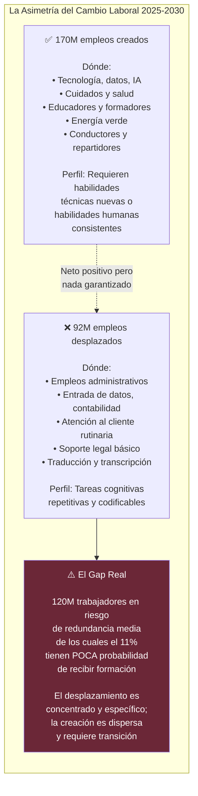
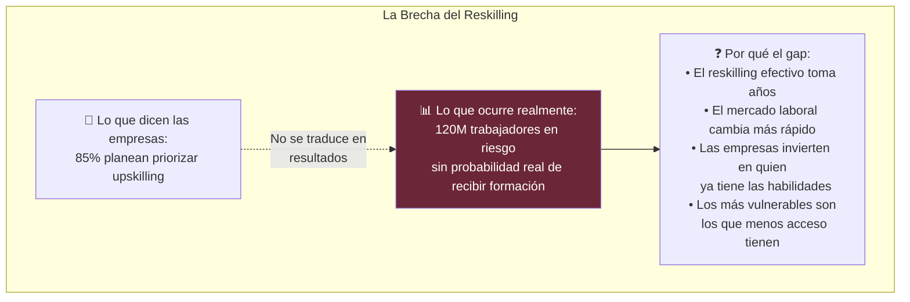
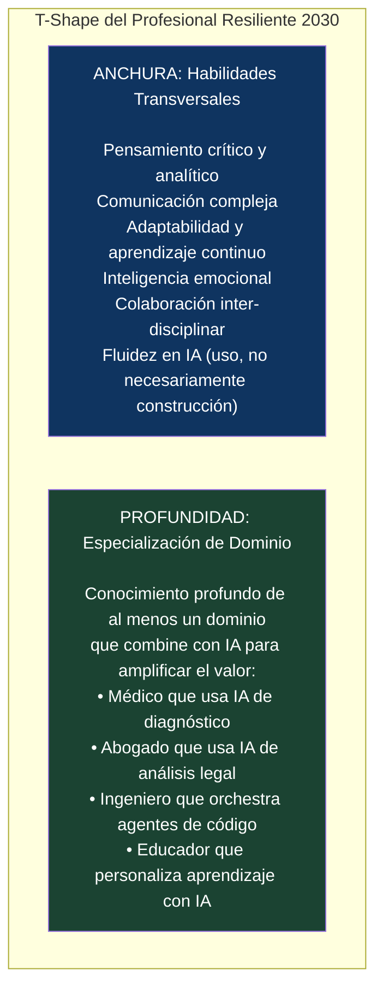

# 👷 II-2 — IA y el Futuro del Trabajo
## Lo que Cambia, lo que Desaparece y lo que Emerge

> *"El problema real no es que la IA tome todos los empleos. Es que los toma de forma desigual — y los trabajadores que los pierden no son los mismos que obtienen los nuevos."*
> — SEOScaleUp, mayo 2026

> *"170 millones de empleos nuevos. 92 millones desplazados. Resultado neto positivo. El problema es que no es un intercambio directo."*
> — WEF, Future of Jobs Report 2025

---

### 📌 Introducción

Cada revolución tecnológica importante generó, en su momento, el mismo debate: ¿las máquinas robarán el trabajo humano? El telar mecánico en el siglo XVIII, la cadena de montaje en el XX, la automatización industrial en los 80. En todos los casos, el resultado histórico fue positivo en términos netos — más empleos totales, mejor calidad de vida promedio — pero con transiciones dolorosas para quienes estaban en los trabajos desplazados.

La IA es diferente en un aspecto crítico: por primera vez en la historia, la automatización amenaza trabajo **cognitivo** de nivel medio-alto, no solo manual y repetitivo. Y eso cambia significativamente quiénes son los afectados y qué herramientas tienen para adaptarse.

---

### 📊 2.1 Los Números del WEF: Un Resultado Neto Positivo con Asterisco

<cite index="37-1">El Future of Jobs Report 2025 del Foro Económico Mundial revela que la disrupción laboral equivaldrá al 22% de los empleos para 2030, con 170 millones de nuevos roles que se crearán y 92 millones desplazados, resultando en un incremento neto de 78 millones de puestos de trabajo.</cite>

El resultado neto es positivo. Pero hay un asterisco enorme: <cite index="42-1">no son intercambios uno a uno que ocurren en los mismos lugares con las mismas personas. El desafío real no es solo sobre números de empleos; es sobre la brecha entre dónde desaparecen los empleos y dónde vuelven, entre las habilidades que los trabajadores poseen y las que requieren los nuevos roles.</cite>

---

### 🎯 2.2 Qué Trabajos Están en Riesgo — y Cuáles No

La clave para entender el riesgo no es el sector ni el título — es la naturaleza de las tareas. Los trabajos más vulnerables comparten características comunes: tareas bien definidas, outputs codificables, patrones predecibles y poca necesidad de juicio en situaciones ambiguas.

**Alta vulnerabilidad (75-95% de automatización de tareas principales):**

| Rol | Razón principal de riesgo |
|-----|--------------------------|
| Entrada y procesamiento de datos | LLMs + OCR + automatización de flujos |
| Traducción y transcripción básica | Whisper + modelos de traducción superan nivel humano |
| Atención al cliente rutinaria | Agentes de IA gestionan el 80% de consultas frecuentes |
| Análisis de documentos legales (básico) | Modelos especializados en lectura y resumen legal |
| Contabilidad y conciliación estándar | Automatización + auditoría por IA |
| Código de bajo nivel y testing básico | Copilot y agentes de codificación |

**Baja vulnerabilidad (requieren capacidades no automatizables):**

| Categoría | Por qué resisten |
|-----------|----------------|
| Roles que requieren presencia física compleja | Plomería, cirugía, cuidado personal |
| Trabajo emocional complejo | Terapia, cuidado de menores y mayores, mediación |
| Liderazgo y toma de decisiones estratégicas | Juicio en situaciones sin precedentes |
| Creatividad de alto nivel | Diseño estratégico, arte innovador, investigación básica |
| Habilidades de relación y confianza | Negociación, ventas complejas, diplomacia |

---

### 💸 2.3 El Premio Salarial de la Fluidez en IA

<cite index="35-1">Los trabajadores con habilidades en IA ganan, en promedio, un 56% más en salario que sus pares en el mismo rol sin habilidades de IA. El número de trabajadores en ocupaciones donde la fluidez en IA es explícitamente requerida ha crecido siete veces en dos años, de aproximadamente 1 millón a 7 millones.</cite>

<cite index="40-1">Los trabajos más expuestos a IA experimentan un crecimiento de productividad casi 4 veces mayor que los menos expuestos; la productividad en industrias expuestas a IA saltó del 7% al 27% desde 2022.</cite>

Esto crea una dinámica potencialmente polarizante: los trabajadores que adoptan y dominan la IA ven sus capacidades multiplicadas, sus salarios subir y su valor de mercado crecer. Los que no — por falta de acceso, recursos o capacidad — quedan progresivamente rezagados en una economía donde la fluidez en IA se convierte en el nuevo requisito base.

---

### 📚 2.4 El Problema del Reskilling: La Promesa que Raramente se Cumple

<cite index="37-1">Si la población activa global fuera representada por un grupo de 100 personas, 59 necesitarían reciclarse o actualizarse para 2030 — 11 de las cuales tienen pocas probabilidades de recibirlo; esto se traduce en más de 120 millones de trabajadores en riesgo de redundancia a medio plazo.</cite>

<cite index="40-1">El 85% de los empleadores dicen que planean priorizar el upskilling — pero 120 millones de trabajadores enfrentan riesgo de redundancia a medio plazo porque es improbable que reciban la formación que necesitan. La desconexión entre la intención de los empleadores y la entrega real de programas es el mayor fracaso de política laboral de la transición de IA.</cite>

---

### 🏆 2.5 Las Habilidades que Protegen en 2030

<cite index="44-1">En los próximos cinco años, el 39% de los conjuntos de habilidades actuales de los trabajadores necesitarán actualizaciones significativas. El WEF identifica el pensamiento creativo, la resiliencia, la flexibilidad y el liderazgo como las habilidades humanas más críticas hasta 2030.</cite>

<cite index="40-1">Los profesionales más valiosos combinan fluidez técnica en IA con capacidades distintivamente humanas. Ninguna por sí sola es tan defendible como ambas juntas.</cite>

Las habilidades del profesional resiliente en la era de la IA:

---

### 🌍 2.6 El Debate del Ingreso Básico Universal

La posibilidad de disrupción masiva del empleo ha revitalizado el debate sobre el **Ingreso Básico Universal (IBU)** como herramienta de transición social.

Los argumentos a favor en el contexto de la IA:
- Proporciona un colchón para trabajadores desplazados durante la transición
- Libera a las personas para explorar trabajos de mayor valor e impacto
- Puede financiarse capturando parte de las ganancias de productividad de la IA mediante impuestos

Los argumentos en contra:
- El coste fiscal a escala universal es masivo e incierto
- Puede reducir los incentivos para el trabajo y la reconversión
- La evidencia de pilotos existentes es mixta y no generalizable a escala nacional

En 2026, ningún país ha implementado un IBU a escala nacional en respuesta directa a la IA. Varios han expandido programas de subsidio de formación y renta mínima garantizada como medidas de transición.

---

### 📚 Referencias II-2

1. **WEF** (ene. 2025). *Future of Jobs Report 2025.* [https://www.weforum.org/publications/the-future-of-jobs-report-2025/](https://www.weforum.org/publications/the-future-of-jobs-report-2025/)
2. **WEF** (ago. 2025). *Why AI is Replacing Some Jobs Faster than Others.* [https://www.weforum.org/stories/2025/08/ai-jobs-replacement-data-careers/](https://www.weforum.org/stories/2025/08/ai-jobs-replacement-data-careers/)
3. **WEF** (dic. 2025). *AI Paradoxes: Why AI's Future Isn't Straightforward.* [https://www.weforum.org/stories/2025/12/ai-paradoxes-in-2026/](https://www.weforum.org/stories/2025/12/ai-paradoxes-in-2026/)
4. **SEOScaleUp** (may. 2026). *AI Replacing Jobs 2026–2030: 70+ Statistics on Displacement, Creation & the Skills Gap.* [https://seoscaleup.com/blog/ai-replacing-jobs-2026-2030/](https://seoscaleup.com/blog/ai-replacing-jobs-2026-2030/)
5. **WEF** (ene. 2026). *Invest in the Workforce for the AI Age.* [https://www.weforum.org/stories/2026/01/ai-roadmap-transforming/](https://www.weforum.org/stories/2026/01/ai-roadmap-transforming/)
6. **WEF** (ene. 2025). *Reskilling Revolution: Preparing 1 Billion People.* [https://www.weforum.org/stories/2026/01/reskilling-revolution-preparing-1-billion-people-for-tomorrows-economy/](https://www.weforum.org/stories/2026/01/reskilling-revolution-preparing-1-billion-people-for-tomorrows-economy/)
7. **McKinsey Global Institute** (2025). *The State of AI in 2025.* [https://www.mckinsey.com/capabilities/quantumblack/our-insights/the-state-of-ai](https://www.mckinsey.com/capabilities/quantumblack/our-insights/the-state-of-ai)

---

*📅 Serie elaborada en junio de 2026*
*🖊️ **Inteligencia Artificial — De la Teoría a la Transformación***

---