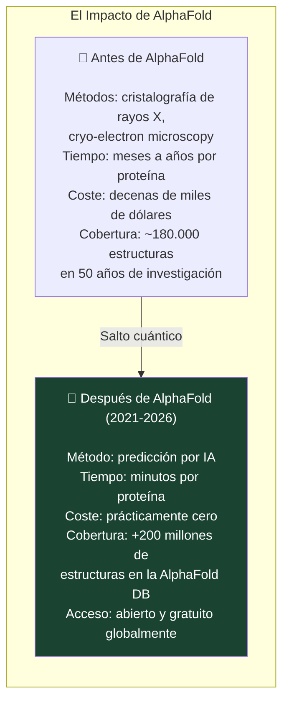
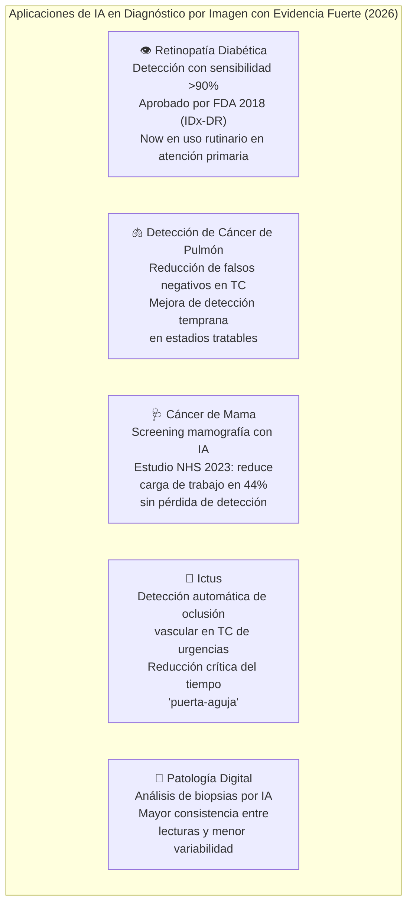

# 🔬 II-3 — IA en la Ciencia y la Salud: La Revolución Silenciosa
## Donde la IA Hace su Trabajo Más Importante

> *"AlphaFold no resolvió mágicamente el desarrollo de fármacos, pero mejoró masivamente el mapa de partida. Esa es la manera correcta de describir el rol de la IA aquí."*
> — BlueHeadline, 2026

> *"El 2024 Nobel de Química fue otorgado a David Baker, Demis Hassabis y John Jumper por su trabajo en usar IA para predecir estructuras de proteínas."*
> — PMC / Clinical and Translational Science, 2025

---

### 📌 Introducción

Si hay un dominio donde el impacto positivo de la IA es más claro, menos contestado y potencialmente más transformador para la humanidad, es el de la ciencia y la salud. No porque la IA no tenga riesgos en estos contextos — los tiene, y son graves — sino porque los problemas que está ayudando a resolver son de una magnitud que justifica la atención y la inversión.

AlphaFold, el diagnóstico médico por imagen, el descubrimiento acelerado de fármacos y la medicina personalizada son casos donde la IA no solo es más rápida que el método anterior — en algunos casos, hace posible lo que antes era imposible.

---

### 🧬 3.1 AlphaFold: El Problema que Llevaba 50 Años Sin Resolver

El plegamiento de proteínas fue durante décadas uno de los "grandes problemas abiertos" de la biología. Las proteínas son las máquinas moleculares de la vida — catalizan reacciones, forman estructuras, transportan sustancias, combaten infecciones. Su función depende de su forma tridimensional. Y determinar esa forma a partir de la secuencia de aminoácidos era extraordinariamente difícil.

<cite index="48-1">El 2024 Nobel de Química fue otorgado a David Baker, Demis Hassabis y John Jumper por su trabajo innovador en usar IA para predecir estructuras de proteínas y diseñar proteínas funcionales. El desarrollo del modelo AlphaFold ha resuelto un desafío de larga data en biología al predecir con precisión las estructuras complejas de proteínas, cruciales para comprender su función.</cite>

<cite index="46-1">AlphaFold no resolvió mágicamente el desarrollo de fármacos, pero mejoró masivamente el mapa de partida. Hace partes del descubrimiento más rápidas, más amplias y más baratas de explorar. No elimina la necesidad de validación en laboratorio húmedo, toxicología, fabricación, ensayos o escrutinio regulatorio.</cite>

<cite index="47-1">AlphaFold 3 permite a los investigadores visualizar sitios de unión con precisión sin precedentes, predecir interacciones fármaco-objetivo incluyendo complejos proteína-ligando, y diseñar moléculas que se ajusten a bolsillos proteicos específicos sin requerir cristalografía experimental costosa y lenta. En términos de predicción de interacciones similares a fármacos, alcanza un 50% más de precisión comparado con métodos tradicionales basados en física.</cite>

---

### 🏥 3.2 Diagnóstico Médico por Imagen: La IA como Segundo Par de Ojos

El diagnóstico por imagen — radiología, patología, dermatología — es uno de los dominios donde la IA ha demostrado resultados más sólidos y reproducibles.

<cite index="51-1">Para investigación médica, la IA potencia el diagnóstico médico auxiliar por imagen (TC, MRI), análisis patológico, planificación de tratamiento personalizado, predicción de riesgo de salud con gestión de salud a lo largo de la vida, y cirugía mínimamente invasiva asistida por robot (como el Sistema Quirúrgico da Vinci).</cite>

Casos documentados con evidencia sólida:

La narrativa es matizada: la IA no reemplaza a los radiólogos. La evidencia actual sugiere que los mejores resultados se obtienen con la combinación humano + IA, donde la IA actúa como primer filtro o segundo par de ojos, y el especialista humano toma la decisión clínica final.

---

### 💊 3.3 Descubrimiento de Fármacos Acelerado por IA

El pipeline tradicional de desarrollo de un medicamento era devastadoramente lento y caro: 10-15 años de media, $1-3 mil millones de coste, con una tasa de fracaso del 90% en ensayos clínicos. La IA está comprimiendo la fase de descubrimiento.

<cite index="47-1">Los modelos de lenguaje entrenados sobre datos químicos han emergido como herramientas poderosas para la representación y generación molecular. Estas tecnologías emergentes complementan otros enfoques de IA, ofreciendo capacidades ortogonales que, cuando se integran, crean plataformas comprensivas de descubrimiento de fármacos impulsadas por IA.</cite>

Casos documentados:
- **Insilico Medicine** usó AlphaFold + IA generativa para identificar un candidato a fármaco para fibrosis pulmonar idiopática en 18 meses — el mismo proceso habría tomado 4-5 años por métodos convencionales
- **Exscientia** llevó una molécula generada por IA a ensayos clínicos fase 1 en 12 meses
- **DeepMind / Isomorphic Labs** ha expandido AlphaFold 3 para predecir interacciones proteína-fármaco, ADN, ARN y otros compuestos biológicos

---

### 🧪 3.4 IA en Ciencia Básica: Más Allá de la Salud

El impacto de la IA en ciencia va mucho más allá de la medicina:

| Campo | Impacto de la IA | Hito reciente |
|-------|-----------------|---------------|
| **Física de Materiales** | Descubrimiento de nuevos superconductores y materiales para baterías mediante aprendizaje por refuerzo | Google DeepMind descubrió 2.2M de nuevos materiales cristalinos estables (GNoME, 2023) |
| **Climatología** | Previsión meteorológica con resolución y precisión sin precedentes | GraphCast (DeepMind) supera a ECMWF en previsión a 10 días |
| **Astronomía** | Clasificación de millones de galaxias, detección de señales débiles | IA procesa datos del James Webb Space Telescope |
| **Matemáticas** | Descubrimiento de demostraciones y conjeturas | AlphaProof resuelve cuatro problemas de la IMO 2024 |
| **Lingüística** | Descifrado de textos antiguos | IA descifró parcialmente textos en lineal A (2024) |

---

### ⚠️ 3.5 Los Riesgos Específicos de la IA en Salud

<cite index="46-1">La Organización Mundial de la Salud mantiene que su guía 2025 sobre grandes modelos multimodales para salud no rechaza la tecnología. Insiste en salvaguardas, supervisión y evidencia: "Debe poner la ética y los derechos humanos en el corazón." Si un sistema de IA en salud es rápido, persuasivo y escalable, pero débil en supervisión, transparencia o equidad, no es maduro. Es simplemente peligroso a escala.</cite>

Los riesgos específicos del contexto de salud:

- **Alucinaciones con consecuencias clínicas:** una respuesta incorrecta en un workflow de cuidado puede causar daño real — a diferencia de una respuesta incorrecta en un chatbot de e-commerce
- **Sesgo en datos de entrenamiento:** si el modelo se entrenó predominantemente con datos de poblaciones específicas, su rendimiento en poblaciones subrepresentadas puede ser significativamente peor
- **Erosión de la habilidad clínica:** si los médicos delegan en IA sistemáticamente, sus propias capacidades diagnósticas pueden deteriorarse
- **Privacidad de datos de salud:** los datos médicos son extraordinariamente sensibles y su uso para entrenamiento levanta preguntas de consentimiento complejas

---

### 📚 Referencias II-3

1. **BlueHeadline** (mar. 2026). *AI In Healthcare In 2026: What Is Real In Diagnosis, Drug Discovery, And Clinical Care.* [https://blueheadline.com/future-tech/ai-in-healthcare-2026-diagnosis-drug-discovery-future/](https://blueheadline.com/future-tech/ai-in-healthcare-2026-diagnosis-drug-discovery-future/)
2. **PMC / Clinical and Translational Science** (feb. 2025). *AI In Action: Redefining Drug Discovery and Development.* [https://pmc.ncbi.nlm.nih.gov/articles/PMC11800368/](https://pmc.ncbi.nlm.nih.gov/articles/PMC11800368/)
3. **MDPI / AI Journal** (ene. 2026). *From Algorithm to Medicine: AI in the Discovery and Development of New Drugs.* [https://www.mdpi.com/2673-2688/7/1/26](https://www.mdpi.com/2673-2688/7/1/26)
4. **PubMed Central** (2026). *AI reshaping life sciences: intelligent transformation, application challenges, and future convergence.* [https://www.ncbi.nlm.nih.gov/pmc/articles/PMC12500557/](https://www.ncbi.nlm.nih.gov/pmc/articles/PMC12500557/)
5. **arXiv** (2022). *AlphaFold Accelerates Artificial Intelligence Powered Drug Discovery.* arXiv:2201.09647. [https://arxiv.org/pdf/2201.09647](https://arxiv.org/pdf/2201.09647)
6. **Fortune** (nov. 2025). *Five years after its debut, Google DeepMind's AlphaFold shows why science is AI's killer app.* [https://fortune.com/2025/11/28/google-deepmind-alphafold-science-ai-killer-app/](https://fortune.com/2025/11/28/google-deepmind-alphafold-science-ai-killer-app/)
7. **WHO** (2025). *Ethics and governance of artificial intelligence for health.* [https://www.who.int/publications/i/item/9789240029200](https://www.who.int/publications/i/item/9789240029200)

---

*📅 Serie elaborada en junio de 2026*
*🖊️ **Inteligencia Artificial — De la Teoría a la Transformación***

---