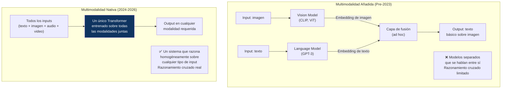
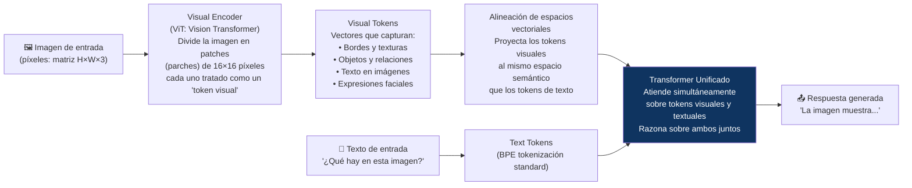

# 👁️ II-4 — IA Multimodal: Cuando el Modelo Ve, Escucha y Habla
## La Próxima Frontera Técnica ya Está en Producción

> *"Fuimos de 'máquina de texto' a 'entiende el mundo como una persona' en aproximadamente tres años."*
> — Medium, marzo 2026

> *"La IA multimodal ha cruzado de 'demo impresionante' a 'infraestructura de producción' en tres años."*
> — Medium, marzo 2026

---

### 📌 Introducción

Los artículos anteriores de esta serie describieron los LLMs como modelos de lenguaje — sistemas que procesan texto y generan texto. Esa descripción fue precisa hasta 2022. En 2026, los modelos frontera son fundamentalmente diferentes: procesan simultáneamente texto, imágenes, audio y video, y generan salidas en múltiples modalidades.

Este artículo explica cómo funciona eso técnicamente, por qué importa en la práctica, y qué está cambiando en producción real como resultado de esta capacidad.

---

### 🧩 4.1 ¿Qué es la Multimodalidad?

<cite index="55-1">Un modelo de IA multimodal procesa múltiples tipos de datos simultáneamente — como texto con imágenes, audio o video. Según el CSAIL del MIT, estos modelos crean representaciones integradas que habilitan capacidades como describir imágenes, responder preguntas visuales o generar imágenes desde texto.</cite>

La distinción crítica es entre **multimodalidad nativa** (diseñada desde el principio) y **multimodalidad añadida** (diferentes modelos especializados conectados):

<cite index="60-1">Los modelos previos como GPT-4 usaban stacks separados. GPT-4o y Gemini usan un único Transformer para todas las modalidades. Los encoders de visión ahora preservan texto fino, elementos de UI, microestructuras y pequeños artefactos.</cite>

---

### 🛠️ 4.2 Cómo Funciona: De Píxeles a Significado

Cuando un modelo multimodal "ve" una imagen, el proceso es:

El avance clave de 2021 que lo hizo posible fue **CLIP** (Contrastive Language-Image Pre-training, OpenAI): entrenó un modelo para que las representaciones de una imagen y su descripción textual estuvieran cerca en el mismo espacio vectorial. Eso creó el puente semántico necesario para que los LLMs pudieran "ver".

---

### 📱 4.3 Los Modelos Frontera Multimodales en 2026

<cite index="58-1">Gemini 3.1 Pro fue construido multimodal desde su fundamento: texto, imagen, audio, video y código, todo tejido en una única arquitectura. Fuimos de "máquina de texto" a "entiende el mundo como una persona" en aproximadamente tres años.</cite>

| Modelo | Modalidades | Punto fuerte | Disponibilidad |
|--------|------------|-------------|---------------|
| **GPT-4o / GPT-5** | Texto, imagen, audio, video | Versatilidad general, conversación natural | API + ChatGPT |
| **Gemini 3.1 Pro** | Texto, imagen, audio, video (nativo) | Razonamiento visual complejo, contexto largo | API + Gemini |
| **Claude Opus 4.7** | Texto, imagen, documentos | Comprensión visual de charts, diagramas, código | API + claude.ai |
| **Llama 4 Maverick** | Texto, imagen | Open-weight, autodesplegable | Descarga directa |
| **Gemma 4** | Texto, imagen | Google, open-weight, eficiente | Descarga directa |

---

### 🏭 4.4 Aplicaciones en Producción: Lo que Está Cambiando Hoy

**Procesamiento de documentos complejos:**
Los modelos multimodales procesan PDFs con tablas, gráficos, formularios manuscritos y texto mixto que los modelos solo-texto no podían manejar. Aplicaciones: contabilidad automatizada, procesamiento de facturas, análisis de contratos con anexos gráficos.

**Accesibilidad:**
Descripciones automáticas de imágenes para personas con discapacidad visual. Subtitulado en tiempo real. Traducción de lenguaje de signos a texto. El impacto en calidad de vida para personas con discapacidad es inmediato y mensurable.

**Manufactura e inspección industrial:**
Visión por computadora integrada con razonamiento lingüístico. Un sistema puede detectar un defecto en una pieza, explicar por qué es un defecto, clasificar su gravedad y generar el registro de incidencia — todo en una sola inferencia.

**Asistencia médica:**
Modelos que analizan imágenes de radiografías, ecografías o dermoscopia y generan un reporte estructurado en lenguaje natural que el médico puede revisar. No como diagnóstico autónomo, sino como primer filtro que amplifica la capacidad del especialista.

**Educación personalizada:**
Sistemas que ven lo que el estudiante dibuja en papel, leen su expresión facial y adaptan la explicación en tiempo real — combinando comprensión visual, análisis de audio y generación de texto de forma integrada.

---

### ⚠️ 4.5 Los Deepfakes: La Cara Oscura de la Multimodalidad

La misma capacidad que permite a un modelo generar imágenes desde texto, o sincronizar audio con video, también hace posible la creación de contenido sintético hiperreaista con fines maliciosos.

La amenaza de los deepfakes en 2026 es cualitativamente más seria que en 2022:
- Los modelos de generación de video (Sora, Kling, Runway) permiten crear videos realistas de personas diciendo cosas que nunca dijeron
- La síntesis de voz (ElevenLabs, Suno) permite clonar la voz de cualquier persona con pocos segundos de audio de referencia
- Las herramientas son accesibles — no requieren hardware especializado ni conocimiento técnico profundo
- La detección de deepfakes está en una carrera armamentística con la generación — los detectores mejoran, pero los generadores también

Las implicaciones para la democracia, el periodismo y la confianza institucional son de primer orden. La capacidad de verificar la autenticidad de un video o un audio se está erosionando sistemáticamente.

---

### 📚 Referencias II-4

1. **SuperAnnotate** (feb. 2026). *What is Multimodal AI: Complete Overview 2026.* [https://www.superannotate.com/blog/multimodal-ai](https://www.superannotate.com/blog/multimodal-ai)
2. **ruh.ai** (2026). *Multimodal AI: Complete Guide to Next-Gen Systems (2026).* [https://www.ruh.ai/blogs/multimodal-ai-complete-guide-2026](https://www.ruh.ai/blogs/multimodal-ai-complete-guide-2026)
3. **Medium / Siddantvardey** (mar. 2026). *Multimodal AI Explained 2026: Vision, Audio & Video in LLMs.* [https://medium.com/@siddantvardey/multimodal-ai-when-models-can-see-hear-and-speak-7176f983d5f3](https://medium.com/@siddantvardey/multimodal-ai-when-models-can-see-hear-and-speak-7176f983d5f3)
4. **DEV Community** (abr. 2026). *Multimodal AI in 2026: How AI Now Understands Images, Audio, and Video.* [https://dev.to/lufumeiying/multimodal-ai-in-2026-how-ai-now-understands-images-audio-and-video-28ic](https://dev.to/lufumeiying/multimodal-ai-in-2026-how-ai-now-understands-images-audio-and-video-28ic)
5. **Medium / Zaina Haider** (nov. 2025). *The Inner Workings of AI Models like GPT-4o and Gemini.* [https://medium.com/@thekzgroupllc/the-inner-workings-of-ai-models-like-gpt-4o-and-gemini-8698359fc950](https://medium.com/@thekzgroupllc/the-inner-workings-of-ai-models-like-gpt-4o-and-gemini-8698359fc950)
6. **Radford, A. et al.** (2021). *Learning Transferable Visual Models From Natural Language Supervision (CLIP).* arXiv:2103.00020.

---

*📅 Serie elaborada en junio de 2026*
*🖊️ **Inteligencia Artificial — De la Teoría a la Transformación***

---