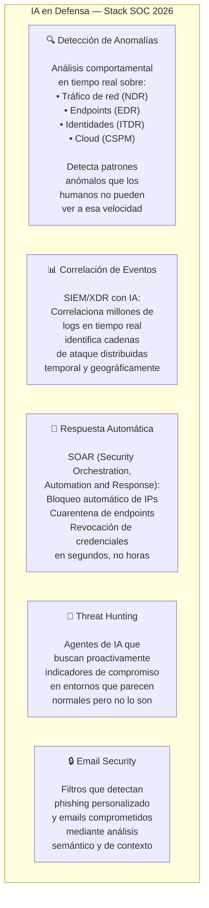
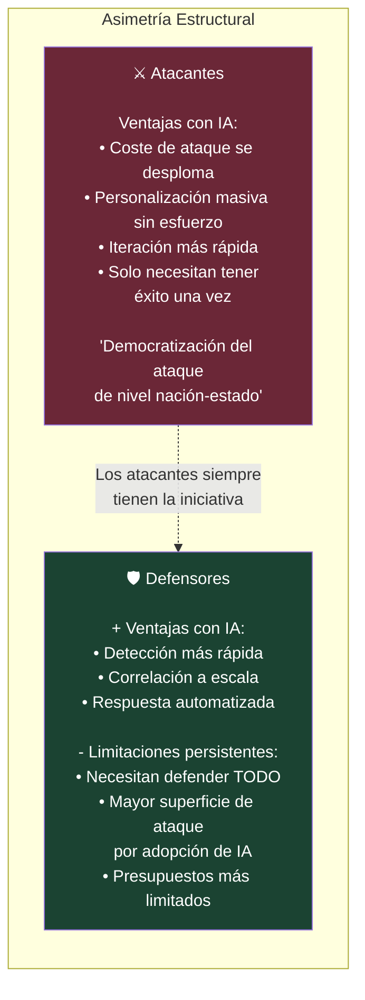

# 🛡️ II-5 — IA en Ciberseguridad: Escudo y Espada
## La Misma Tecnología que Defiende también Ataca

> *"La misma IA generativa que impulsa la automatización del SOC está siendo usada como arma por los atacantes para phishing sofisticado, malware polimórfico e ingeniería social deepfake a escala."*
> — Secure.com, 2026

---

### 📌 Introducción

La relación entre la IA y la ciberseguridad es profundamente paradójica: la misma tecnología que permite a los defensores detectar amenazas más rápido, correlacionar señales de millones de eventos y responder automáticamente, también permite a los atacantes escalar sus operaciones, personalizar sus ataques y evadir las defensas más eficazmente.

No hay neutralidad posible en este campo. La IA es simultáneamente la mejor herramienta de defensa disponible y la mayor amenaza ofensiva emergente.

---

### ⚔️ 5.1 La IA como Arma: El Panorama de Amenazas 2026

**Phishing impulsado por IA:**

<cite index="67-1">Los emails de phishing generados por IA alcanzan una tasa de apertura del 78% al eliminar errores gramaticales y usar personalización contextual que imita comunicaciones legítimas, con una tasa de click del 21%.</cite>

<cite index="66-1">Los ataques de phishing contra instituciones financieras han aumentado un 1.265% desde 2022 (SlashNext State of Phishing Report).</cite>

La diferencia con el phishing tradicional es cualitativa. Antes, los emails de phishing podían detectarse por errores gramaticales, solicitudes genéricas o inconsistencias de formato. Ahora, la IA genera emails perfectamente redactados, personalizados con datos de LinkedIn y redes sociales, en el idioma y estilo de comunicación de la organización objetivo.

**Malware polimórfico guiado por IA:**

<cite index="64-1">El malware polimórfico que se reescribe usando lógica de evasión de IA ha crecido para representar el 22% de las amenazas persistentes avanzadas en 2025.</cite>

El malware tradicional tenía firmas detectables — patrones de código que los antivirus podían identificar. El malware polimórfico cambia su código automáticamente para evadir la detección. La IA hace este proceso más sofisticado, generando variantes que mantienen la funcionalidad maliciosa pero presentan un aspecto diferente a los sistemas de detección.

**Deepfakes en ingeniería social:**

<cite index="64-1">Las llamadas de centros de estafa impulsadas por IA que aprovechan voces sintéticas para escalar la ingeniería social resultaron en un 41% más de fraude al consumidor en 2025. Los deepfakes faciales animados dirigidos a sistemas KYC (Know Your Customer) eludieron la verificación en el 12% de los casos probados.</cite>

---

### 🛡️ 5.2 La IA como Escudo: Defensa en la Era Automatizada

Del lado defensivo, la IA está transformando las operaciones de seguridad:

Los números del impacto defensivo son significativos: <cite index="67-1">las organizaciones que usan seguridad con IA identifican brechas 108 días más rápido que los métodos tradicionales, reduciendo los costes promedio de brecha de 4,44 millones a 2,54 millones de dólares — una reducción del 43%.</cite>

<cite index="66-1">Los SOCs aumentados con IA detectan amenazas un 50% más rápido y reducen la carga de trabajo de los analistas hasta en un 60%, permitiendo a los equipos de seguridad pasar de la gestión reactiva de alertas a la caza proactiva de amenazas y la defensa estratégica.</cite>

---

### 📊 5.3 La Carrera Armamentística Asimétrica

La ciberseguridad siempre ha sido una carrera entre atacantes y defensores. La IA amplifica esa dinámica, pero de forma asimétrica:

<cite index="61-1">Los modelos de IA de caja negra crean pesadillas de cumplimiento y erosionan la confianza — las implementaciones exitosas priorizan trazas de transparencia y razonamiento auditable sobre la pura automatización.</cite>

---

### 🎯 5.4 Los Riesgos Específicos de la IA en la Ciberseguridad

**Prompt Injection como vector de ataque:** Como vimos en el artículo sobre agentes, la inyección de prompts en sistemas agénticos es un riesgo activo. <cite index="66-1">La inyección de prompts ocupa el puesto número 1 en el OWASP Top 10 para Aplicaciones LLM 2025. Solo el 24% de las empresas tienen un equipo dedicado a gobernanza de seguridad de IA.</cite>

**Shadow AI:** Los empleados usando herramientas de IA no aprobadas con datos corporativos sensibles. Según múltiples encuestas, más del 60% de los empleados reconocen usar herramientas de IA no sancionadas para trabajo.

**Envenenamiento de datos:** Atacantes que inyectan datos maliciosos en los conjuntos de entrenamiento de modelos de IA, corrupting su comportamiento de formas difíciles de detectar.

---

### 📚 Referencias II-5

1. **Secure.com** (mar. 2026). *State of AI in Cybersecurity 2025: What's Real vs. Hype.* [https://www.secure.com/blog/cybersecurity/ai-in-cybersecurity](https://www.secure.com/blog/cybersecurity/ai-in-cybersecurity)
2. **Darktrace** (feb. 2026). *The State of AI Cybersecurity 2026 | Insights from 1,500+ Leaders.* [https://www.darktrace.com/blog/the-state-of-ai-cybersecurity-2026](https://www.darktrace.com/blog/the-state-of-ai-cybersecurity-2026)
3. **SQ Magazine** (oct. 2025). *AI Cyber Attacks Statistics 2025: How Attacks, Deepfakes & Ransomware Have Escalated.* [https://sqmagazine.co.uk/ai-cyber-attacks-statistics/](https://sqmagazine.co.uk/ai-cyber-attacks-statistics/)
4. **Total Assure** (ene. 2026). *AI Cybersecurity Statistics in 2025: Comprehensive Data.* [https://www.totalassure.com/blog/ai-cybersecurity-stats-2025](https://www.totalassure.com/blog/ai-cybersecurity-stats-2025)
5. **Practical DevSecOps** (mar. 2026). *AI Security Statistics 2026: Latest Data, Trends & Research Report.* [https://www.practical-devsecops.com/ai-security-statistics-2026-research-report/](https://www.practical-devsecops.com/ai-security-statistics-2026-research-report/)
6. **DeepStrike** (dic. 2025). *Top Cybersecurity Threats in 2025: What the Data Reveals.* [https://deepstrike.io/blog/top-cybersecurity-threats-2025](https://deepstrike.io/blog/top-cybersecurity-threats-2025)
7. **Fortinet** (may. 2026). *Artificial Intelligence (AI) in Cybersecurity: The Future of Threat Defense.* [https://www.fortinet.com/resources/cyberglossary/artificial-intelligence-in-cybersecurity](https://www.fortinet.com/resources/cyberglossary/artificial-intelligence-in-cybersecurity)
8. **OWASP** (2025). *OWASP Top 10 for LLM Applications 2025.* [https://owasp.org/www-project-top-10-for-large-language-model-applications/](https://owasp.org/www-project-top-10-for-large-language-model-applications/)

---

*📅 Serie elaborada en junio de 2026*
*🖊️ **Inteligencia Artificial — De la Teoría a la Transformación***

---