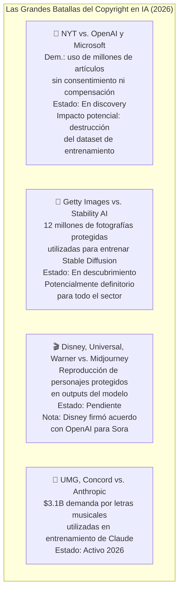

# 🎨 II-6 — IA Generativa y Creatividad: Arte, Música, Código y el Debate del Copyright
## Cuando la Máquina Crea: Quién Posee Qué y Qué Significa Crear

> *"El Tribunal Supremo de EE.UU. rechazó el 2 de marzo de 2026 una apelación que buscaba protección de copyright para una obra creada por IA, dejando intactas las sentencias que establecen que las obras sin creador humano no son elegibles para protección de copyright."*
> — BuiltIn, abril 2026

---

### 📌 Introducción

La IA generativa ha producido la perturbación más profunda en las industrias creativas en décadas. Stable Diffusion, Midjourney y DALL-E generan imágenes que compiten con el trabajo de fotógrafos y diseñadores profesionales. Suno y ElevenLabs componen música y clonan voces. Claude y GPT-5 escriben código, artículos, guiones y poesía. Sora y Runway generan video cinematográfico desde descripciones de texto.

El resultado es un debate que toca simultáneamente la estética, el derecho, la economía y la filosofía: ¿puede una máquina crear? ¿A quién pertenece lo que crea? ¿Qué ocurre con los creadores humanos cuyo trabajo alimentó los modelos?

---

### 🖼️ 6.1 Cómo Funcionan los Modelos Generativos

#### Imagen: Difusión Latente

Los modelos de imagen como Stable Diffusion y DALL-E usan **difusión latente**: aprenden a añadir y luego eliminar ruido de imágenes. Durante el entrenamiento, se añade ruido progresivo hasta convertir la imagen en ruido puro. El modelo aprende a invertir ese proceso — a "limpiar" el ruido condicionado en una descripción textual. En inferencia, parte de ruido puro y lo "limpia" paso a paso hasta generar la imagen correspondiente al prompt.

#### Música: Difusión sobre Audio y Tokens

Modelos como Suno usan variantes de este proceso sobre representaciones del audio, condicionadas en descripciones de estilo, género, tempo e instrumentación. ElevenLabs para síntesis y clonación de voz usa arquitecturas que aprenden a modelar la distribución estadística del habla humana.

#### Video: El Salto más Reciente

Sora (OpenAI, 2024) extendió la difusión a secuencias de video, modelando la consistencia temporal entre frames. En 2026, modelos como Kling, Runway Gen-3 y Sora 2 generan video de hasta varios minutos con coherencia visual notable. Aunque la física y la consistencia de movimientos complejos siguen siendo puntos débiles.

---

### ⚖️ 6.2 El Campo de Batalla Legal: 51 Demandas y Contando

Las industrias creativas han respondido con litigios masivos. <cite index="69-1">En abril de 2025, el Panel Judicial de Litigación Multidistrito de EE.UU. consolidó doce casos contra OpenAI que se originaban en el Distrito Sur de Nueva York y el Distrito Norte de California. El MDL engloba demandas colectivas originalmente presentadas en California por autores, demandas en Nueva York presentadas por organizaciones de noticias, demandas centradas en DMCA y un caso presentado por un creador de video online.</cite>

Los casos más relevantes:

<cite index="72-1">El 2 de marzo de 2026, el Tribunal Supremo de EE.UU. rechazó una apelación del científico Stephen Thaler, quien buscaba protección de copyright para una obra visual creada por su sistema de IA. Al negarse a revisar el caso, los magistrados dejaron intactas las sentencias de tribunales inferiores que establecen que las obras sin un creador humano no son elegibles para protección de copyright.</cite>

El argumento central de la defensa de las empresas de IA es el **fair use**: usan el material de entrenamiento de forma transformativa, sin reproducirlo directamente. <cite index="69-1">En pocas palabras, el caso está lejos de cerrarse en cuanto al fair use en datos de entrenamiento. Los tribunales — incluso los que sesionan en el mismo distrito — pueden alcanzar conclusiones diferentes cuando se enfrentan a hechos similares.</cite>

---

### 💰 6.3 El Impacto Económico en las Industrias Creativas

El impacto es real y desigual según el tipo de trabajo creativo:

| Tipo de trabajo | Impacto actual | Tendencia |
|----------------|---------------|-----------|
| **Ilustración de stock / fotografia genérica** | Alto — plataformas como Shutterstock reportan caída de ventas | Acelerando |
| **Diseño gráfico básico** | Medio-alto — herramientas IA automatizan logos, banners | Acelerando |
| **Composición musical de stock** | Alto — música para comerciales, juegos, podcasts | Acelerando |
| **Redacción de contenido web genérico** | Alto — SEO content mills ya usan IA masivamente | Acelerado |
| **Diseño estratégico y branding** | Bajo — requiere comprensión profunda del cliente | Estable |
| **Arte conceptual de alta complejidad** | Bajo-medio — la IA como herramienta, no sustituto | Mixto |
| **Composición musical original** | Bajo — la originalidad artística sigue siendo humana | Mixto |

---

### 🤔 6.4 La Pregunta Filosófica: ¿Puede una IA Crear?

Esta pregunta divide al campo entre dos posiciones irreconciliables.

**La posición funcionalista:** Si el output es indistinguible de una obra humana, la distinción de origen carece de relevancia práctica. La creatividad es el resultado, no el proceso.

**La posición humanista:** La creatividad genuina requiere experiencia vivida, intencionalidad, la posibilidad de fracaso y significado personal. Una IA no "decide" crear algo — ejecuta una función estadística sobre distribuciones de entrenamiento. El output puede ser bello, pero no es creativo en el sentido que importa.

La cuestión del copyright añade una dimensión económica: <cite index="74-1">las actividades creativas siempre han necesitado una estructura social viable para financiarlas. Cuando estas estructuras se vuelven disfuncionales, la cultura y el conocimiento sufren, y los creadores deben luchar en condiciones inhumanas e improductivas.</cite>

---

### 🌟 6.5 El Modelo de Colaboración: La Dirección que Emerge

Más que el debate binario "IA vs. creadores humanos", el patrón emergente es la **colaboración aumentada**: la IA como herramienta que amplifica las capacidades del creador humano, no como su reemplazo.

El director de arte que usa Midjourney para explorar rápidamente 50 conceptos visuales y luego refina los más prometedores. El compositor que usa Suno para generar variaciones rítmicas que nunca habría explorado manualmente. El escritor que usa Claude para brainstormar tramas y estructuras argumentales mientras mantiene la voz y el control editorial.

<cite index="72-1">El acuerdo Disney-OpenAI de 2025 señala un cambio estratégico de la oposición legal a la colaboración entre Hollywood y la industria de IA generativa, dando a Disney influencia sobre cómo se usa su propiedad intelectual mientras establece un posible blueprint para el licenciamiento de IA en el entretenimiento.</cite>

---

### 📚 Referencias II-6

1. **Norton Rose Fulbright** (2026). *AI in litigation series: An update on AI copyright cases in 2026.* [https://www.nortonrosefulbright.com/en/knowledge/publications/ce8eaa5f/ai-in-litigation-series-an-update-on-ai-copyright-cases-in-2026](https://www.nortonrosefulbright.com/en/knowledge/publications/ce8eaa5f/ai-in-litigation-series-an-update-on-ai-copyright-cases-in-2026)
2. **McKool Smith** (nov. 2025). *AI Infringement Case Updates.* [https://www.mckoolsmith.com/newsroom-ailitigation-46](https://www.mckoolsmith.com/newsroom-ailitigation-46)
3. **BuiltIn** (abr. 2026). *AI-Generated Content and Copyright Law: What We Know.* [https://builtin.com/artificial-intelligence/ai-copyright](https://builtin.com/artificial-intelligence/ai-copyright)
4. **Mishcon de Reya** (2026). *Generative AI – IP cases and policy tracker.* [https://www.mishcon.com/generative-ai-intellectual-property-cases-and-policy-tracker](https://www.mishcon.com/generative-ai-intellectual-property-cases-and-policy-tracker)
5. **Sustainable Tech Partner** (abr. 2026). *Generative AI Lawsuits Timeline.* [https://sustainabletechpartner.com/topics/ai/generative-ai-lawsuit-timeline/](https://sustainabletechpartner.com/topics/ai/generative-ai-lawsuit-timeline/)
6. **Kluwer Copyright Blog** (2024). *Is Generative AI Fair Use of Copyright Works? NYT v. OpenAI.* [https://legalblogs.wolterskluwer.com/copyright-blog/is-generative-ai-fair-use-of-copyright-works-nyt-v-openai/](https://legalblogs.wolterskluwer.com/copyright-blog/is-generative-ai-fair-use-of-copyright-works-nyt-v-openai/)

---

*📅 Serie elaborada en junio de 2026*
*🖊️ **Inteligencia Artificial — De la Teoría a la Transformación***

---