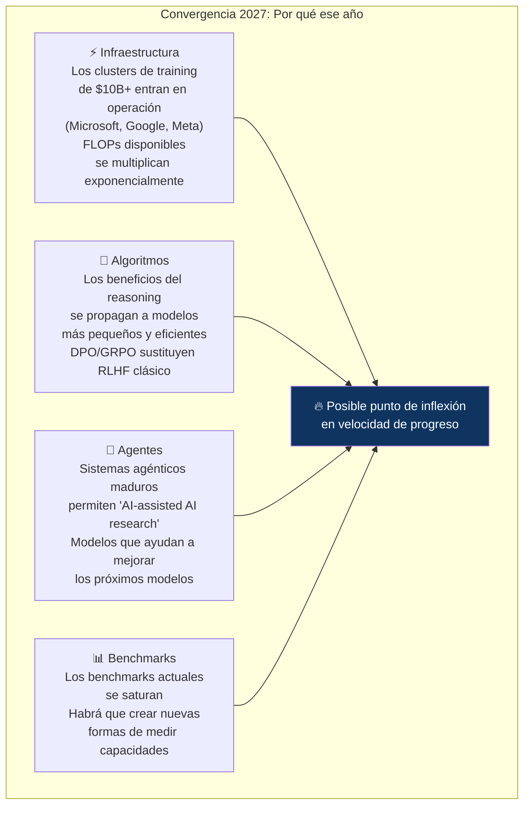
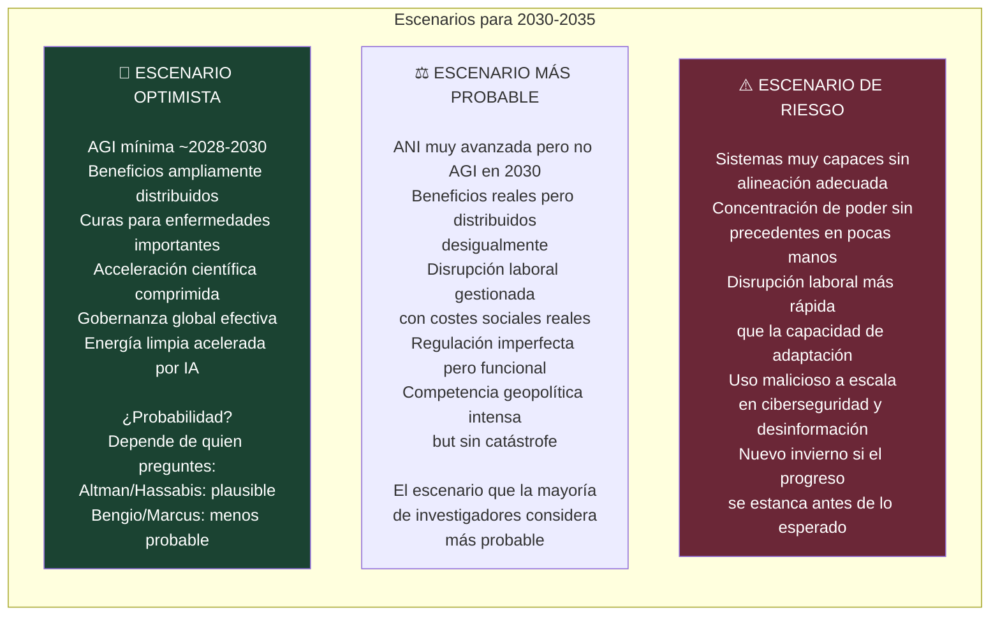
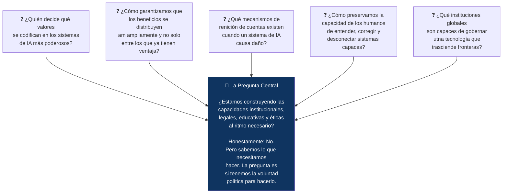

# 🔮 II-7 — El Futuro de la IA: Horizontes 2027–2035
## Lo que Predicen los Investigadores Serios (No los Evangelistas)

> *"Los efectos de la IA sobre el mundo empiezan realmente a compoundarse en 2027."*
> — AI-2027.com, escenario de investigadores (actualizado dic. 2025)

> *"Para 2035, las fábricas, almacenes y hospitales serán irreconocibles. La superinteligencia artificial podría ser realidad entre 2035 y 2040."*
> — GlobalData, DirectIndustry eMagazine, 2026

---

### 📌 Introducción

Este es el artículo más especulativo de la serie — y el más honesto en serlo. Nadie sabe con certeza qué traerá la próxima década de IA. Las predicciones de los investigadores más serios varían en plazos de años, a veces décadas. Y la historia de la IA está llena de predicciones que resultaron prematuras.

Lo que sí podemos hacer con rigor: identificar las tendencias técnicas con evidencia actual sólida, presentar el rango de predicciones de fuentes creíbles, separar lo que es casi seguro de lo que es posible y de lo que es especulativo, y terminar con las preguntas que realmente importan independientemente de los plazos.

---

### 📊 7.1 El Consenso Emergente: 2027 como Punto de Inflexión

<cite index="81-1">Para 2025 y 2026, la previsión está sustancialmente más anclada que lo que sigue. Esto es parcialmente porque es más cercano. Pero también porque los efectos de la IA en el mundo realmente empiezan a compoundarse en 2027. Para 2025 y 2026, la previsión está fuertemente informada por la extrapolación de líneas rectas en escalado de cómputo, mejoras algorítmicas y rendimiento en benchmarks.</cite>

El consenso de predicciones de investigadores — con todas las advertencias sobre incertidumbre — sitúa 2027 como un año crítico porque es cuando varios factores convergen:

---

### 🛤️ 7.2 Las Tendencias Técnicas más Sólidas: 2025–2030

#### World Models: La Apuesta de LeCun

Yann LeCun, tras fundar AMI (Advanced Machine Intelligence), está apostando por la arquitectura que considera correcta para la inteligencia general: los **World Models**. En lugar de predecir el siguiente token, estos sistemas construyen representaciones predictivas del mundo físico y planifican acciones sobre ellas.

<cite index="86-1">A medida que el rendimiento de los modelos mejora, el cuello de botella en la calidad de los datos se vuelve cada vez más difícil de superar, inhibiendo el progreso adicional, especialmente en dominios multimodales que requieren análisis preciso.</cite>

#### Robótica Agéntica: La IA Sale del Mundo Digital

La combinación de modelos multimodales + razonamiento agéntico + hardware robótico está produciendo una nueva generación de robots capaces de operar en entornos no estructurados. Figaro, 1X, Boston Dynamics y Tesla Optimus están en distintas fases de desarrollo de robots humanoides para trabajo industrial y doméstico.

La diferencia con los robots industriales clásicos es cualitativa: en lugar de ejecutar una secuencia programada de movimientos en un entorno controlado, estos sistemas razonan sobre su entorno, planifican acciones y se adaptan a variaciones inesperadas.

#### Computación Neuromórfica: Menos Energía, Más Eficiencia

<cite index="79-1">Con modelos de IA cada vez más complejos e intensivos en datos, se necesitan nuevos paradigmas de computación. Las innovaciones en computación neuromórfica, que imita la estructura neural del cerebro humano, están a la vanguardia de esta transición.</cite>

Los chips neuromórficos (Intel Loihi, IBM NorthPole) procesan información de forma más similar al cerebro — en spikes de actividad en lugar de operaciones matriciales continuas. Son drásticamente más eficientes energéticamente para ciertos tipos de tareas. El desafío es que los frameworks de entrenamiento actuales no son compatibles — requieren repensar cómo se programa la IA desde el principio.

#### Computación Cuántica y su Relación con la IA

<cite index="83-1">Para 2027, las primeras plataformas de modelado mejoradas por computación cuántica se desplegarán en investigación farmacéutica, acelerando significativamente las simulaciones de plegamiento de proteínas. Para 2029, una columna vertebral global de distribución de claves cuánticas (QKD) se integrará con redes financieras para asegurar transacciones internacionales.</cite>

La relación entre IA y computación cuántica es más compleja de lo que el hype sugiere. La computación cuántica no va a "hacer más rápido" el entrenamiento de LLMs en el corto plazo — el hardware cuántico actual no es adecuado para la aritmética matricial masiva que eso requiere. Donde sí hay potencial: optimización combinatoria, simulación química y criptografía.

---

### 🌡️ 7.3 El Espectro de Escenarios: De Optimista a Pesimista

---

### 🔭 7.4 Las Predicciones de los Más Serios

| Figura | Predicción | Plazo | Confianza declarada |
|--------|-----------|-------|-------------------|
| **Dario Amodei (Anthropic)** | IA "ampliamente mejor que todos los humanos en casi todo" | 2026-2027 | Alta (declaración oficial OSTP) |
| **Sam Altman (OpenAI)** | AGI en el mandato presidencial actual (antes 2029) | 2027-2028 | Alta |
| **Demis Hassabis (DeepMind)** | AGI en la próxima década | 2030-2034 | Media |
| **Geoffrey Hinton** | IA más inteligente que humanos | 5-20 años | Media, con gran incertidumbre |
| **Yoshua Bengio** | Plazo largo, riesgos serios | Sin plazo específico | Muy cauteloso |
| **Yann LeCun** | Los LLMs no llevarán a AGI; necesitamos nueva arquitectura | Sin plazo | Alta (en que los LLMs no son suficientes) |
| **GlobalData** | ASI: 2035-2040 | 2035-2040 | Baja-media |
| <cite index="80-1">**Metaculus Community**</cite> | AGI pasó de 2041 a 2031 en un año | 2031 | Colectiva, con alta varianza |

---

### 🏛️ 7.5 La Brecha de Gobernanza: El Desafío que Define la Década

Independientemente de cuándo llegue cualquier versión de AGI, el reto de gobernanza es urgente ahora mismo, con las capacidades actuales.

Los tres problemas de gobernanza más difíciles de los próximos 10 años:

**Problema 1 — La carrera sin frenos:** La competencia entre EE.UU. y China por el liderazgo en IA crea incentivos fuertes para acelerar y debilitar los frenos de seguridad. Un acuerdo de control de armamentos de IA —análogo a los tratados de no proliferación nuclear— es conceptualmente necesario y políticamente casi imposible.

**Problema 2 — La concentración de poder:** Si sistemas de capacidad AGI llegan, ¿en manos de quién estarán? La concentración actual en cinco empresas privadas podría volverse exponencialmente más problemática. Las estructuras de gobernanza del siglo XXI no están diseñadas para este escenario.

**Problema 3 — La velocidad vs. la institucionalidad:** Las instituciones humanas —legislaturas, tribunales, tratados, estándares— operan en años o décadas. La tecnología opera en meses. Cerrar esa brecha sin sofocar la innovación es el desafío de diseño institucional más difícil de nuestra era.

---

### 🎯 7.6 Las Preguntas que Importan Independientemente del Plazo

---

### 🔚 Cierre de la Segunda Etapa

La segunda etapa de esta serie ha recorrido los dominios donde la IA tiene mayor impacto hoy y mayor potencial —y mayor riesgo— mañana. Empresa, trabajo, ciencia, percepción multimodal, seguridad, creatividad y horizonte futuro.

Lo que une todos estos artículos es una convicción que se ha ido consolidando a lo largo de la serie completa: la IA no es ni la salvación que sus evangelistas proclaman ni el apocalipsis que sus críticos temen. Es una de las herramientas más poderosas que la humanidad ha creado — con todo lo que eso implica en términos de responsabilidad, diseño cuidadoso y supervisión activa.

El conocimiento de qué es la IA, cómo funciona, qué puede y qué no puede hacer, y cómo está cambiando el mundo es la condición de posibilidad de participar de forma informada en las decisiones que van a definir las próximas décadas.

Esta serie ha intentado contribuir a ese conocimiento.

---

### 📚 Referencias II-7

1. **AI-2027.com** (dic. 2025). *AI 2027: Forecast and Scenario Analysis.* [https://ai-2027.com/](https://ai-2027.com/)
2. **DirectIndustry eMagazine** (ene. 2026). *Tech in 2035: The Future of AI, Quantum, and Space Innovation.* [https://emag.directindustry.com/2025/10/27/artificial-superintelligence-quantum-computing-polyfunctional-robots-technology-2035-emerging-trends-future-innovation/](https://emag.directindustry.com/2025/10/27/artificial-superintelligence-quantum-computing-polyfunctional-robots-technology-2035-emerging-trends-future-innovation/)
3. **IBM** (jun. 2026). *The future of AI: trends shaping the next 10 years.* [https://www.ibm.com/think/insights/artificial-intelligence-future](https://www.ibm.com/think/insights/artificial-intelligence-future)
4. **AI Rights Institute** (oct. 2025). *The Future of AI: Expert Predictions & Industry Impacts 2025-2030.* [https://airights.net/legacy/future-of-ai](https://airights.net/legacy/future-of-ai)
5. **StartUs Insights** (may. 2025). *10 Top Future Technology Trends [2025-2030].* [https://www.startus-insights.com/innovators-guide/future-technology-trends/](https://www.startus-insights.com/innovators-guide/future-technology-trends/)
6. **ScienceDaily** (jun. 2026). *Artificial Intelligence News.* [https://www.sciencedaily.com/news/computers_math/artificial_intelligence/](https://www.sciencedaily.com/news/computers_math/artificial_intelligence/)
7. **PMC** (2024). *Digital neuromorphic technology: current and future prospects.* [https://www.ncbi.nlm.nih.gov/pmc/articles/PMC10989295/](https://www.ncbi.nlm.nih.gov/pmc/articles/PMC10989295/)
8. **arXiv** (feb. 2026). *Research on World Models Is Not Merely Injecting World Knowledge into Specific Tasks.* arXiv:2602.01630. [https://arxiv.org/pdf/2602.01630](https://arxiv.org/pdf/2602.01630)
9. **arXiv** (2026). *Neuromorphic Computing for Low-Power Artificial Intelligence.* arXiv:2604.04727.

---

*📅 Serie elaborada en junio de 2026*
*🖊️ **Inteligencia Artificial — De la Teoría a la Transformación***

---