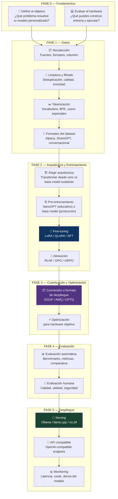
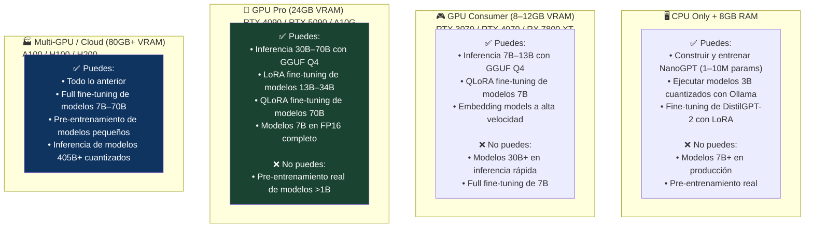
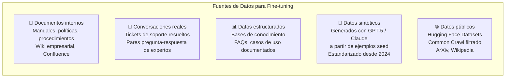
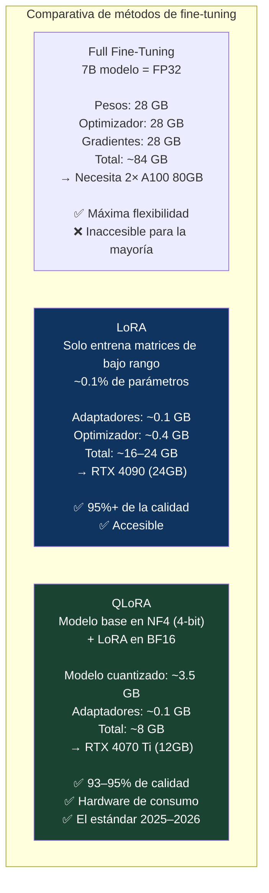
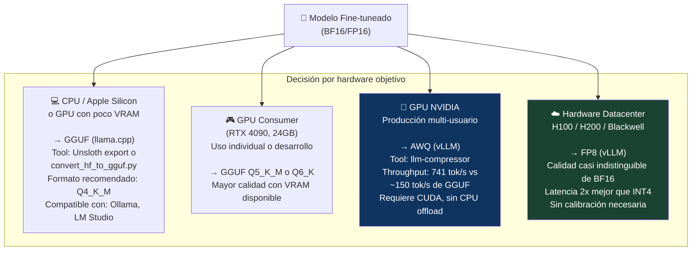
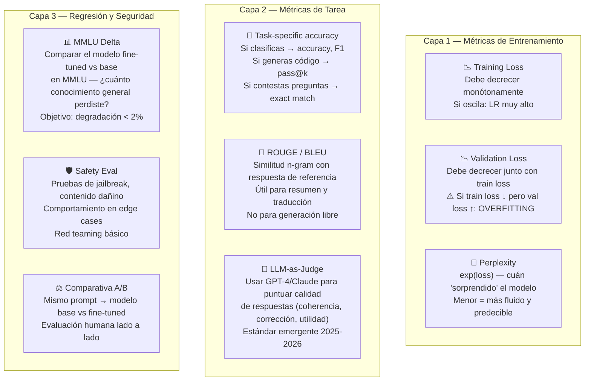
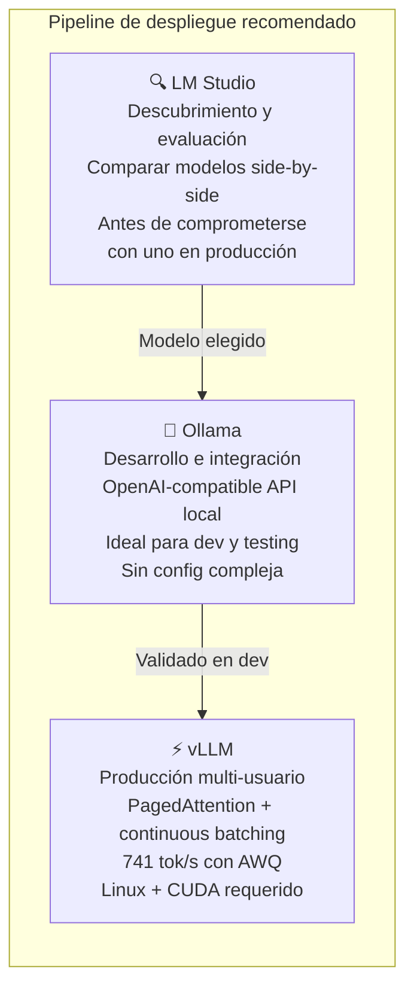
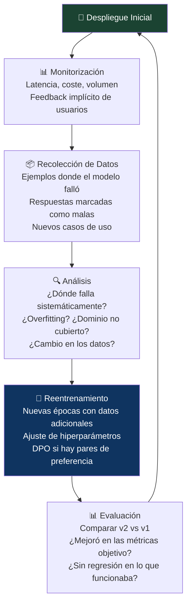

# 🏗️ LLM Desde Cero Hasta Tu Modelado Personalizado
## La Guía Técnica Completa: De Entender la Arquitectura a Desplegar Tu Propio Modelo en Producción

> *"Más de 50.000 desarrolladores ejecutaron sus propios LLMs locales en 2025 — y ese número se duplica en 2026 a medida que las herramientas maduran y los costes de hardware caen."*
> — Amit Ray, 2026

> *"En 2026, una RTX 4070 Ti es suficiente para especializar un modelo de 7B en tus datos de dominio — en una tarde."*
> — Effloow, abril 2026

---

## 📌 Introducción: El Artículo que Cierra el Círculo

Esta serie comenzó con los mitos griegos sobre autómatas de bronce. Pasó por la historia de la IA, sus conceptos fundamentales, la ética y la gobernanza, el debate AGI, la arquitectura interna de los LLMs, cómo se entrenan, los mitos que los rodean, cómo hablarles eficazmente, cómo desplegarlos en producción, qué son los agentes y cómo se posiciona el open source frente a los modelos propietarios.

Este artículo es el cierre del círculo — y el más práctico de todos. Aquí no explicamos qué es un LLM. Mostramos cómo **construirlo, entrenarlo, afinarlo y desplegarlo tú mismo**, con código real, hardware accesible y una visión completa del pipeline de principio a fin.

El objetivo es ambicioso pero alcanzable: que al terminar este artículo, tengas un mapa claro de cada decisión que necesitas tomar para pasar de cero a un modelo personalizado funcionando en producción.

---

## 🗺️ El Pipeline Completo: De Cero a Producción



---

## 💻 FASE 0 — Fundamentos: Objetivo y Hardware

### 0.1 La pregunta más importante antes de escribir una línea de código

Antes de elegir un modelo base, un framework de fine-tuning o un servidor de inferencia, hay una pregunta que determina absolutamente todo lo demás:

> **¿Qué problema específico resuelve tu modelo personalizado que un modelo genérico no resuelve bien?**

Las respuestas que justifican la inversión en un modelo personalizado son:
- **Dominio muy especializado** con vocabulario técnico que los modelos generales manejan pobremente (medicina, derecho, ingeniería aeroespacial, normativa específica de sector)
- **Formato de salida muy específico** y estable (siempre JSON con un schema concreto, siempre en un estilo empresarial definido)
- **Privacidad absoluta** — los datos no pueden salir del perímetro bajo ninguna circunstancia
- **Volumen muy alto** donde el coste de APIs propietarias supera la inversión en infraestructura propia
- **Latencia crítica** que requiere inferencia local sin round-trip de red

Si ninguna de estas condiciones aplica, la respuesta correcta es usar una API propietaria o un modelo open-weight genérico con buen prompting.

### 0.2 El Hardware: Qué Puedes Hacer con lo que Tienes

<cite index="2-1">La barrera de entrada ha caído dramáticamente en 2025–2026. Tu hardware determina qué puedes construir, entrenar y ejecutar.</cite>



> 💡 **El punto de inflexión de 2026:** <cite index="10-1">Hace dos años, el fine-tuning de un modelo grande requería un rack de A100s, un equipo de machine learning y una factura cloud de cinco cifras. En 2026, una sola RTX 4070 Ti es suficiente para especializar un modelo de 7B en datos de dominio — en una tarde. Ese cambio ocurrió gracias a LoRA y QLoRA.</cite>

---

## 📦 FASE 1 — El Pipeline de Datos

El principio más importante del entrenamiento de LLMs, respaldado por la evidencia empírica de 2024-2026: <cite index="2-1">**"Better data beats bigger models."** Un modelo pequeño entrenado con datos limpios, de alta calidad y diversos superará a un modelo mayor entrenado con datos ruidosos, repetitivos o tóxicos. Filtra agresivamente.</cite>

### 1.1 Recolección de Datos



**Volumen mínimo por objetivo:**

| Objetivo | Mínimo viable | Óptimo | Nota |
|---------|--------------|--------|------|
| Estilo y tono | 500 ejemplos | 2.000+ | Consistencia > cantidad |
| Dominio específico | 1.000 ejemplos | 10.000+ | Calidad crítica |
| Instrucciones complejas | 2.000 ejemplos | 20.000+ | Diversidad de casos |
| Comportamiento seguro (DPO) | 500 pares comparativos | 5.000+ | Necesita pares ganador/perdedor |

### 1.2 Limpieza y Filtrado

<cite index="5-1">Los pasos de preprocesamiento son esenciales antes de la tokenización: manejar datos faltantes, estandarizar formatos de texto, eliminar duplicados y limpiar ruido. La calidad del preprocesamiento impacta directamente en el rendimiento del modelo.</cite>

Pipeline de limpieza estándar:

```python
# Pipeline de limpieza de datos para fine-tuning (esquema conceptual)

def clean_dataset(raw_data):
    """
    Pipeline estándar de limpieza para datos de fine-tuning LLM
    """
    steps = [
        # 1. Normalización de encoding
        normalize_unicode,          # Todo a UTF-8, eliminar caracteres extraños
        
        # 2. Limpieza de formato
        remove_html_tags,           # Limpiar HTML/XML residual
        normalize_whitespace,       # Colapsar espacios múltiples, tabs, newlines
        fix_punctuation,            # Normalizar comillas, guiones, elipsis
        
        # 3. Filtros de calidad
        filter_by_length,           # min_tokens=50, max_tokens=2048
        filter_low_quality,         # Detectar texto repetitivo, gibberish, spam
        filter_toxic_content,       # Clasificador de toxicidad (Detoxify, Perspective)
        
        # 4. Deduplicación
        minhash_deduplication,      # Eliminar duplicados exactos y casi-duplicados
                                    # MinHash + LSH para escala
        
        # 5. Estadísticas finales
        compute_dataset_stats       # Distribución de longitud, diversidad léxica
    ]
    
    for step in steps:
        raw_data = step(raw_data)
    
    return raw_data
```

### 1.3 Formatos de Dataset

El formato estándar en 2026 para fine-tuning supervisado es **JSONL** (JSON Lines), con tres plantillas dominantes:

```python
# Formato Alpaca — para instrucciones con y sin contexto adicional
{
    "instruction": "Clasifica el nivel de urgencia de este incidente de Kubernetes",
    "input": "Pod en estado CrashLoopBackOff, servicio de pagos afectado, 500 errores/min",
    "output": "CRÍTICO — El servicio de pagos está completamente degradado. Acción inmediata requerida."
}

# Formato ShareGPT — para conversaciones multi-turno
{
    "conversations": [
        {"from": "human", "value": "¿Cómo configuro un PodDisruptionBudget en Kubernetes?"},
        {"from": "gpt", "value": "Un PodDisruptionBudget (PDB) garantiza que..."},
        {"from": "human", "value": "¿Y si tengo un Deployment con 3 réplicas?"},
        {"from": "gpt", "value": "Para 3 réplicas, lo recomendable es..."}
    ]
}

# Formato para DPO (Direct Preference Optimization) — pares comparativos
{
    "prompt": "Explica qué es un memory leak en Go",
    "chosen": "En Go, un memory leak ocurre cuando...[respuesta correcta y completa]",
    "rejected": "Un memory leak es cuando la memoria...[respuesta vaga o incorrecta]"
}
```

---

## 🏗️ FASE 2A — Construir un LLM desde Cero (Educativo)

Antes de hablar de fine-tuning — que es lo que casi todos harán en producción — es valioso haber construido al menos una vez un LLM mínimo desde cero. Entiende el mecanismo a un nivel que ningún tutorial de fine-tuning puede darte.

### 2A.1 NanoGPT: El Punto de Partida

El proyecto **NanoGPT** de Andrej Karpathy (ex-OpenAI) es el recurso de referencia para construir un GPT mínimo funcional desde cero en PyTorch. En menos de 300 líneas de código implementa todo el pipeline:

```python
# Arquitectura mínima GPT (basada en NanoGPT, Karpathy 2022)
# Ilustra los componentes que estudiamos en LLM-1

import torch
import torch.nn as nn
from torch.nn import functional as F

class CausalSelfAttention(nn.Module):
    """Multi-head causal self-attention"""
    
    def __init__(self, config):
        super().__init__()
        assert config.n_embd % config.n_head == 0
        # Proyecciones Q, K, V en una sola operación (eficiencia)
        self.c_attn = nn.Linear(config.n_embd, 3 * config.n_embd, bias=config.bias)
        self.c_proj = nn.Linear(config.n_embd, config.n_embd, bias=config.bias)
        self.attn_dropout = nn.Dropout(config.dropout)
        self.resid_dropout = nn.Dropout(config.dropout)
        self.n_head = config.n_head
        self.n_embd = config.n_embd
        # Máscara causal: cada token solo puede atender a tokens anteriores
        self.register_buffer("bias", torch.tril(
            torch.ones(config.block_size, config.block_size))
            .view(1, 1, config.block_size, config.block_size))

    def forward(self, x):
        B, T, C = x.size()  # batch, secuencia, embedding
        # Calcular Q, K, V para todas las cabezas en paralelo
        q, k, v  = self.c_attn(x).split(self.n_embd, dim=2)
        k = k.view(B, T, self.n_head, C // self.n_head).transpose(1, 2)
        q = q.view(B, T, self.n_head, C // self.n_head).transpose(1, 2)
        v = v.view(B, T, self.n_head, C // self.n_head).transpose(1, 2)
        # Atención: (B, nh, T, hs) x (B, nh, hs, T) -> (B, nh, T, T)
        att = (q @ k.transpose(-2, -1)) * (1.0 / (k.size(-1) ** 0.5))
        att = att.masked_fill(self.bias[:,:,:T,:T] == 0, float('-inf'))
        att = F.softmax(att, dim=-1)
        att = self.attn_dropout(att)
        y = att @ v  # (B, nh, T, T) x (B, nh, T, hs) -> (B, nh, T, hs)
        y = y.transpose(1, 2).contiguous().view(B, T, C)
        return self.resid_dropout(self.c_proj(y))


class MLP(nn.Module):
    """Feed-Forward Network dentro del bloque Transformer"""
    
    def __init__(self, config):
        super().__init__()
        self.c_fc    = nn.Linear(config.n_embd, 4 * config.n_embd, bias=config.bias)
        self.gelu    = nn.GELU()
        self.c_proj  = nn.Linear(4 * config.n_embd, config.n_embd, bias=config.bias)
        self.dropout = nn.Dropout(config.dropout)

    def forward(self, x):
        x = self.c_fc(x)
        x = self.gelu(x)
        x = self.c_proj(x)
        return self.dropout(x)


class Block(nn.Module):
    """Un bloque Transformer completo: Atención + MLP + conexiones residuales"""
    
    def __init__(self, config):
        super().__init__()
        self.ln_1 = nn.LayerNorm(config.n_embd)
        self.attn = CausalSelfAttention(config)
        self.ln_2 = nn.LayerNorm(config.n_embd)
        self.mlp = MLP(config)

    def forward(self, x):
        # Conexión residual: x + atención(normalizado(x))
        x = x + self.attn(self.ln_1(x))
        x = x + self.mlp(self.ln_2(x))
        return x
```

### 2A.2 Tokenizador de Caracteres (Punto de Partida)

<cite index="3-1">El tokenizador más simple es a nivel de carácter: cada carácter único es un token. Vocabulario de ~65–256 tokens. Simple de implementar, perfecto para NanoGPT.</cite>

```python
class Tokenizer:
    """Tokenizador a nivel de carácter — punto de partida educativo"""
    
    def __init__(self, text):
        self.UNK = "<UNK>"
        self.chars = sorted(list(set(text))) + [self.UNK]
        self.vocab_size = len(self.chars)
        self.char_to_id = {char: id for id, char in enumerate(self.chars)}
        self.id_to_char = {id: char for id, char in enumerate(self.chars)}

    def encode(self, text):
        """Texto → lista de IDs de tokens"""
        return [self.char_to_id.get(ch, self.char_to_id[self.UNK]) for ch in text]

    def decode(self, ids):
        """Lista de IDs de tokens → texto"""
        return "".join(self.id_to_char.get(id, self.UNK) for id in ids)

# En producción: usar tiktoken (OpenAI) o SentencePiece para BPE
# tokenizer = tiktoken.get_encoding("cl100k_base")  # GPT-4 tokenizer
```

> ⚠️ **Expectativa honesta:** <cite index="2-1">El pre-entrenamiento real de un modelo grande (7B+ parámetros) desde cero requiere cientos de GPUs y terabytes de datos — más allá de cualquier setup individual. Sin embargo, puedes absolutamente construir un Transformer mínimo para aprender profundamente, hacer fine-tuning de modelos pequeños existentes, y ejecutar modelos capaces de 3B–7B localmente ahora mismo.</cite>

---

## 🎯 FASE 2B — Fine-tuning con LoRA y QLoRA: El Camino Real

Para el 99% de los casos de uso, **fine-tuning sobre un modelo base existente** es la estrategia correcta. No construyes un coche desde cero para aprender a conducir — y no deberías entrenar un LLM desde cero para personalizar su comportamiento.

### 2B.1 Por Qué LoRA y QLoRA son el Estándar



<cite index="11-1">La diferencia de calidad entre full fine-tuning y QLoRA es dentro del 1–2% en la mayoría de benchmarks — un trade-off negligible para una reducción 10× en requisitos de hardware.</cite>

### 2B.2 La Matemática de LoRA en 90 Segundos

LoRA no modifica los pesos originales del modelo. En su lugar, **inyecta matrices adicionales de bajo rango** en las capas de atención:

```
# Para una capa de peso W ∈ ℝ^(d×k):
# En lugar de actualizar W directamente (costoso, requiere gradientes de d×k):
#
# W_actualizado = W_original + ΔW
#               = W_original + B × A
#
# Donde:
#   A ∈ ℝ^(r×k)  — r << d, k (rango muy bajo, típicamente r=4,8,16,32)
#   B ∈ ℝ^(d×r)  — inicializado a cero (ΔW = 0 al inicio)
#
# Solo entrenamos A y B (muchos menos parámetros)
# W_original permanece CONGELADO durante todo el fine-tuning
#
# Ejemplo con r=16, d=4096, k=4096:
# FullFT: 4096×4096 = 16.7M parámetros
# LoRA:   (16×4096) + (4096×16) = 131K parámetros → 127× menos
```

### 2B.3 Pipeline Completo con Unsloth + QLoRA + SFTTrainer

<cite index="9-1">En 2026, la barrera de entrada para personalizar la inteligencia artificial ha colapsado.</cite> Este es el pipeline estándar:

```python
# ============================================================
# FINE-TUNING CON QLORA Y UNSLOTH — PIPELINE COMPLETO 2026
# ============================================================
# Requisitos: pip install unsloth trl transformers datasets peft
# Hardware mínimo: 8GB VRAM (RTX 3070 / RTX 4060 Ti)
# ============================================================

from unsloth import FastLanguageModel
from trl import SFTTrainer
from transformers import TrainingArguments
from datasets import load_dataset
import torch

# ─────────────────────────────────────────────────────────────
# PASO 1: CARGAR MODELO BASE CON CUANTIZACIÓN 4-BIT (QLoRA)
# ─────────────────────────────────────────────────────────────
model, tokenizer = FastLanguageModel.from_pretrained(
    # Modelos recomendados para fine-tuning 2026 (cumplimiento Kyndryl):
    # "unsloth/Meta-Llama-3.1-8B-Instruct"    # Llama — Meta RAIL license
    # "unsloth/mistral-7b-instruct-v0.3"       # Mistral — Apache 2.0 ✅
    # "unsloth/Phi-4"                           # Microsoft Phi-4 ✅
    # "unsloth/devstral-small-2505"             # Mistral Devstral ✅
    model_name="unsloth/mistral-7b-instruct-v0.3",
    max_seq_length=4096,        # Longitud máxima de secuencia en entrenamiento
    dtype=None,                 # Auto-detect: FP16 (Pascal/Turing) o BF16 (Ampere+)
    load_in_4bit=True,          # QLoRA: cuantización NF4 del modelo base
)

# ─────────────────────────────────────────────────────────────
# PASO 2: CONFIGURAR ADAPTADORES LORA
# ─────────────────────────────────────────────────────────────
model = FastLanguageModel.get_peft_model(
    model,
    r=16,                       # Rango LoRA: mayor = más capacidad pero más VRAM
                                # Valores típicos: 8 (mínimo), 16 (recomendado), 32 (máximo útil)
    lora_alpha=16,              # Scaling: típicamente igual al rango
    lora_dropout=0,             # 0 recomendado por Unsloth para velocidad
    target_modules=[            # Qué capas adaptar
        "q_proj", "k_proj",     # Proyecciones de atención (críticas)
        "v_proj", "o_proj",     # Output de atención
        "gate_proj",            # Feed-forward (MLP)
        "up_proj", "down_proj", # Feed-forward (MLP)
    ],
    bias="none",                # Sin bias en adaptadores
    use_gradient_checkpointing="unsloth",  # 2x reducción memoria con mínimo impacto velocidad
)

# ─────────────────────────────────────────────────────────────
# PASO 3: PREPARAR EL DATASET
# ─────────────────────────────────────────────────────────────
# Formato Alpaca con plantilla de instrucción
alpaca_prompt = """A continuación se presenta una instrucción que describe una tarea.
Escribe una respuesta que complete adecuadamente la solicitud.

### Instrucción:
{}

### Entrada:
{}

### Respuesta:
{}"""

EOS_TOKEN = tokenizer.eos_token  # Crítico: siempre terminar con EOS

def formatting_func(examples):
    """Formatea los ejemplos del dataset para el entrenamiento"""
    instructions = examples["instruction"]
    inputs       = examples["input"]
    outputs      = examples["output"]
    texts = []
    for inst, inp, out in zip(instructions, inputs, outputs):
        text = alpaca_prompt.format(inst, inp, out) + EOS_TOKEN
        texts.append(text)
    return {"text": texts}

# Cargar tu dataset (JSONL, CSV, Hugging Face Dataset, o dataset local)
dataset = load_dataset(
    "json",
    data_files={"train": "mi_dataset_train.jsonl",
                "validation": "mi_dataset_val.jsonl"},
    split="train"
)
dataset = dataset.map(formatting_func, batched=True)

# ─────────────────────────────────────────────────────────────
# PASO 4: CONFIGURAR Y EJECUTAR EL ENTRENAMIENTO
# ─────────────────────────────────────────────────────────────
trainer = SFTTrainer(
    model=model,
    tokenizer=tokenizer,
    train_dataset=dataset,
    dataset_text_field="text",
    max_seq_length=4096,
    dataset_num_proc=2,
    packing=False,              # True si los ejemplos son cortos (más eficiencia)
    args=TrainingArguments(
        # Hiperparámetros conservadores para evitar catastrophic forgetting
        per_device_train_batch_size=2,
        gradient_accumulation_steps=4,    # Batch efectivo = 2×4 = 8
        num_train_epochs=3,               # 1-3 épocas típicamente
        warmup_ratio=0.1,
        learning_rate=2e-4,               # Rango: 1e-4 a 5e-4
        fp16=not torch.cuda.is_bf16_supported(),
        bf16=torch.cuda.is_bf16_supported(),
        logging_steps=10,
        optim="adamw_8bit",               # Optimizador cuantizado (menos VRAM)
        weight_decay=0.01,
        lr_scheduler_type="cosine",       # Decaimiento coseno del learning rate
        output_dir="./checkpoints",
        save_strategy="steps",
        save_steps=200,
        evaluation_strategy="steps",
        eval_steps=200,
        load_best_model_at_end=True,
        metric_for_best_model="eval_loss",
    ),
)

# ¡A entrenar!
trainer_stats = trainer.train()
print(f"Training loss: {trainer_stats.training_loss:.4f}")
```

### 2B.4 Hiperparámetros Clave y Qué Controlan

| Hiperparámetro | Rango recomendado | Qué controla | Señal de problema |
|---------------|-------------------|-------------|------------------|
| `r` (rango LoRA) | 8–32 | Capacidad del adaptador | Muy bajo → underfitting; muy alto → overfitting |
| `learning_rate` | 1e-4 – 5e-4 | Velocidad de actualización | Loss diverge → bajar LR; loss no baja → subir |
| `num_epochs` | 1–5 | Cuántas veces ve los datos | Val loss sube pero train loss baja → overfitting |
| `batch_size` efectivo | 8–32 | Estabilidad del gradiente | Muy pequeño → entrenamiento ruidoso |
| `max_seq_length` | 512–4096 | Longitud máxima de ejemplos | Mayor → más VRAM, más contexto aprendido |

---

## 🤝 FASE 2C — Alineación: DPO y GRPO

Después del SFT, el modelo sigue instrucciones pero sin garantías de calidad comparativa. El **DPO** (Direct Preference Optimization) enseña al modelo cuál de dos respuestas es preferible:

```python
# Configuración DPO con TRL (Transformer Reinforcement Learning)
from trl import DPOTrainer, DPOConfig

dpo_config = DPOConfig(
    beta=0.1,                  # Factor de regularización — mayor = más conservador
    max_prompt_length=1024,
    max_length=2048,
    per_device_train_batch_size=1,
    gradient_accumulation_steps=8,
    learning_rate=5e-7,        # LR mucho más bajo que SFT — ajuste fino
    num_train_epochs=1,        # Típicamente 1 época es suficiente para DPO
    output_dir="./dpo_output",
)

# El dataset DPO requiere pares: prompt + chosen + rejected
# {"prompt": "...", "chosen": "respuesta mejor", "rejected": "respuesta peor"}

dpo_trainer = DPOTrainer(
    model=sft_model,           # Modelo ya afinado con SFT
    ref_model=None,            # Si None, usa copia interna del modelo SFT
    args=dpo_config,
    train_dataset=dpo_dataset,
    tokenizer=tokenizer,
)
dpo_trainer.train()
```

**GRPO** (Group Relative Policy Optimization), popularizado por DeepSeek-R1, es la alternativa emergente para entrenar capacidades de razonamiento sin necesidad de un Reward Model separado — genera múltiples respuestas para el mismo prompt y usa su ranking relativo como señal de entrenamiento.

---

## 📦 FASE 3 — Cuantización: Del Modelo Entrenado al Formato de Despliegue

Una vez completado el fine-tuning, el modelo está en FP16 o BF16 — preciso pero pesado. La cuantización reduce su tamaño haciéndolo ejecutable en hardware más modesto.

### 3.1 Exportar el Modelo Fine-tuneado

```python
# ─────────────────────────────────────────────────────────────
# OPCIÓN A: Exportar a GGUF (para Ollama / llama.cpp)
# ─────────────────────────────────────────────────────────────
# Unsloth exporta directamente a GGUF con cuantización integrada
model.save_pretrained_gguf(
    "mi_modelo_personalizado",
    tokenizer,
    quantization_method="q4_k_m"   # El sweet spot de 2026: mejor balance
                                    # calidad/tamaño para uso local
)
# Opciones de cuantización GGUF:
# q2_k    → Más pequeño, calidad reducida (~70% FP16)
# q4_k_m  → Sweet spot: 92% calidad, 75% reducción de tamaño ✅
# q5_k_m  → 95% calidad, 60% reducción — si tienes VRAM extra
# q6_k    → 97% calidad, 45% reducción — near-lossless
# q8_0    → 99% calidad, 50% reducción — para evaluaciones precisas

# ─────────────────────────────────────────────────────────────
# OPCIÓN B: Exportar a Hugging Face + subir al Hub
# ─────────────────────────────────────────────────────────────
model.save_pretrained_merged(
    "mi_modelo_merged",   # Fusiona LoRA en el modelo base
    tokenizer,
    save_method="merged_16bit",
)
# Luego subir al Hub privado:
# model.push_to_hub("tu-usuario/mi-modelo-privado", token="hf_...")
```

### 3.2 El Mapa de Cuantización 2026



> 🔑 **La regla de 2026:** <cite index="18-1">Para la mayoría de desarrolladores, empieza con GGUF Q4_K_M para experimentación local via Ollama o LM Studio. Cuando estés listo para despliegue en producción en GPUs NVIDIA, cambia a AWQ a través de vLLM para la mejor combinación de velocidad y calidad.</cite>

---

## 📊 FASE 4 — Evaluación: ¿Tu Modelo Personalizado Es Realmente Mejor?

Una de las trampas más comunes: **asumir que el fine-tuning ha mejorado el modelo** sin medir sistemáticamente.

### 4.1 Framework de Evaluación por Capas



```python
# Evaluación básica: comparativa base vs fine-tuned
def evaluate_model_pair(prompts_file, base_model, finetuned_model, n_samples=100):
    """
    Compara el modelo base con el fine-tuneado en una muestra de prompts
    Genera un informe de diferencias cuantitativas y cualitativas
    """
    results = {
        "base_wins": 0,
        "finetuned_wins": 0,
        "ties": 0,
        "examples": []
    }
    
    with open(prompts_file) as f:
        prompts = [json.loads(line) for line in f][:n_samples]
    
    for item in prompts:
        prompt = item["prompt"]
        expected = item.get("expected_output", "")
        
        base_response = generate(base_model, prompt)
        ft_response = generate(finetuned_model, prompt)
        
        # LLM-as-Judge: usa Claude/GPT-4 para evaluar cuál respuesta es mejor
        judgment = judge_responses(prompt, base_response, ft_response, expected)
        
        results[f"{judgment}_wins"] += 1
        results["examples"].append({
            "prompt": prompt,
            "base": base_response,
            "finetuned": ft_response,
            "winner": judgment
        })
    
    return results
```

### 4.2 La Señal de Alarma Principal: Catastrophic Forgetting

El riesgo más serio del fine-tuning es el **olvido catastrófico**: el modelo gana capacidades en tu dominio específico pero pierde conocimiento general. Síntomas:

- No puede responder preguntas básicas que respondía bien antes del fine-tuning
- El MMLU delta supera el 5% de degradación
- Fallos en razonamiento común fuera del dominio de entrenamiento

Mitigaciones:
- Mezclar datos del dominio con datos generales de alta calidad en el dataset de fine-tuning (proporción 80/20 típica)
- Usar LoRA (no full fine-tuning) — el olvido catastrófico es mucho menor
- Learning rate bajo y pocas épocas

---

## 🚀 FASE 5 — Despliegue: Tu Modelo en Producción

### 5.1 El Stack de Despliegue 2026

<cite index="19-1">Muchos desarrolladores en 2026 usan un pipeline de tres herramientas: LM Studio para descubrimiento y evaluación de modelos, Ollama para desarrollo e integración, y vLLM para despliegue en producción.</cite>



### 5.2 Despliegue con Ollama (Desarrollo)

```bash
# ─────────────────────────────────────────────────────────────
# DESPLIEGUE CON OLLAMA — QUICKSTART
# ─────────────────────────────────────────────────────────────

# 1. Instalar Ollama
curl -fsSL https://ollama.com/install.sh | sh

# 2. Importar tu modelo GGUF personalizado con un Modelfile
cat > Modelfile << 'EOF'
FROM ./mi_modelo_personalizado-q4_k_m.gguf

# Definir el system prompt específico de tu dominio
SYSTEM """
Eres un asistente especializado en infraestructura Kubernetes para el equipo
de masorange. Tienes acceso a conocimiento específico sobre los clusters n1 y n2.
Respondes siempre en español con precisión técnica.
Cuando no sabes algo, lo indicas explícitamente en lugar de inventar.
"""

# Parámetros de inferencia
PARAMETER temperature 0.1        # Bajo para respuestas consistentes (técnicas)
PARAMETER num_ctx 4096            # Ventana de contexto
PARAMETER num_predict 2048        # Máximo tokens de respuesta
PARAMETER stop "<|eot_id|>"       # Token de fin según el modelo base

# Plantilla de conversación (adaptar al modelo base)
TEMPLATE """{{ if .System }}<|start_header_id|>system<|end_header_id|>
{{ .System }}<|eot_id|>{{ end }}{{ range .Messages }}<|start_header_id|>{{ .Role }}<|end_header_id|>
{{ .Content }}<|eot_id|>{{ end }}<|start_header_id|>assistant<|end_header_id|>"""
EOF

# 3. Crear el modelo en Ollama
ollama create masorange-assistant -f Modelfile

# 4. Probarlo interactivamente
ollama run masorange-assistant "¿Cómo configuro un HPA para el servicio de pagos?"

# 5. La API OpenAI-compatible está disponible automáticamente en:
# http://localhost:11434/v1/chat/completions
```

### 5.3 Despliegue con vLLM (Producción Multi-usuario)

```bash
# ─────────────────────────────────────────────────────────────
# DESPLIEGUE CON vLLM — PRODUCCIÓN
# ─────────────────────────────────────────────────────────────

# Instalar vLLM (requiere Linux + CUDA 12.x)
pip install vllm

# Servir el modelo con API OpenAI-compatible
python -m vllm.entrypoints.openai.api_server \
    --model ./mi_modelo_personalizado \
    --quantization awq \          # AWQ para máximo throughput en NVIDIA
    --max-model-len 4096 \
    --tensor-parallel-size 1 \    # Número de GPUs
    --host 0.0.0.0 \
    --port 8000 \
    --served-model-name "masorange-assistant"

# El endpoint es compatible con el SDK de OpenAI:
# curl http://localhost:8000/v1/chat/completions \
#   -H "Content-Type: application/json" \
#   -d '{"model": "masorange-assistant", "messages": [...]}'
```

### 5.4 Integración como Systemd Service (Producción en Mac mini M5 Pro)

```ini
# /etc/systemd/system/ollama-custom.service
# O usando Podman Quadlets (tu setup actual)

[Unit]
Description=Ollama Custom Model — masorange-assistant
After=network.target

[Service]
Type=simple
User=ollama
ExecStart=/usr/bin/ollama serve
Environment="OLLAMA_MODELS=/opt/ollama/models"
Environment="OLLAMA_HOST=0.0.0.0:11434"
Restart=always
RestartSec=5

[Install]
WantedBy=multi-user.target
```

---

## 🔄 El Ciclo Completo: Iterar y Mejorar

Un modelo personalizado no es un proyecto con un fin — es un sistema vivo que mejora con el tiempo:



---

## 🎓 Recursos para Continuar

### Libros y Cursos Fundamentales

| Recurso | Tipo | Nivel | Enfoque |
|---------|------|-------|---------|
| **"Build a Large Language Model From Scratch"** — Sebastian Raschka | Libro + código GitHub | Intermedio | Arquitectura completa en PyTorch |
| **Stanford CS336: Language Modeling from Scratch** | Curso universitario (gratuito) | Avanzado | Pre-entrenamiento, datos, alineación |
| **"LLMs-from-scratch"** — rasbt (GitHub) | Código interactivo | Intermedio | GPT-like desde cero, paso a paso |
| **Unsloth Documentation** | Documentación oficial | Práctico | Fine-tuning eficiente 2025-2026 |
| **Hugging Face Course** | Curso online gratuito | Principiante-Intermedio | Transformers, datasets, PEFT |

### Stack Técnico de Referencia 2026

```
DATOS:         Hugging Face Datasets + JSONL propio
TOKENIZACIÓN:  tiktoken (OpenAI) o SentencePiece
ENTRENAMIENTO: Unsloth + TRL (SFTTrainer / DPOTrainer)
FINE-TUNING:   LoRA / QLoRA via PEFT
EVALUACIÓN:    LM-Eval-Harness + LLM-as-Judge
CUANTIZACIÓN:  GGUF (Unsloth export) o AWQ (llm-compressor)
SERVING LOCAL: Ollama + llama.cpp
SERVING PROD:  vLLM (NVIDIA GPU) o llama.cpp server (CPU/Mac)
INTEGRACIÓN:   LiteLLM (proxy unificado OpenAI-compatible)
OBSERVABILIDAD: Prometheus + Grafana + Langfuse
```

---

## 🔚 Conclusión: El Cierre del Círculo

Esta serie comenzó explicando que un LLM no es magia sino una función matemática entrenada. Y termina mostrando que esa función matemática — con las herramientas correctas, el hardware adecuado y el pipeline apropiado — está al alcance de cualquier equipo técnico en 2026.

El camino completo que hemos recorrido:


El conocimiento para construir tu propio LLM personalizado ya no está reservado a los laboratorios con miles de GPUs y presupuestos de miles de millones. Está en este artículo, en los recursos listados, en Hugging Face, en Ollama, en Unsloth — al alcance de una tarde y una GPU de consumo.

Lo que sí sigue siendo irreemplazable: el problema correcto, los datos correctos y el criterio para distinguir un modelo que funciona de uno que solo parece que funciona. La herramienta es accesible. El juicio para usarla bien es lo que define la diferencia.

---

## 📚 Referencias y Fuentes

1. **Raschka, S.** (2024). *Build a Large Language Model (From Scratch).* Manning Publications. GitHub: [https://github.com/rasbt/LLMs-from-scratch](https://github.com/rasbt/LLMs-from-scratch)
2. **Stanford CS336** (Spring 2026). *Language Modeling from Scratch.* [https://cs336.stanford.edu/](https://cs336.stanford.edu/)
3. **Amit Ray** (jun. 2026). *Building and Running LLMs Locally from Scratch – Complete 2026 Guide.* [https://amitray.com/building-running-llms-locally-from-scratch/](https://amitray.com/building-running-llms-locally-from-scratch/)
4. **Dr. Ashish Bamania** (dic. 2025). *Build and train an LLM from Scratch.* IntoAI. [https://www.intoai.pub/p/build-and-train-an-llm-from-scratch](https://www.intoai.pub/p/build-and-train-an-llm-from-scratch)
5. **Springer Nature** (2025). *Building Large Language Models from Scratch: Design, Train, and Deploy LLMs with PyTorch.* [https://link.springer.com/book/10.1007/979-8-8688-2297-1](https://link.springer.com/book/10.1007/979-8-8688-2297-1)
6. **Effloow** (abr. 2026). *Fine-Tune LLMs with LoRA and QLoRA: 2026 Guide.* [https://effloow.com/articles/llm-fine-tuning-lora-qlora-guide-2026](https://effloow.com/articles/llm-fine-tuning-lora-qlora-guide-2026)
7. **Pockit Tools** (mar. 2026). *Fine-Tuning Open-Source LLMs with QLoRA and Unsloth: The Complete 2026 Guide.* [https://pockit.tools/blog/fine-tuning-llms-qlora-unsloth-complete-guide/](https://pockit.tools/blog/fine-tuning-llms-qlora-unsloth-complete-guide/)
8. **n1n.ai** (abr. 2026). *Comprehensive Guide to Fine-Tuning LLMs with LoRA and QLoRA in 2026.* [https://explore.n1n.ai/blog/fine-tune-llm-lora-qlora-guide-2026-2026-04-17](https://explore.n1n.ai/blog/fine-tune-llm-lora-qlora-guide-2026-2026-04-17)
9. **SitePoint** (mar. 2026). *Fine-Tune Local LLMs 2026: Practical Guide.* [https://www.sitepoint.com/fine-tune-local-llms-2026/](https://www.sitepoint.com/fine-tune-local-llms-2026/)
10. **Meta Intelligence** (ago. 2025). *LoRA & QLoRA Fine-Tuning: Build Custom LLMs on a Single GPU.* [https://www.meta-intelligence.tech/en/insight-lora-finetuning](https://www.meta-intelligence.tech/en/insight-lora-finetuning)
11. **Unsloth AI** (2026). *Fine-tuning LLMs Guide.* Documentación oficial. [https://unsloth.ai/docs/get-started/fine-tuning-llms-guide](https://unsloth.ai/docs/get-started/fine-tuning-llms-guide)
12. **Fungies.io** (jun. 2026). *LLM Quantization Explained: GGUF vs AWQ vs GPTQ — The Complete 2026 Guide.* [https://fungies.io/llm-quantization-gguf-awq-gptq-guide-2026/](https://fungies.io/llm-quantization-gguf-awq-gptq-guide-2026/)
13. **Starmorph Blog** (mar. 2026). *Local LLM Inference in 2026: The Complete Guide to Tools, Hardware & Open-Weight Models.* [https://blog.starmorph.com/blog/local-llm-inference-tools-guide](https://blog.starmorph.com/blog/local-llm-inference-tools-guide)
14. **VRLA Tech** (abr. 2026). *LLM Quantization Explained: INT4, INT8, FP8, AWQ, and GPTQ in 2026.* [https://vrlatech.com/llm-quantization-explained-int4-int8-fp8-awq-and-gptq-in-2026/](https://vrlatech.com/llm-quantization-explained-int4-int8-fp8-awq-and-gptq-in-2026/)
15. **Spheron Network** (abr. 2026). *GGUF Dynamic Quantization on GPU Cloud: Deploy LLMs 50% Cheaper.* [https://www.spheron.network/blog/gguf-dynamic-quantization-gpu-cloud/](https://www.spheron.network/blog/gguf-dynamic-quantization-gpu-cloud/)
16. **arXiv** (ene. 2026). *Which Quantization Should I Use? A Unified Evaluation of llama.cpp Quantization.* arXiv:2601.14277. [https://arxiv.org/html/2601.14277v1](https://arxiv.org/html/2601.14277v1)
17. **Hu, E. et al.** (2021). *LoRA: Low-Rank Adaptation of Large Language Models.* Microsoft Research. arXiv:2106.09685.
18. **Dettmers, T. et al.** (2023). *QLoRA: Efficient Finetuning of Quantized LLMs.* arXiv:2305.14314.
19. **Latitude.so** (mar. 2025). *Ultimate Guide to Preprocessing Pipelines for LLMs.* [https://latitude.so/blog/ultimate-guide-to-preprocessing-pipelines-for-llms](https://latitude.so/blog/ultimate-guide-to-preprocessing-pipelines-for-llms)
20. **Deepchecks** (feb. 2026). *LLM Training Pipelines: Key Facts About Pretraining.* [https://deepchecks.com/llm-training-pipelines-pretraining-guide/](https://deepchecks.com/llm-training-pipelines-pretraining-guide/)
21. **SitePoint** (feb. 2026). *The Complete Developer's Guide to Running LLMs Locally.* [https://www.sitepoint.com/local-llms-complete-guide/](https://www.sitepoint.com/local-llms-complete-guide/)
22. **llama.cpp GitHub** (2026). *ggml-org/llama.cpp — LLM inference in C/C++.* [https://github.com/ggml-org/llama.cpp](https://github.com/ggml-org/llama.cpp)

---

*📅 Artículo elaborado en junio de 2026 | Serie: **Inteligencia Artificial — De la Teoría a la Práctica***
*🖊️ Artículo de Cierre — Primera Etapa Completada*

---